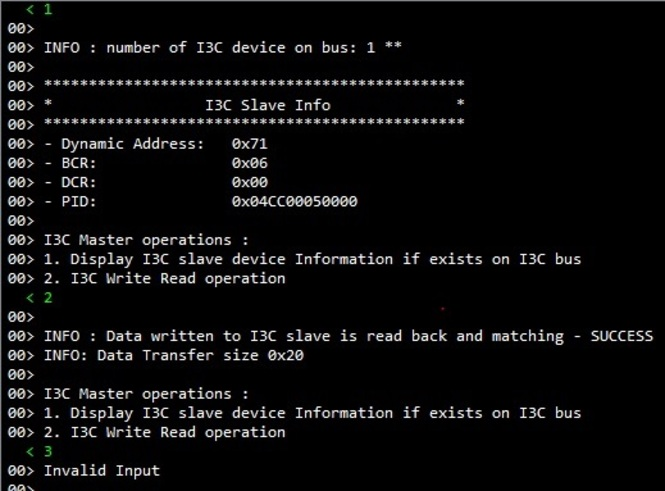
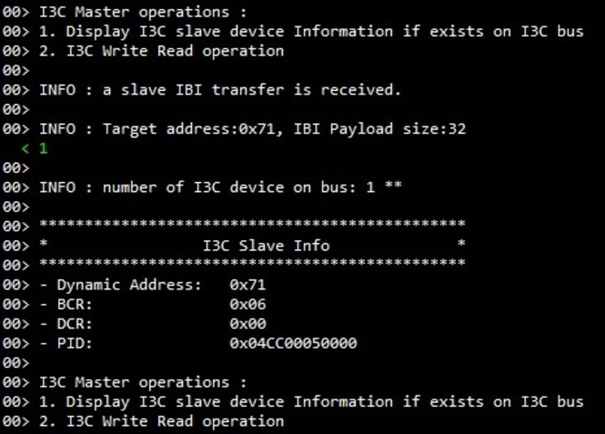
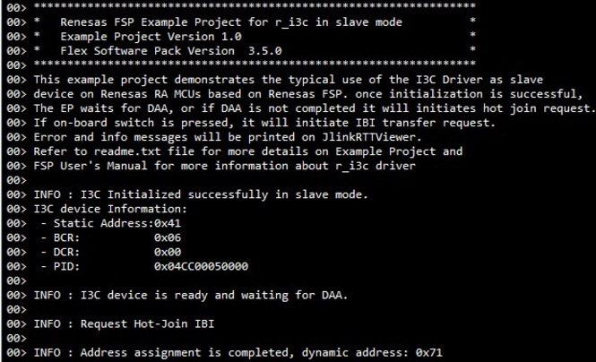
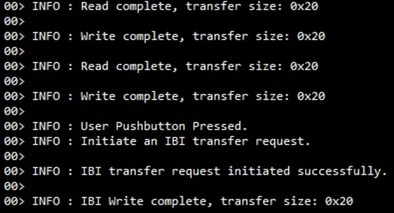

**Note :** MD file is common for both i3c_master and i3c_slave EP.

# Introduction #
 
The sample code accompanying this file shows the operation of the I3C Driver on Renesas RA2E2 MCUs based on Renesas FSP.  
The I3C master on EK-RA2E2 demonstrates operations associated with an I3C slave running on another EK-RA2E2 board. Once initialization is successful,
I3C Master device assigns slave address to I3C slave device through DAA (dynamic address assignment) using I3C common command code (CCC).  
Once Dynamic Address Assignment is completed, the Master EP performs write/read operations, and displays slave device information based on user input. 
If the on-board switch is pressed on the slave side, it will initiate an IBI transfer request.
The application status messages will be displayed in the Jlink RTT Viewer and on-board LEDs. Refer **[LED Status](#led-status)** section for LED observation.

Please refer to the [Example Project Usage Guide](https://github.com/renesas/ra-fsp-examples/blob/master/example_projects/Example%20Project%20Usage%20Guide.pdf) 
for general information on example projects and [readme.txt](./readme.txt) for specifics of operation.

## Required Resources ## 
To build and run the I3C example project, the following resources are needed.

### Hardware ###
* Renesas EK-RA2E2 kit - 2x
* USB A to USB Micro B Cable - 2x
* Jumper wires to link EK-RA2E2 kits - 5x
* Pull up resistor of value 3.9 or 4.7k ohms - 1x

Refer to [readme.txt](./readme.txt) for information on how to connect the hardware.

### Software ###
1. Refer to the software required section in [Example Project Usage Guide](https://github.com/renesas/ra-fsp-examples/blob/master/example_projects/Example%20Project%20Usage%20Guide.pdf)

## Related Collateral References ##
The following documents can be referred to for enhancing your understanding of 
the operation of this example project:
- [FSP User Manual on GitHub](https://renesas.github.io/fsp/)
- [FSP Known Issues](https://github.com/renesas/fsp/issues)

# Project Notes #

## System Level Block Diagram ##
 High level block diagram
  

## FSP Modules Used ##
List of important modules that are used in this example project. Refer to the FSP User Manual for further details on each module listed below.

| Module Name | Usage | Searchable Keyword  |
|-------------|-----------------------------------------------|-----------------------------------------------|
|I3C | Driver for the I3C peripheral to demonstrate Master and Slave mode on RA2E2 MCUs | i3c|
|AGT | Driver for the AGT peripheral is used for demonstrating timeout condition. | agt|
|ICU | The external_irq interface is for configuring interrupts to fire when a trigger condition is detected on an external IRQ pin | icu|

## Module Configuration Notes ##
This section describes FSP Configurator properties which are important or different than those selected by default. 

**I3C Master Configuration properties**

|   Module Property Path and Identifier   |   Default Value   |   Used Value   |   Reason   |
| :-------------------------------------: | :---------------: | :------------: | :--------: |
| configuration.xml -> HAL/Common -> Properties > Settings > Property >Common > Slave Support |Enable | Disable |As only master mode is required, disable slave support to decrease code size. |
| configuration.xml -> HAL/Common -> Properties > Settings > Property >Module I3C > Master Mode > ACK Hot-Join Requests |Disable | Enable |Enable Hot-Join Requests acknowledgment. If a Hot-Join event is received, then the master will initiate the dynamic address assignment. |
| configuration.xml -> HAL/Common -> Properties > Settings > Property >Module I3C > Master Mode > Notify Rejected Hot-Join Requests |Disable | Enable |Generate a callback when an IBI Hot-Join Request is rejected. |
| configuration.xml -> HAL/Common -> Properties > Settings > Property >Module I3C > Master Mode > Notify Rejected Mastership Requests |Disable | Enable |Generate a callback when an IBI Mastership Request is rejected. |
| configuration.xml -> HAL/Common -> Properties > Settings > Property >Module I3C > Master Mode > Notify Rejected Interrupt Requests |Disable | Enable |Generate a callback when an IBI Interrupt Request is rejected. |  

**I3C Slave Configuration properties**

|   Module Property Path and Identifier   |   Default Value   |   Used Value   |   Reason   |
| :-------------------------------------: | :---------------: | :------------: | :--------: |
| configuration.xml -> HAL/Common -> Properties > Settings > Property >Common > Master Support |Enable | Disable |If only slave mode is required, disable master support to decrease code size. |
| configuration.xml -> HAL/Common -> Properties > Settings > Property >Module I3C > Slave Mode > Command Response Info > ENEC/DISEC > In-Band Interrupts |Disable | Enable |Enable the In-Band Interrupts capability, so that the slave should issue IBI requests. |
| configuration.xml -> HAL/Common -> Properties > Settings > Property >Module I3C > Slave Mode > Command Response Info > ENEC/DISEC > Hot-Join Requests |Disable | Enable |Enable the Hot-Join Requests capability, so that the slave should issue Hot-Join requests. |
| configuration.xml -> HAL/Common -> Properties > Settings > Property >Module I3C > Slave Mode > Command Response Info > SETMWL/GETMWL > Max Write Length |65535 | 64 |Set the Device Max Write Length. In this EP, the write buffer is 64-byte. |
| configuration.xml -> HAL/Common -> Properties > Settings > Property >Module I3C > Slave Mode > Command Response Info > SETMRL/GETMRL > Max Read Length |65535 | 64 |Set the Device Max Read Length. In this EP, the read buffer is 64-byte. |
| configuration.xml -> HAL/Common -> Properties > Settings > Property >Module I3C > Slave Mode > Command Response Info > SETMRL/GETMRL > Max IBI Payload Length |0 | 32 |Set the Device Max IBI Payload Length. In this EP, the IBI read buffer is 32-byte. |

The table below lists the FSP provided API used at the application layer by this example project.

| API Name    | Usage                                                                          |
|-------------|--------------------------------------------------------------------------------|
|R_I3C_Open|This API is used to Open the I3C instance. |
|R_I3C_DeviceCfgSet|This API is used to set the configuration for this device  |
|R_I3C_MasterDeviceTableSet|This API configures an entry in the master device table. |
|R_I3C_Enable|This API is used to Enable the I3C device.  |
|R_I3C_IbiRead|This API is used to set the read buffer for storing received IBI data. Used in only master mode.  |
|R_I3C_DynamicAddressAssignmentStart|This API is used to start the Dynamic Address Assignment Process. |
|R_I3C_Write|This API is used to set the write buffer for the transfer. In master mode, start the transfer. |
|R_I3C_Read|This API is used set the read buffer for the transfer. In master mode, start the transfer. |
|R_I3C_SlaveStatusSet|This API is used to set the status returned to the master in response to a GETSTATUS command. |
|R_I3C_IbIWrite|This API is used to initiate an IBI write operation. Used in only Slave mode. |
|R_I3C_Close|This API is used to close the I3C instance |
|R_AGT_Open|This API is used to initialize the AGT module instance. |
|R_AGT_Stop|This API is used to stop the timer. |
|R_AGT_Reset|This API is used to reset the counter value. |
|R_AGT_Start|This API is used to Start timer. |
|R_AGT_Close|This API is used to close the AGT module instance. |
|R_ICU_ExternalIrqOpen|This API is used to prepare an external IRQ pin for operation. |
|R_ICU_ExternalIrqEnable|This API is used to enable external interrupt for specified channel at NVIC. |
|R_ICU_ExternalIrqClose|This API is used to close the external interrupt channel. |
|R_IOPORT_PinRead |This API is used to read the current status of GPIO Pin. |
|R_IOPORT_PinWrite |This API is used to write the value on GPIO Pin. |

## Verifying operation ##
1. Import, generate and build both i3c_master and i3c_slave EPs in different workspaces.
   Before running the example project, make sure hardware connections are done on both master and slave side.
2. Download i3c_master EP to one EK-RA2E2 kit and run the project.
3. Download i3c_slave EP to another EK-RA2E2 kit and run the project.
4. Now open one Jlink RTT Viewer and connect to the master board and open another/second JlinkRTTViewer and connect it to slave board.
5. User can perform Menu option operations on the master side and check corresponding results for the Master and Slave EPs on the respective JlinkRTTViewer.
6. Also on slave side user can perform IBI transfer request using Push button(S2) and verify result on JLinkRTT_Viewer.  
   
   Below images showcases the I3C Master output on JLinkRTT_Viewer:

   
 
   
 
   

   Below images showcases the I3C Slave output on JLinkRTT_Viewer:

   

    
   

## LED Status ##
Below are the obsrvations of the LED operation on slave board :
* When Dynamic Address Assignment completes, the onboard Blue LED status will be toggled.
* When write trasfer completes, the onboard Green LED status will be toggled.
* When read transfer completes, the onboard Red LED status will be toggled.
* When IBI write trasfer completes, the onboard Green LED status will be toggled.