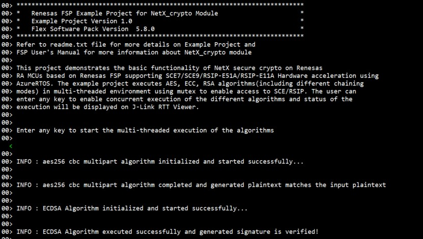
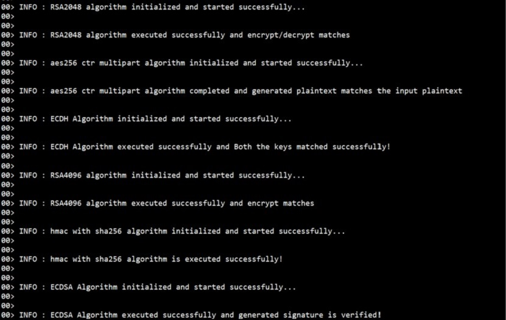
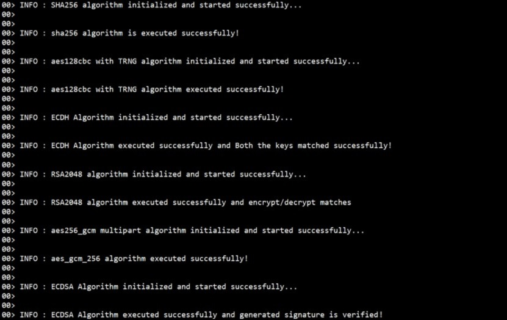

# Introduction #
This project demonstrates the basic functionality of NetX secure crypto on Renesas RA MCUs based on Renesas FSP supporting SCE7/SCE9/RSIP-E51A/RSIP-E11A Hardware acceleration using AzureRTOS. The example project executes AES, ECC, RSA algorithms (including different chaining modes) in multi-threaded environment using mutex to enable access to SCE/RSIP. The user can enter any key to enable concurrent execution of the different algorithms and status of the execution will be displayed on J-Link RTT Viewer.

Please refer to the [Example Project Usage Guide](https://github.com/renesas/ra-fsp-examples/blob/master/example_projects/Example%20Project%20Usage%20Guide.pdf) 
for general information on example projects and [readme.txt](./readme.txt) for specifics of operation.

## Required Resources ##
To build and run the NetX crypto example project, the following resources are needed.

### Software ###
* Renesas Flexible Software Package (FSP): Version 6.2.0
* e2 studio: Version 2025-10
* SEGGER J-Link RTT Viewer: Version 8.74
* GCC ARM Embedded Toolchain: Version 13.2.1.arm-13-7

1. Refer to the software required section in [Example Project Usage Guide](https://github.com/renesas/ra-fsp-examples/blob/master/example_projects/Example%20Project%20Usage%20Guide.pdf)
2. Refer to [Special Topics](#special-topics) for more information of NetX crypto setup.

### Hardware ###
* Supported RA Boards:
  * SCE7      - EK-RA6M2
  * SCE9      - EK-RA4M2, EK-RA4M3, EK-RA6M4, EK-RA6M5
  * RSIP-E51A - EK-RA8M1, EK-RA8D1, MCK-RA8T1, FPB-RA8E1
  * RSIP-E11A - EK-RA4L1
* 1 x Renesas RA board.
* 1 x Type-C USB cable for programming and debugging.

Refer to [readme.txt](./readme.txt) for information on how to connect the hardware.

## Related Collateral References ##
The following documents can be referred to for enhancing your understanding of 
the operation of this example project:
- [FSP User Manual on GitHub](https://renesas.github.io/fsp/)
- [FSP Known Issues](https://github.com/renesas/fsp/issues)

# Project Notes #
## System Level Block Diagram ##
 High level block diagram
 

## FSP Modules Used ##
List all the various modules that are used in this example project. Refer to the FSP User Manual for further details on each module listed below.

| Module Name | Usage | Searchable Keyword  |
|-------------|-----------------------------------------------|-----------------------------------------------|
|NetX Crypto|NetX Crypto with hardware acceleration demonstrating the ECC, AES, RSA crypto algorithms on renesas mcus.| rm_netx_crypto|
|Azure RTOS|Azure RTOS timer is used for algorithm execution time tracking. ||
|[NIST CAVP test vectors](https://csrc.nist.gov/Projects/Cryptographic-Algorithm-Validation-Program )|NIST CAVP test vectors are used in the example project to demonstrate the cryptographic operation of the SCE7/SCE9/RSIP-E51A/RSIP-E11A.||

## Module Configuration Notes ##
This section describes FSP Configurator properties which are important or different than those selected by default. 

**Common Configuration Properties**

|   Module Property Path and Identifier   |   Default Value   |   Used Value   |   Reason   |
| :-------------------------------------: | :---------------: | :------------: | :--------: |
| configuration.xml -> HAL/Common -> Azure RTOS NetX Crypto HW Acceleration -> Properties > Settings > Property > Common > Hardware Acceleration > TRNG |Disabled | Enabled |The default setting for TRNG is disabled, should be enable to test the random key generation for aes method.|
| configuration.xml -> ECC Thread -> Properties > Settings > Property > Thread > Stack Size (bytes)| 1024| 0x2000 |Stack size of ecc thread should require minimum of 8KB to execute the algorithms.|
| configuration.xml -> AES Thread -> Properties > Settings > Property > Thread > Stack Size (bytes)| 1024| 0x2400 |Stack size of aes thread should require minimum of 9KB to execute the algorithms.|
| configuration.xml -> RSA Thread -> Properties > Settings > Property > Thread > Stack Size (bytes)| 1024| 0x2400 |Stack size of rsa thread should require minimum of 9KB to execute the algorithms.|
| configuration.xml -> RTT Thread -> Properties > Settings > Property > Thread > Priority |1 | 2 |RTT thread priority is lowered to ensure higher priority for critical crypto processing threads (ECC, AES, and RSA).|

**For SCE9/RSIP-E51A:**

|   Module Property Path and Identifier   |   Default Value   |   Used Value   |   Reason   |
| :-------------------------------------: | :---------------: | :------------: | :--------: |
| configuration.xml -> HAL/Common -> Azure RTOS NetX Crypto HW Acceleration -> Properties > Settings > Property > Common > Hardware Acceleration > Public Key Cryptography > RSA > RSA 4096 Verify/Encryption (HW) |Disabled | Enabled |The default setting for RSA 4096 is disabled, should be enabled to verify the 4096 key size.|

The table below lists the FSP provided API used at the application layer by this example project.

| API Name    | Usage                                                                          |
|-------------|--------------------------------------------------------------------------------|
|nx_crypto_initialize|This API is used to initialize the NetX crypto.|
|_nx_crypto_method_aes_init|This API is used to initialize the NetX crypto aes method.|
|_nx_crypto_method_aes_operation|This API is used to do the encypt and decrypt operations in aes method.|
|_nx_crypto_method_aes_cleanup|This API is used to cleanup the aes metadata.|
|_nx_crypto_method_ecdh_init|This API is used to initialize the NetX crypto ecdh method.|
|_nx_crypto_method_ecdh_operation |This API is used to perform the ecdh operations.|
|_nx_crypto_method_ecdh_cleanup |This API is used to cleanup the ecdh metadata.|
|_nx_crypto_method_ecdsa_init |This API is used to initialize the NetX crypto ecdsa method.|
|_nx_crypto_method_ecdsa_operation |This API is used to perform the ecdsa operations.|
|_nx_crypto_method_ecdsa_cleanup |This API is used to cleanup the ecdsa metadata.|
|_nx_crypto_method_hmac_sha256_init |This API is used to initialize the NetX crypto hmac sha 256 method.|
|_nx_crypto_method_hmac_sha256_operation |This API is used to perform encryption and decryption operation in hmac 256 method.|
|_nx_crypto_method_hmac_sha256_cleanup |This API is used to cleanup the hmac sha 256 metadata.|
|_nx_crypto_method_sha256_init |This API is used to initialize the Netx crypto sha256 method.|
|_nx_crypto_method_sha256_operation |This API is used to encrypt and decrypt operations in sha256 method.|
|_nx_crypto_method_sha256_cleanup |This API is used to cleanup the sha256 metadata.|  

Note : The example project includes three threads exercising the above crypto APIs. AES, ECC and RSA threads operate the corresponding cryptographic APIs. Note that the SHA APIs are exercised in the RSA thread.

Refer to [Azure RTOS NetX Secure Crypto Hardware Acceleration](https://docs.microsoft.com/en-us/azure/rtos/netx/netx-crypto/chapter1) for more details of API used.

## Verifying operation ##
Import, Build and Debug the EP (Refer section Starting Development of FSP User Manual). After running the EP, open J-Link RTT Viewer to see the output status of EP.  

Below images showcase the output for **concurrent execution of the algorithms** on **J-Link RTT Viewer** when the user input:

