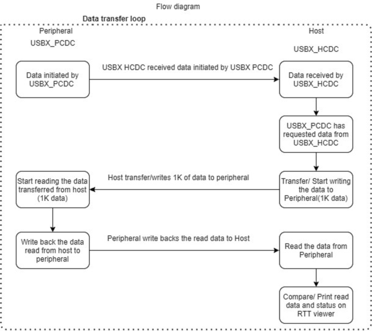
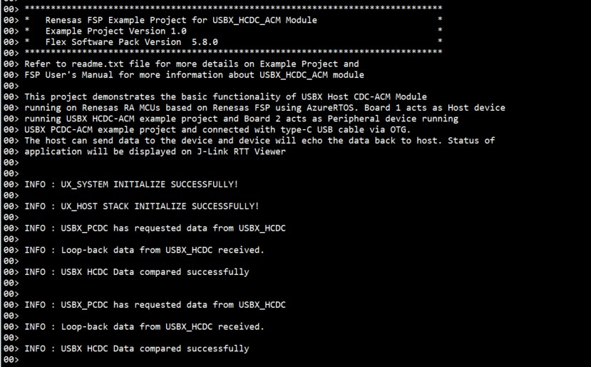

# Introduction #

This project demonstrates the basic functionality of USBX Host CDC ACM module on Renesas RA MCUs based on Renesas FSP using AzureRTOS. Board 1 acts as Host device running USBX HCDC-ACM example project and Board 2 acts as Peripheral device running USBX PCDC-ACM example project and connected with type-C USB cable via OTG. 
The peripheral initiates the communication and once the host reads the data initiated by the peripheral. The host will then send predefined data to the peripheral and the device will echo the data back to the host. 
The application status messages will be displayed on the J-Link RTT Viewer.

Please refer to the [Example Project Usage Guide](https://github.com/renesas/ra-fsp-examples/blob/master/example_projects/Example%20Project%20Usage%20Guide.pdf) 
for general information on example projects and [readme.txt](./readme.txt) for specifics of operation.

## Required Resources ## 
To build and run the USBx HCDC ACM example project, the following resources are needed.

### Software ###
1. Refer to the software required section in [Example Project Usage Guide](https://github.com/renesas/ra-fsp-examples/blob/master/example_projects/Example%20Project%20Usage%20Guide.pdf)

### Hardware ###
* Supported RA boards: EK-RA4M2, EK-RA4M3, EK-RA6M3, EK-RA6M4, EK-RA6M5, EK-RA8M1, EK-RA8D1, MCK-RA8T1, EK-RA4L1
* 2 x Renesas RA boards:
  - 1 x RA board runs the USBX HCDC ACM Example Project.
  - 1 x RA board runs the USBX PCDC ACM Example Project.
* 1 x OTG cable: Type-C to USB Host (Female).
* 3 x USB cables for programming and debugging.

Refer to [readme.txt](./readme.txt) for information on how to connect the hardware.

### Hardware Connections ###
Connect Board 1, running USBX HCDC ACM Example Project, through OTG cable to Board 2, running USBX PCDC ACM Example Project.

* For EK-RA4M2, EK-RA4M3, EK-RA6M3, EK-RA6M4, EK-RA6M5, EK-RA8M1, EK-RA8D1 (Full Speed):

  * Jumper J12 placement is pins 1-2.
  * Remove Jumper J15 pins.
  * Connect USB device to J11 connector with help of micro USB Host cable.

* For EK-RA6M3 (High Speed):

  * Jumper J7: Connect pins 1-2.
  * Remove Jumper J17 pins.
  * Connect USB device to J6 connector with help of micro USB Host cable.

* For MCK-RA8T1 (Full Speed):

  * Jumper JP9 placement is pins 1-2.
  * Remove Jumper J10 pins.
  * Connect USB device to CN14 connector with help of Type-C USB Host cable.

* For EK-RA4L1 (Full Speed):

  * The user must turn OFF S4-4 to select USB Host Controller mode.
  * Set J17 jumper to pins 2-3, Set J7 jumper to use P407 for USBFS VBUS.
  * Connect USB device to J11 connector with help of Type-C USB Host cable.

 
## Related Collateral References ##
The following documents can be referred to for enhancing your understanding of 
the operation of this example project:
- [FSP User Manual on GitHub](https://renesas.github.io/fsp/)
- [Microsoft Azure USBX Host Class API ](https://docs.microsoft.com/en-us/azure/rtos/usbx/usbx-host-stack-5)
- [FSP Known Issues](https://github.com/renesas/fsp/issues)
- [USBX HCDC Limitation](https://renesas.github.io/fsp/group___u_s_b_x.html?pos=151,4,246,4,311,7,398,4,413,4,1546,4,1665,4,5295,4)

# Project Notes #

## System Level Block Diagram ##
 High level block diagram
 

 Data transfer flow diagram of USBX HCDC
 

## FSP Modules Used ##
List all the various modules that are used in this example project. Refer to the FSP User Manual for further details on each module listed below.

| Module Name | Usage | Searchable Keyword  |
|-------------|-----------------------------------------------|-----------------------------------------------|
|USBX HCDC| USBX HCDC is used for data transfer to and from a CDC peripheral device. | HCDC |
|USB Basic Driver | USB driver operates in combination with the device class drivers provided by Renesas to form a complete USB stack.|r_usb_basic|
|DMAC Transfer |DMAC is used to transfer the usb data for faster rate without using the CPU.  | r_dmac  |

## Module Configuration Notes ##
This section describes FSP Configurator properties which are important or different than those selected by default. 

**Common Configuration properties**

|   Module Property Path and Identifier   |   Default Value   |   Used Value   |   Reason   |
| :-------------------------------------: | :---------------: | :------------: | :--------: |
| configuration.xml -> HCDC ACM Thread -> Properties > Settings > Property > Common > Timer> Timer Ticks Per Second |100 | 1000 |The default UX_PERIODIC_RATE ticks should be 1000 indicating 1 tick per millisecond.|
| configuration.xml -> HCDC ACM Thread -> Properties > Settings > Property > Thread > Priority| 1 | 14 |HCDC ACM thread priority is lowered to allow the other usb operations at faster rate.|
| configuration.xml -> RTT Thread -> Properties > Settings > Property > Thread > Priority| 1 | 15 | RTT thread priority is lowered to allow the USBX HCDC ACM data process at the fastest rate possible.|
| configuration.xml -> HCDC ACM Thread -> g_basic0 USB (r_usb_basic) > Properties > Settings > Property > Common > DMA/DTC Support| DMA Disable | DMA Enable | DMA is enabled for faster data processing.|

**Configuration Properties for USB Speed as High-Speed**

|   Module Property Path and Identifier   |   Default Value   |   Used Value   |   Reason   |
| :-------------------------------------: | :---------------: | :------------: | :--------: |
| configuration.xml -> HCDC ACM Thread -> g_basic0 USB (r_usb_basic) > Properties > Settings > Property > Module g_basic0 USB (r_usb_basic) > USB Speed| Full-Speed | Hi-Speed | This property is used to configure USB speed. |
| configuration.xml -> HCDC ACM Thread -> g_basic0 USB (r_usb_basic) > Properties > Settings > Property > Common > DMA/DTC Source Address| DMA Disabled | HS Address | USB basic driver is configured USB Speed as High Speed. Accordingly, DMA Source Address is provided with HS Address.|
| configuration.xml -> HCDC ACM Thread -> g_basic0 USB (r_usb_basic) > Properties > Settings > Property > Common > DMA/DTC Destination Address| DMA Disabled | HS Address | USB basic driver is configured USB speed as High Speed (Default). Accordingly, DMA Destination Address is provided with HS Address. |
| configuration.xml -> HCDC ACM Thread -> g_basic0 USB (r_usb_basic) > Properties > Settings > Property > Module g_basic0 USB (r_usb_basic) > USB Module Number | USB_IP0_Port | USB_IP1_Port | This property is used to specify USB module number to be used as per configured USB speed. |
| configuration.xml -> HCDC ACM Thread -> g_transfer0 Transfer (r_dmac) > Properties > Settings > Property > Module g_transfer0 Transfer (r_dmac) > Activation Source| No ELC Trigger | USBHS FIFO 1 (DMA/DTC Transfer request 1)  |This is an event trigger for DMA transfer 0 instance for destination pointer address.|
| configuration.xml -> HCDC ACM Thread -> g_transfer1 Transfer (r_dmac) > Properties > Settings > Property > Module g_transfer1 Transfer (r_dmac) > Activation Source| No ELC Trigger | USBHS FIFO 0 (DMA/DTC Transfer request 0)  |This is an event trigger for DMA transfer 1 instance for source pointer address.|
| configuration.xml -> HCDC ACM Thread -> g_transfer1 Transfer (r_dmac) > Properties > Settings > Property > Module g_transfer1 Transfer (r_dmac) > Transfer Size| 2 Bytes | 4 Bytes  | This is used to select DMAC transfer size for High Speed. |
| configuration.xml -> HCDC ACM Thread -> g_transfer0 Transfer (r_dmac) > Properties > Settings > Property > Module g_transfer0 Transfer (r_dmac) > Transfer Size| 2 Bytes | 4 Bytes  | This is used to select DMAC transfer size for High Speed. |

**Configuration Properties for USB Speed as Full-Speed**

|   Module Property Path and Identifier   |   Default Value   |   Used Value   |   Reason   |
| :-------------------------------------: | :---------------: | :------------: | :--------: |
| configuration.xml -> HCDC ACM Thread -> g_basic0 USB (r_usb_basic) > Properties > Settings > Property > Common > DMA/DTC Source Address| DMA Disabled | FS Address | USB basic driver is configured USB Speed as Full Speed. Accordingly, DMA Source Address is provided with FS Address.|
| configuration.xml -> HCDC ACM Thread -> g_basic0 USB (r_usb_basic) > Properties > Settings > Property > Common > DMA/DTC Destination Address| DMA Disabled | FS Address | USB basic driver is configured USB speed as Full Speed (Default). Accordingly, DMA Destination Address is provided with FS Address. |
| configuration.xml -> HCDC ACM Thread -> g_transfer0 Transfer (r_dmac) > Properties > Settings > Property > Module g_transfer0 Transfer (r_dmac) > Activation Source| No ELC Trigger | USBFS FIFO 1 (DMA/DTC Transfer request 1)  |This is an event trigger for DMA transfer 0 instance for destination pointer address.|
| configuration.xml -> HCDC ACM Thread -> g_transfer1 Transfer (r_dmac) > Properties > Settings > Property > Module g_transfer1 Transfer (r_dmac) > Activation Source| No ELC Trigger | USBFS FIFO 0 (DMA/DTC Transfer request 0)  |This is an event trigger for DMA transfer 1 instance for source pointer address.|

The table below lists the FSP provided API used at the application layer by this example project.

| API Name    | Usage                                                                          |
|-------------|--------------------------------------------------------------------------------|
|_ux_system_initialize|This API is used to initialize the USBx system. |
|ux_host_stack_initialize|This API is used to initialize the USBx device stack.  |
|ux_host_class_cdc_acm_write|This API is used to write to the CDC class.|
|ux_host_class_cdc_acm_read|This API is used to read from the CDC class.|
|R_USB_Open|This API opens the USB basic driver.|

**Callback:**  
ux_host_usr_event_notification callback function is called to identify the USB events and perform operation as per the received events. Also there are only two events available in the EP, they are used to signal the HCDC that USB communication can be started.
1. When event UX_FSP_DEVICE_INSERTION is received the USBX_HCDC checks for the interface cdc class and sets the event flag to perform USBX_HCDC operation (i.e write/read).
2. When event UX_FSP_DEVICE_REMOVAL is received the USBX_HCDC will clear the event flag and will wait for USB_INSERTION event.

## Verifying operation ##
1. Import, generate and build the USBX PCDC ACM and USBX HCDC ACM EP.
2. Now, flash USBX PCDC ACM code on RA board (i.e Board 2) which will acts as peripheral device.
3. Open J-Link RTT Viewer for Board 2.
4. Next, flash USBX HCDC ACM code on another RA Board (i.e Board 1) which will acts as host device.
5. Open J-Link RTT Viewer for Board 1 and verify host device operation.

**Note:** Both the USBX HCDC ACM and PCDC ACM boards need to be running at High Speed or Full Speed in order for the correct EP functionality.

1. Below images showcases the output on **J-Link RTT Viewer** for USBX HCDC:

 

## Special Topics ##
* How to Switch between USB FS to HS for MCU supporting both USB speed:
1. Select the USB Speed and USB Module Number from configuration property as per supported USB speed.
2. Configure the DMA Source Address and DMA Destination Address, according to the USB speed selected.  

3. When using DMAC, Configure the transfer size as per the selected USB Speed (i.e For FS: 2 bytes and HS: 4 bytes).  

