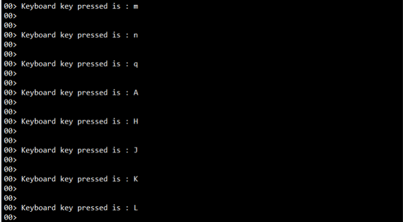
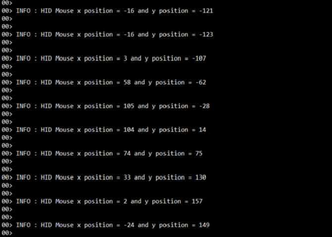
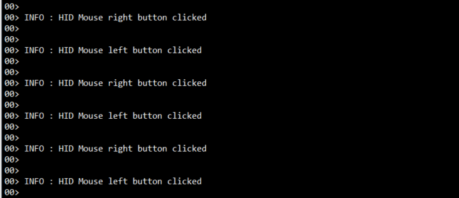
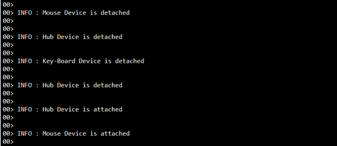

# Introduction #
This project demonstrates basic functionalities of USBX Host Hub driver with AZURE RTOS on Renesas RA MCUs based
on Renesas FSP. USBX HHID driver enumerates Human Interface Devices limited to keyboard or mouse using USBX middleware. 
Upon connecting a keyboard and mouse to the hub and pressing a key on the keyboard, the received keycode will be displayed on J-Link RTT Viewer.
When the mouse is moved, the x and y axis position will be printed on J-Link RTT Viewer. Error and info messages will be printed on J-Link RTT Viewer.
The application status messages will be displayed on the J-Link RTT Viewer.

Please refer to the [Example Project Usage Guide](https://github.com/renesas/ra-fsp-examples/blob/master/example_projects/Example%20Project%20Usage%20Guide.pdf) 
for general information on example projects and [readme.txt](./readme.txt) for specifics of operation.

## Required Resources ## 
To build and run the USBX Host Hub example project, the following resources are needed.

### Hardware ###
* 1 x Renesas RA board.
* 1 x Type-C USB cable for programming and debugging.
* 1 x OTG cable.
* 1 x USB Hub.
* 1 x USB Keyboard.
* 1 x USB Mouse.

Refer to [readme.txt](./readme.txt) for information on how to connect the hardware.

### Software ###
1. Refer to the software required section in [Example Project Usage Guide](https://github.com/renesas/ra-fsp-examples/blob/master/example_projects/Example%20Project%20Usage%20Guide.pdf)

## Related Collateral References ##
The following documents can be referred to for enhancing your understanding of 
the operation of this example project:
- [FSP User Manual on GitHub](https://renesas.github.io/fsp/)
- [Microsoft Azure USBX Host Class API ](https://docs.microsoft.com/en-us/azure/rtos/usbx/usbx-host-stack-5)
- [FSP Known Issues](https://github.com/renesas/fsp/issues)

# Project Notes #
## System Level Block Diagram ##
 High level block diagram

## FSP Modules Used ##
List of important modules that are used in this example project. Refer to the FSP User Manual for further details on each module listed below.

| Module Name | Usage | Searchable Keyword  |
|-------------|-----------------------------------------------|-----------------------------------------------|
|USBX HHID | This usbx_hhid module combines with the r_usb_basic module to provide a USBX Host Human Interface Device Class (HHID) driver. | HHID|
|USB Porting layer | This USB driver works by combining USBX and r_usb_basic module. |rm_usb_port|
|USB Basic Driver | USB driver operates in combination with the device class drivers provided by Renesas to form a complete USB stack.|r_usb_basic|

## Module Configuration Notes ##
This section describes FSP Configurator properties which are important or different than those selected by default. 

**Common Configuration properties**
|   Module Property Path and Identifier   |   Default Value   |   Used Value   |   Reason   |
| :-------------------------------------: | :---------------: | :------------: | :--------: |
| configuration.xml > BSP > Properties > Settings > Property > Main Stack Size (bytes)| 0x400 |0x1000| Main Program thread stack is configured to store the local variables of different functions in the code. |
| configuration.xml > BSP > Properties > Settings > Property > Heap Size (bytes)| 0 |0x400| Heap size is required for standard library functions to be used. |
| configuration.xml > HID Mouse HUB Thread > Properties > Settings > Property >Common > Timer> Timer Ticks Per Second |100 | 1000 |The default UX_PERIODIC_RATE ticks should be 1000 indicating 1 tick per millisecond|
| configuration.xml > HID Mouse HUB Thread > Properties > Settings > Property >Thread > Priority| 1 | 15 |HID Mouse HUB thread priority is lowered to allow the other USB operations at faster rate.|
| configuration.xml > USBX HID HUB Thread > Properties > Settings > Property >Thread > Priority| 1 | 15 | USBX HID HUB thread priority is lowered to allow the other USB operations at faster rate.|
| configuration.xml > RTT Thread > Properties > Settings > Property >Thread > Priority| 1 | 16 | RTT thread priority is lowered to allow the USBX HHID data process at the fastest rate possible.|
| configuration.xml > RTT Thread > Properties > Settings > Property > Stack Size (bytes)| 1024 | 4096 | The size of the RTT Thread Stack is increased so that data from any type of file can be printed on the J-Link RTT Viewer. |

The table below lists the FSP provided API used at the application layer by this example project.

| API Name    | Usage                                                                          |
|-------------|--------------------------------------------------------------------------------|
|ux_system_initialize|This API is used to initialize the USBX system. |
|ux_host_stack_initialize|This API is used to initialize the USBX device stack.  |
|ux_utility_memory_compare|This API is used to compare two memory blocks. |
|R_USB_Open|This API opens the USB basic driver. |
|ux_host_class_hid_keyboard_key_get|This API is used to get the keyboard key and state.  |
|ux_host_class_hid_mouse_buttons_get|This API is used to get the mouse buttons pressed.  |
|ux_host_class_hid_mouse_position_get|This API is used to get the mouse position in x & y coordinates. |
|R_USB_Close|This API is used to close the usb instance.  |
|ux_host_stack_uninitialize|This API is used to uninitialize all the host code for USBX. |

* Note:        
EP does not support high speed as USBX HHID does not support it.

## Verifying operation ##
1. Import, generate and build the EP.
2. Flash USBX Host hub code on Renesas RA board which will act as host device (Refer the Block Diagram above).
3. Open J-Link RTT Viewer. Connect host hub first to OTG cable, then connect the host devices (i.e keyboard and/or mouse).
4. Press any key on the keyboard and check the key pressed event output on the J-Link RTT Viewer.
5. Check the x and y coordinates and button pressed of mouse on J-Link RTT Viewer.

  Below images showcases the output on J-Link RTT Viewer for USBX HHID:
 
 
 
 

 

 

 
