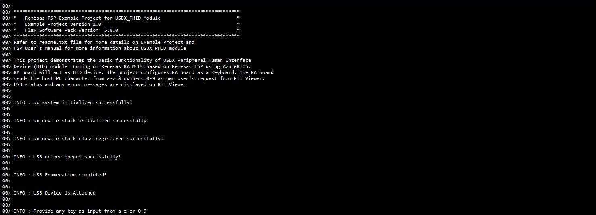
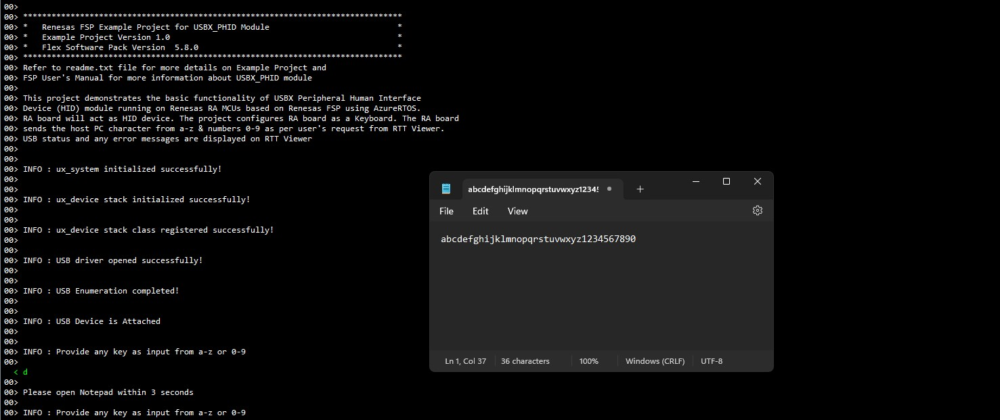
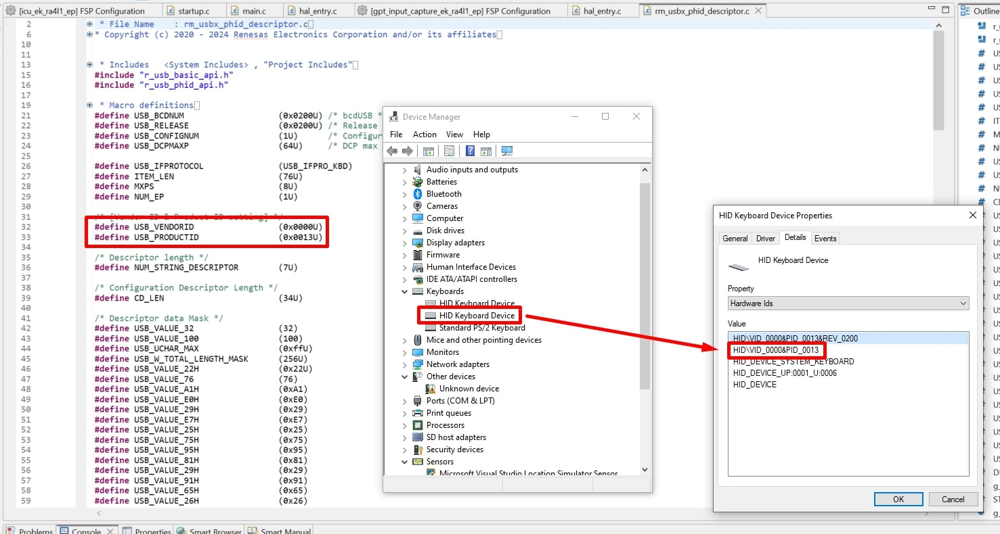

# Introduction #

This project demonstrates basic functionality of USBX Peripheral Human Interface Device Class module on Renesas RA MCUs 
based on Renesas FSP using Azure RTOS. The user will be able to use RA board as a keyboard (HID Device) by connecting it to
the Host PC. Once the board is connected, the user can provide any input from RTT Viewer to send characters 
from a - z & numbers 0 - 9 from RA board to host PC.
USB status and any error messages are displayed on RTT Viewer. 

Please refer to the [Example Project Usage Guide](https://github.com/renesas/ra-fsp-examples/blob/master/example_projects/Example%20Project%20Usage%20Guide.pdf) 
for general information on example projects and [readme.txt](./readme.txt) for specifics of operation.

## Required Resources ##
To build and run the USBX PHID example project, the following resources are needed.
   
### Hardware ###
Supported RA boards: EK-RA2A1, EK-RA4M1, EK-RA6M1, EK-RA6M2, EK-RA6M3, EK-RA6M4, EK-RA6M5, EK-RA4M3, EK-RA4M2, EK-RA8M1, EK-RA8D1, EK-RA4E2, EK-RA6E2, MCK-RA8T1, EK-RA4L1
* 1 x Renesas RA board.
* 2 x Type-C USB cables for programming and debugging.
* 1 x PC with at least 2 USB ports 

Refer to [readme.txt](./readme.txt) for information on how to connect the hardware.

### Software ###
* Renesas Flexible Software Package (FSP): Version 5.8.0
* e2 studio: Version 2025-01
* SEGGER J-Link RTT Viewer: Version 8.12c
* GCC ARM Embedded Toolchain: Version 13.2.1.arm-13-7
* Refer to the software required section in [Example Project Usage Guide](https://github.com/renesas/ra-fsp-examples/blob/master/example_projects/Example%20Project%20Usage%20Guide.pdf)
* Refer to [Special Topics](#special-topics) for more information of USBX phid setup.

### Hardware Connections ###  
* For EK-RA2A1, EK-RA4M1, EK-RA6M1, EK-RA6M2:
    * Connect the micro USB end of the micro USB device cable to micro-AB USB Full Speed port (J9) of the board. Connect the other end of this cable to USB port of the host PC. 

* For EK-RA6M3, EK-RA6M4, EK-RA6M5, EK-RA4M3, EK-RA4M2, EK-RA8M1, EK-RA8D1:
    * Jumper J12 placement is pins 2-3
    * Connect jumper J15 pins 
    * Connect the micro USB end of the micro USB device cable to micro-AB USB Full Speed port (J11) of the board. Connect the other end of this cable to USB port of the host PC. 

* For EK-RA4E2, EK-RA6E2:
    * Connect the micro USB end of the micro USB device cable to micro-AB USB Full Speed port (J11) of the board. Connect the other end of this cable to USB port of the host PC.

* For MCK-RA8T1:
    * Jumper JP9 placement is pins 2-3.
    * Connect jumper JP10 pins.
    * Connect the Type-C USB end of the Type-C USB cable to Type-C USB Full Speed port (CN14) of the board. Connect the other end of this cable to USB port of the host PC.	

* For EK-RA4L1:
    * Turn ON S4-4 to select USB device mode. 
    * Set J17 jumper to pins 2-3, Set J7 jumper to use P407 for USBFS VBUS.
    * Connect Type-C USB end of the Type-C USB cable to Type-C USB Full Speed port (J11) of the board.  
    Connect the other end of this cable to USB port of the host PC.

## Related Collateral References ##
The following documents can be referred to for enhancing your understanding of 
the operation of this example project:
- [FSP User Manual on GitHub](https://renesas.github.io/fsp/)
- [FSP Known Issues](https://github.com/renesas/fsp/issues)

# Project Notes #

## System Level Block Diagram ##
 High level block diagram
 
 

## FSP Modules Used ##
List of all the various modules that are used in this example project. Refer to the FSP User Manual for further details on each module listed below.

| Module Name | Usage | Searchable Keyword  |
|-------------|-----------------------------------------------|-----------------------------------------------|
|USBX PHID| USBX PHID is used to communicate with Host machine to send characters from the device class.| rm_usbx_port|
| USB Basic Driver | USB driver is required for hardware configuration on RA MCU. |r_usb_basic|

## Module Configuration Notes ##
This section describes FSP Configurator properties which are important or different than those selected by default. 

**Common Configuration Properties**

|   Module Property Path and Identifier   |   Default Value   |   Used Value   |   Reason   |
| :-------------------------------------: | :---------------: | :------------: | :--------: |
| configuration.xml -> PHID Thread -> Properties > Settings > Property > Common > Timer> Timer Ticks Per Second |100 | 1000 |The default ticks should be 1000 indicating 1 tick per millisecond.|
| configuration.xml -> PHID Thread -> Properties > Settings > Property > Thread > Priority| 1 | 21 |PHID thread priority is lowered to allow the other usb operations at faster rate.|
| configuration.xml -> RTT Thread -> Properties > Settings > Property > Thread > Priority| 1 | 22 | RTT thread priority is lowered to allow the USBX PHID data process at the fastest rate possible.|

Refer to [User Callback Handlers](#user-callback-handlers) section for user callback

The table below lists the FSP provided API used at the application layer by this example project.

| API Name    | Usage                                                                          |
|-------------|--------------------------------------------------------------------------------|
|[ux_system_initialize](https://docs.microsoft.com/en-us/azure/rtos/usbx/usbx-device-stack-2#initialization-of-usbx-resources)|This API is used to initialize the USBX system. |
|[ux_system_uninitialize](https://docs.microsoft.com/en-us/azure/rtos/usbx/usbx-device-stack-2#uninitialization-of-usbx-resources)|This API is used to un initialize he USBX system.|
|[ux_device_stack_initialize](https://docs.microsoft.com/en-us/azure/rtos/usbx/usbx-device-stack-4#ux_device_stack_initialize)|This API is used to initialize the USBX device stack.  |
|[ux_device_stack_uninitialize](https://docs.microsoft.com/en-us/azure/rtos/usbx/usbx-device-stack-4#ux_device_stack_uninitialize)|This API is used to uninitialize the USBX device stack.|
|[ux_device_stack_class_register](https://docs.microsoft.com/en-us/azure/rtos/usbx/usbx-device-stack-4#ux_device_stack_class_register)|This API is used to registers the usb device slave class.|
|[ux_device_stack_class_unregister](https://docs.microsoft.com/en-us/azure/rtos/usbx/usbx-device-stack-4#ux_device_stack_class_unregister)|This API is used to un registers the usb device class.
|[ux_device_class_hid_event_set](https://docs.microsoft.com/en-us/azure/rtos/usbx/usbx-device-stack-5#ux_device_class_hid_event_set)|This API is used to set the PHID event.|
|R_USB_Open|This API opens the USB basic driver.|
|R_USB_Close|This API closes the USB basic driver.|

Refer to [USBX Device HID Class Considerations](https://docs.microsoft.com/en-us/azure/rtos/usbx/usbx-device-stack-5#usb-device-hid-class) for more details of API used.

## Verifying operation ##

Import, Build and Debug the EP(see section Starting Development of FSP User Manual). After running the EP, open the J-Link RTT Viewer to see the output status of EP.

1. Below images showcases the output on **J-Link RTT Viewer** :

 
 
2. Below image shows Keyboard keys printing on Notepad.

 
 
3. Below image showcases the device enumeration in device manager. The user can update the Vendor ID and Product ID of their own devices in descriptor file.

 

### Special Topics 
#### Developing Descriptor
1. Refer **Descriptors** section in [USBX Porting Layer (rm_usbx_port)](https://renesas.github.io/fsp/group___u_s_b_x.html) for developing the descriptor. We can take template file of required usb combination from mentioned path in above link and use the same in source folder by removing the **.template** file extension.

#### User Callback Handlers
1. **usbx_status_callback()** which handle the USB Attach and Removed events.
2. **ux_hid_device_instance_activate()** and **ux_hid_device_instance_deactivate()** which handles the device stack enumeration events.

#### USBX PHID Example Project Limitations
1. USBX PHID module does not support High Speed mode.
2. This example project does not support the out transfer.