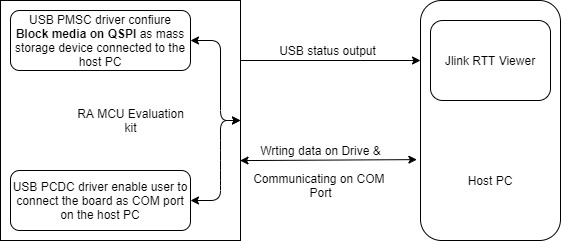
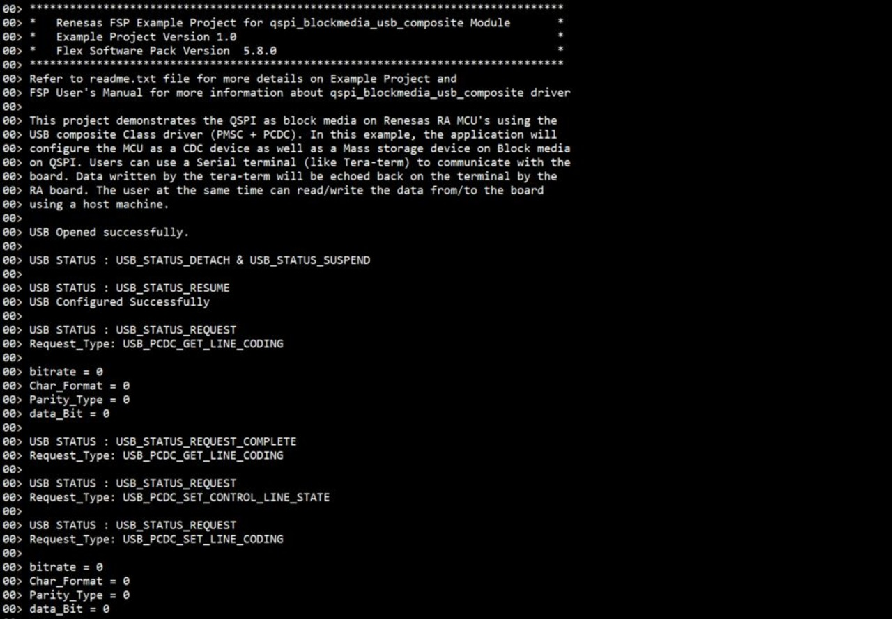
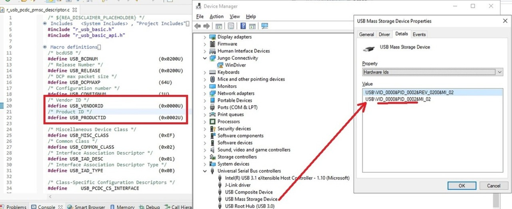
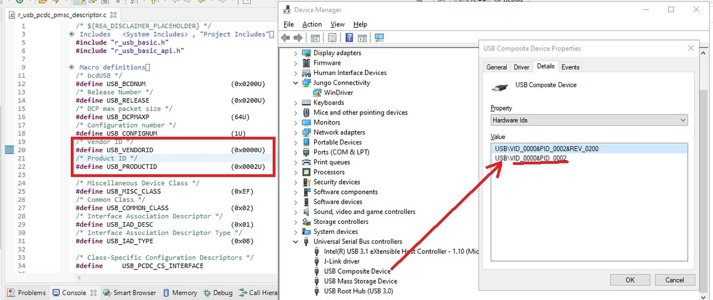

# Introduction #

The sample code accompanying this file shows the operation of a Composite Device using the USB FS peripheral on a RA MCU.
USB Composite Class allows the device to enumerate as one or more USB device classes. E.g.: When connected to a PC, this 
sample code will show enumeration of a USB Mass Storage Device and a CDC Device. This allows the Host to simultaneously transfer 
communications data over the CDC, and perform file transfer using the Mass Storage Class on QSPI Block-media. Such functionality 
is popular for applications that require a console interface to view the status of the system, and the ability to accept configuration
information for modifying operating modes of the system.

Please refer to the [Example Project Usage Guide](https://github.com/renesas/ra-fsp-examples/blob/master/example_projects/Example%20Project%20Usage%20Guide.pdf) 
for general information on example projects and [readme.txt](./readme.txt) for specifics of operation.

## Required Resources ##
To build and run the qspi blockmedia usb composite example project, the following resources are needed.

### Hardware ###
Supported RA boards: EK-RA4M2, EK-RA4M3, EK-RA6M3, EK-RA6M4, EK-RA6M5, EK-RA4L1  
* 1 x Renesas RA board.
* 2 x Type-C USB cables.
* 1 x Host PC with at least 2 USB ports (1 for debug and 1 for COM port).

### Hardware Connections ###
* For EK-RA4M2, EK-RA4M3, EK-RA6M3, EK-RA6M4, EK-RA6M5:
    * Jumper J12: Connect pins 2-3.
    * Connect jumper J15 pins.
    * Connect the micro USB end of the micro USB device cable to micro-AB USB Full Speed port (J11) of the board. Connect the other end of this cable to a USB port of the host PC. 

* For EK-RA4L1:
    * The user needs to turn ON S4-4 to use USB Device.
    * The user needs to connect jumper J7 and set jumper J17 to pins 2-3 to enable P407 for USBFS VBUS function.
    * Connect the Type-C end of the Type-C USB device cable to Type-C USB Full-Speed port (J11) of the board. Connect the other end of this cable to USB port of the host PC.

### Software ###
* Renesas Flexible Software Package (FSP): Version 6.1.0
* e2 studio: Version 2025-07
* SEGGER J-Link RTT Viewer: Version 8.58
* GCC ARM Embedded Toolchain: Version 13.2.1.arm-13-7
* Terminal Console Application: Tera Term or a similar application

Refer to software requirements mentioned in [Example Project Usage Guide](https://github.com/renesas/ra-fsp-examples/blob/master/example_projects/Example%20Project%20Usage%20Guide.pdf)

## Related Collateral References ##
The following documents can be referred to for enhancing your understanding of 
the operation of this example project:
- [FSP User Manual on GitHub](https://renesas.github.io/fsp/)
- [FSP Known Issues](https://github.com/renesas/fsp/issues)

# Project Notes #

## System Level Block Diagram ##

## FSP Modules Used ##
List all the various modules that are used in this example project. Refer to the FSP User Manual for further details on each module listed below.

| Module Name | Usage  | Searchable Keyword (using New Stack > Search) |
|-------------|-----------------------------------------------|-----------------------------------------------|
| USB composite |USB composite device works as a USB Peripheral by combining two peripheral device classes and r_usb_basic module. | USB composite |

## Module Configuration Notes ##
This section describes FSP Configurator properties which are important or different than those selected by default. 

|   Module Property Path and Identifier   |   Default Value   |   Used Value   |   Reason   |
| :-------------------------------------: | :---------------: | :------------: | :--------: |
|   configuration.xml -> QSPI BM Thread > g_basic USB (r_usb_basic) > Properties > Settings > Property > Module g_basic USB (r_usb_basic) > USB Callback  |   NULL   |   usb_composite_callback   |   As RTOS is used, so the callback function is set and this callback function will notify the user about occurance of usb events.   |
|   configuration.xml ->  QSPI BM Thread > g_qspi QSPI (r_qspi) > Properties > Settings > Property > Module g_qspi QSPI (r_qspi) > General > SPI Protocol   |   Extended SPI   |   QPI   |   MCU's QSPI controller is initialized in QPI mode/configuration   |   
|   configuration.xml ->  QSPI BM Thread > g_qspi QSPI (r_qspi) > Properties > Settings > Property > Module g_qspi QSPI (r_qspi) > General > Address Bytes   |   3   |   4   |   This is changed because QSPI flash is of 256 Mb.   |
|   configuration.xml -> QSPI BM Thread > Properties > Settings > Property > Common > Memory Allocation > Support Dynamic Allocation |   Disabled   |   Enabled   |   RTOS objects can be created using RAM that is automatically allocated from the FreeRTOS heap.   |
|   configuration.xml -> QSPI BM Thread > Properties > Settings > Property > Common > Memory Allocation > Total Heap Size  |   0   |   20000   |   This is changed because Dynamic Allocation support is enabled, so application makes use of amount of RAM available in the FreeRTOS heap.   |
|   configuration.xml -> QSPI BM Thread > g_pmsc USB PMSC (r_usb_pmsc) > Properties > Settings > Property > Common > Sector size  |   512   |   4096   |   This is changed because sector size for QSPI is 4096.   |

For EK-RA6M3:
|   Module Property Path and Identifier   |   Default Value   |   Used Value   |   Reason   |
| :-------------------------------------: | :---------------: | :------------: | :--------: |
|   configuration.xml -> QSPI BM Thread > Properties > Settings > Property > Common > Memory Allocation > Total Heap Size |   0   |   30000   |   This is changed because Dynamic Allocation support is enabled, so application makes use of amount of RAM available in the FreeRTOS heap.   |

For EK-RA4L1:
|   Module Property Path and Identifier   |   Default Value   |   Used Value   |   Reason   |
| :-------------------------------------: | :---------------: | :------------: | :--------: |
|   configuration.xml -> QSPI BM Thread > Properties > Settings > Property > Common > Memory Allocation > Total Heap Size |   0   |   10000   |   This is changed because Dynamic Allocation support is enabled, so application makes use of amount of RAM available in the FreeRTOS heap.   |
## API Usage ##

The table below lists the FSP provided API used at the application layer by this example project.

| API Name    | Usage                                                                          |
|-------------|--------------------------------------------------------------------------------|
|R_USB_Read | This API is used to Read data from tera term, when USB Write complete state event occur. |
|R_USB_Write| This API is used to Write back the read data from mcu to tera term, when USB READ complete state event occur.|
|R_USB_PeriControlDataGet| This API is used to get the class request, when USB class request type is USB_PCDC_SET_LINE_CODING .|
|R_USB_PeriControlDataSet| This API is used to set the class request, when USB class request type is USB_PCDC_GET_LINE_CODING .|
|R_USB_PeriControlStatusSet| This API is used to set the USB status as ACK response, when USB class request type is USB_PCDC_SET_CONTROL_LINE_STATE .|
|R_USB_Close| This API is used to close the opened USB instance, when any failure occur.|
|R_IOPORT_PinWrite| This API is used to toggle the LED pin state, when USB class request type is USB_PCDC_SET_CONTROL_LINE_STATE .| 

## Verifying operation ##
Import, Build and Debug the EP (see section Starting Development of **FSP User Manual**). After running the EP, open the J-Link RTT Viewer to see the output 
and connect to Tera Term for writing and reading back the data. One can also copy the files to the media manually.

Below images showcases the output on J-Link RTT Viewer :

  

Below images showcases the media creation on Host machine :

  

Below images showcases the device enumeration in device manager :

### Additional Steps ###  
* Build Download and Run firmware on board. Connect the cable to USB peripheral connector.
* Confirm that the PC detects an unformatted media using the "Disk Management" application on Windows.

* Format the drive to use it as a flash drive.  

* Confirm drive content.

## Special Topics ##

### Developing Descriptor ###
Refer **Descriptor** section of [usb_composite_descriptor](https://renesas.github.io/fsp/group___u_s_b___c_o_m_p_o_s_i_t_e.html) for developing  a descriptor.
We can take template file of required usb combination from mentioned path in above link and use the same in source folder by removing the .template file extension.

### Pipe Selection ###
* For Bulk In/Out transfers, USB Pipe 1 to USB Pipe 5 can be used for both usb_pcdc and usb_pmsc operations. The ability of a Pipe to support a USB transfer can be found in the MCU Group User's Manual: Hardware.         
    **Note :** XML configurator will throw an error when same pipes are selected for usb_pcdc and usb_pmsc. Hence it is recommended to select different pipes for usb_pcdc and usb_pmsc.
* For Interrupt, USB Pipe 6 to USB Pipe 9 can be used for usb_pcdc operation.  

### QSPI as media ###  
The QSPI flash device contents are mapped to address 0x60000000 and can be read like on-chip flash.
QSPI memory address ranges should be less than or equal to 64 MB (one bank).
On-chip QSPI flash storage is of 32 MB.  

### Block media on QSPI Initialization ###
R_USB_Open internally calls r_usb_pmsc_media_initialize() to initialize the media. r_usb_pmsc_media_initialize() calls the required API sequence
i.e. RM_BLOCK_MEDIA_SPI_Open and RM_BLOCK_MEDIA_SPI_MediaInit to initialize the Block media on QSPI as the mass storage class.
