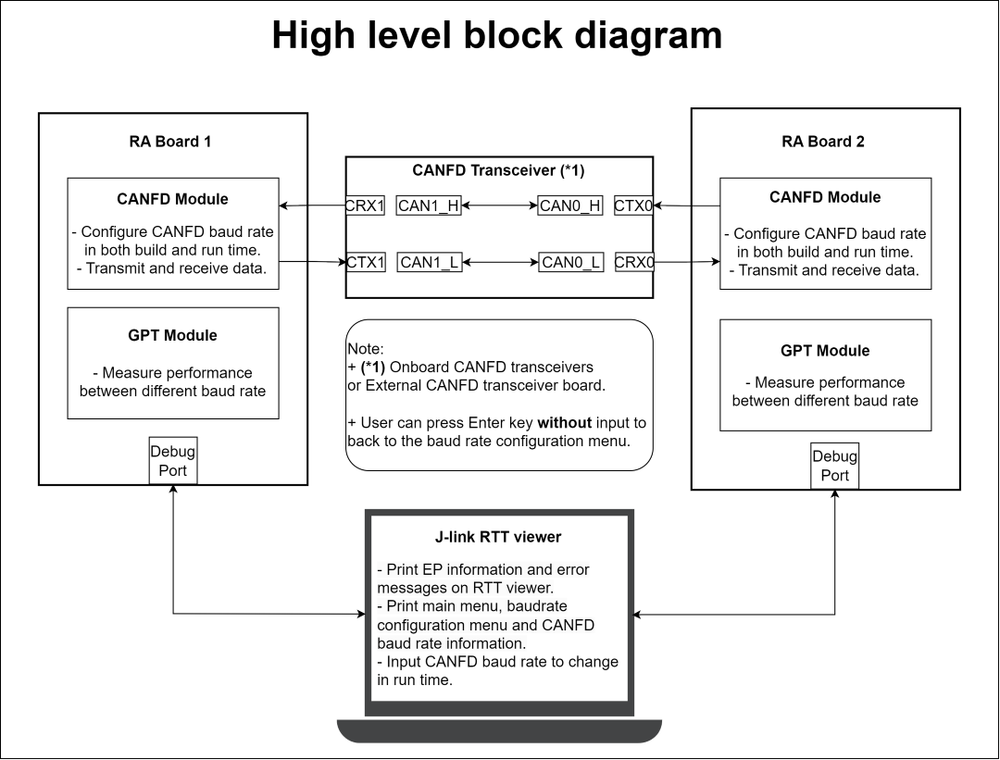
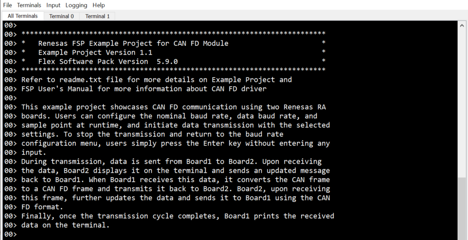
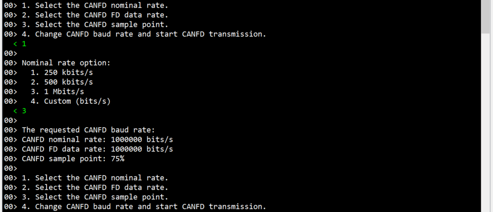
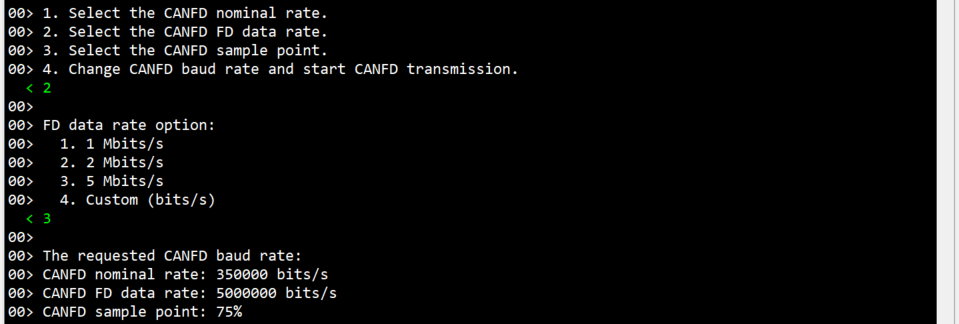
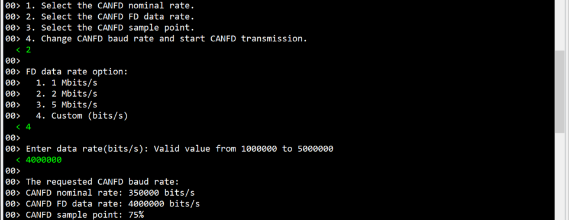
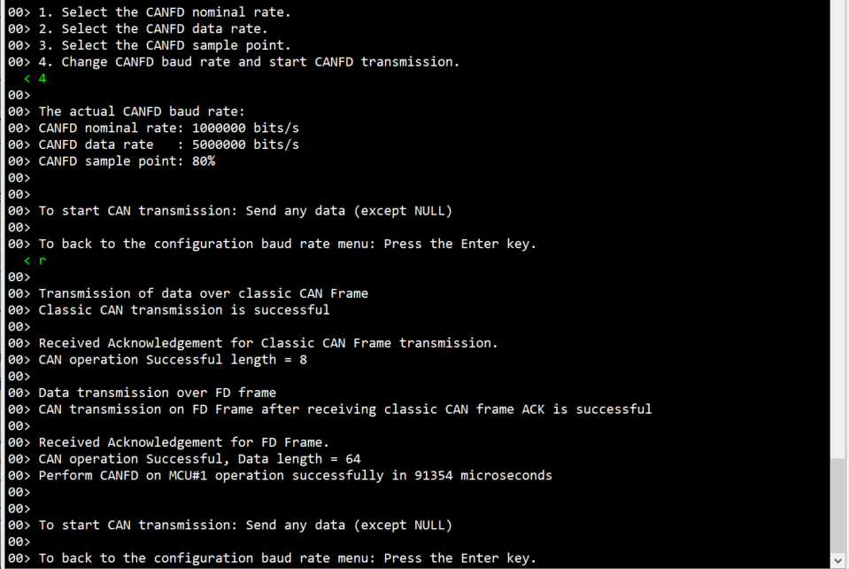
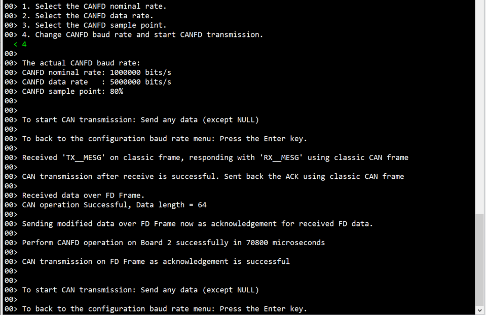

# Introduction #

This example project showcases CAN FD communication using two Renesas RA boards. Users can configure the nominal baud rate, data baud rate, and sample point at runtime, and initiate data transmission with the selected settings. To stop the transmission and return to the baud rate configuration menu, users simply press the Enter key without entering any input.

During transmission, data is sent from Board1 to Board2. Upon receiving the data, Board2 displays it on the terminal and sends an updated message back to Board1. When Board1 receives this data, it converts the CAN frame to a CAN FD frame and transmits it back to Board2. Board2, upon receiving this frame, further updates the data and sends it to Board1 using the CAN FD format.

Finally, once the transmission cycle completes, Board1 prints the received data on the terminal.

**Note**: In this example project, the same code runs on both boards. The board from which the user initiates the transmission becomes board1, and the board which receives the data becomes board2.

Please refer to the [Example Project Usage Guide](https://github.com/renesas/ra-fsp-examples/blob/master/example_projects/Example%20Project%20Usage%20Guide.pdf) 
for general information on example projects and [readme.txt](./readme.txt) for specifics of operation.

## Required Resources ##
To build and run the CAN FD example project, the following resources are needed.

### Hardware Requirements ###
* Supported RA boards: EK-RA6M5
* 2 x RA boards
* 2 x Micro USB cables  
* For using on board CAN Transceivers: 3 x Jumper wires with both ends female
* For using external CAN-FD Transceiver Board (eg.OM13099): 
    * 1 x OM13099 (CAN-FD Transceiver Board): 
        * Link product: [OM13099 (CAN-FD Transceiver Board)](https://www.nxp.com/products/interfaces/can-transceivers/can-with-flexible-data-rate/dual-can-fd-transceiver-shield:OM13099).
        * Manufacturer Product Number: OM13099
    * 9 x Jumper wires with both ends female

### Hardware Connections  ###
Note: This project requires two RA boards, which may be the same MCUs (e.g., EK-RA8M1 <-> EK-RA8M1) or different MCUs (e.g., EK-RA8M1 <-> EK-RA6T3).

Identical boards with onboard CAN transceivers populated: simply connect CANH, CANL, and GND between the two boards.

Identical boards without populated transceivers (e.g., EK-RA8D1 <-> EK-RA8D1) or different board types lacking onboard transceivers (e.g., EK-RA8D1 <-> EK-RA6T3): use an external OM13099 board and wire it as detailed in the optional sections for each board combination.

* EK-RA6M5:
    * For using on board CAN Transceivers:
        - Short E33, E34 & E35 
        - J33:1 of board 1 to J33:1 of board 2
        - J33:2 of board 1 to J33:2 of board 2
        - J33:3 of board 1 to J33:3 of board 2

    * (Optional) For using external CAN-FD Transceiver Board:
    	- Note: To use the external CAN-FD transceiver, the user must either cut E33, E34, and E35 to prevent conflicts with the onboard CAN transceiver or configure alternative CAN CTX and CRX pins instead of cutting E33, E34, and E35.

        |     Board 1      | OM13099 (CAN-FD Transceiver Board) |     Board 2      |
		|------------------|------------------------------------|------------------|
		| CTX P609 (J3:12) |           CAN0 TX (J3:4)           |        ---       |
		| CRX P610 (J3:13) |           CAN0 RX (J3:2)           |        ---       |
		|   VCC (J18:4)    |            3V3 (J3:12)             |        ---       |
		|   5V0 (J18:5)    |            5V0 (J3:14)             |        ---       |
		|   GND (J18:6)    |            GND (J3:16)             |        ---       |
		|        ---       |           CAN1 TX (J1:4)           | CTX P609 (J3:12) |
		|        ---       |           CAN1 RX (J1:2)           | CRX P610 (J3:13) |
		|        ---       |           P3:2 <-> P3:13           |        ---       |
		|        ---       |           P3:7 <-> P3:18           |        ---       |

### Software Requirements ###
* Renesas Flexible Software Package (FSP): Version 6.1.0
* e2 studio: Version 2025-07
* GCC ARM Embedded Toolchain: Version 13.2.1.arm-13-7
* SEGGER J-Link RTT Viewer: Version 8.58

Refer to software requirements mentioned in [Example Project Usage Guide](https://github.com/renesas/ra-fsp-examples/blob/master/example_projects/Example%20Project%20Usage%20Guide.pdf)

## Related Collateral References ##
The following documents can be referred to for enhancing your understanding of 
the operation of this example project:
- [FSP User Manual on GitHub](https://renesas.github.io/fsp/)
- [FSP Known Issues](https://github.com/renesas/fsp/issues)

# Project Notes #

## System Level Block Diagram ##

## FSP Modules Used ##
List all the various modules that are used in this example project. Refer to the FSP User Manual for further details on each module listed below.

| Module Name | Usage  | Searchable Keyword|
|-------------|-----------------------------------------------|-----------------------------------------------|
| CANFD | CANFD module is used to support CAN with both flexible data rate and classic frame, to support multiple channel operation and gateway function. | CAN |
| GPT | GPT is used to measure execution time of CANFD module operations. | r_gpt |

## Module Configuration Notes ##
This section describes FSP Configurator properties which are important or different than those selected by default. 

**Note**: Following is the formula for data and nominal rate calculation.

**baud rate = canfd_clock_hz / ((time_segment_1 + time_segment_2 + 1) * prescalar)**

Refer [FSP User Manual on GitHub](https://renesas.github.io/fsp/group___c_a_n_f_d.html) for more details like min, max values of time_segment_1, time_segment_2 and prescalar.

These values are chosen by taking reference of ek-ra6m5 hardware user manual from the **Section 32.4.1**

**Configuration Properties for CANFD instance**
|   Module Property Path and Identifier   |   Default Value   |   Used Value   |   Reason   |
| :-------------------------------------: | :---------------: | :------------: | :--------: |
| configuration.xml > Stacks > Properties > g_canfd0 CAN FD (r_canfd) > Settings > Property > Common > Global Error Interrupt > Sources  | ☐ | ☑ | Error conditions for which interrupt has to be triggered are enabled, so that the application handles them by setting error status flags in callback. |
| configuration.xml > Stacks > Properties > g_canfd0 CAN FD (r_canfd) > Settings > Property > Common > Reception > Message Buffers > Number of buffers | 0 | 1 | Number of RX Message Buffer to be used for reception is specified here. '0' value disables the RX message buffers. |
| configuration.xml > Stacks > Properties > g_canfd0 CAN FD (r_canfd) > Settings > Property > Common > Reception > Message Buffers > Payload Size | 8 bytes | 64 bytes | Maximum data payload size of 64 is specified here for the RX message buffer to accommodate data length in FD frame. |
| configuration.xml > Stacks > Properties > g_canfd0 CAN FD (r_canfd) > Settings > Property > Module g_canfd0 CAN FD (r_canfd) > Bitrate > Manual > Use Manual Settings | No | Yes | Use manual baud rate values so that automatic baud rate values are overwritten and user configured baud rate values are used. |
| configuration.xml > Stacks > Properties > g_canfd0 CAN FD (r_canfd) > Settings > Property > Module g_canfd0 CAN FD (r_canfd) > Transmit Interrupts > TXMB 0 | ☐ | ☑ | Relevant Tx buffer is enabled to trigger interrupt after transmission is complete. |
| configuration.xml > Stacks > Properties > g_canfd0 CAN FD (r_canfd) > Settings > Property > Module g_canfd0 CAN FD (r_canfd) > Channel Error Interrupts | Not check | Checked | Required channel error interrupt sources are enabled for which interrupt has to be triggered are enabled, so that the application handles them by setting error status flags in callback. |

**Configuration Properties for GPT instance**
|   Module Property Path and Identifier   |   Default Value   |   Used Value   |   Reason   |
| :-------------------------------------: | :---------------: | :------------: | :--------: |
| configuration.xml > g_timer_periodic Timer, General PWM (r_gpt) > Settings > Property > Module g_timer Timer, General PWM (r_gpt) > General > Channel | 0 | 0 | Use GPT Channel 0 to measure execution time of CANFD operations. |
| configuration.xml > g_timer_periodic Timer, General PWM (r_gpt) > Settings > Property > Module g_timer Timer, General PWM (r_gpt) > General > Period | 0x10000 | 0x100000000 | Set the period to 0x100000000 raw count. |

## API Usage ##

The table below lists the API used at the application layer by this example project.

| API Name    | Usage                                                                          |
|-------------|--------------------------------------------------------------------------------|
| R_CANFD_Open | This API is used to initialize CANFD module. |
| R_CANFD_Write | This API is used to write data to the CANFD channel. |
| R_CANFD_InfoGet | This API is used to get the status information for CAN transmission. |
| R_CANFD_Read | This API is used to  read data from a CANFD Message Buffer or FIFO. |
| R_CANFD_Close | This API is used to close the CANFD channel. |
| R_IOPORT_PinWrite | This API is used to set pin's status. |
| R_GPT_Open | This API is used to initialize GPT module. |
| R_GPT_Reset | This API is used to clear GPT count value. |
| R_GPT_Start | This API is used to start GPT module. |
| R_GPT_StatusGet | This API is used to get GPT count value. |
| R_GPT_InfoGet | This API is used to get GPT clock frequency. |
| R_GPT_Stop | This API is used to stop GPT module. |
| R_GPT_Close | This API is used to de-initialize GPT module. |

## Verifying operation ##
1. Import the example project. 
2. Generate, and build the example project.
3. Before running the example project, make sure hardware connections are completed.
4. Connect the RA Board debug port to the host PC via a micro USB cable.
5. Open J-Link RTT Viewer and connect to the RA board.
6. Debug or flash the example project to the RA board to view output log.

Note: Since the same project applies to both boards, repeat these steps on Board 2 as well.

Below images showcases the output on J-Link RTT Viewer :

Menu option:

Change baudrate runtime (make sure the configured baud rate of 2 Boards are same):

Data Transmission from B1 to B2

Board 1 log:

Board 2 log:

## Special Topics ##
1. Ensure the configured baud rate of 2 Boards are same.
3. The user is expected to enter data not exceeding 15 bytes in size.
4. For OM13099 (CAN Transceiver Board):
	* Connect P3 loopback connection on CAN Transceiver Board with jumper cables instead of a db9 serial cable.
	* Connect jumpers J3, J4, J5 and J6 on OM13099 (CAN Transceiver Board) to establish connection to CAN termination resistors.