# Introduction #

This project demonstrates the basic functionalities of USB Host Composite(CDC and MSC) on Renesas RA MCUs based on Renesas FSP. In this example, the application will configure the MCU as a Host Communications Device Class (HCDC) and as a Host Mass StorageClass(HMSC). The EP will present a menu list for user to communicate with both the PMSC and PCDC devices. The usb_composite EP can be used as the PCDC device and the PMSC device to demonstrate this USB Multi Host example. For HCDC operation, the host prompts the user to input text for transfer to the PCDC device and retrieves echoed data from the PCDC device. For HMSC operation, the EP performs File Operations such as Creating, Writing, Reading and Deleting of a file and USB Specific operations such as formatting, ejecting and reinitializing a USB drive.

In case only the PCDC device is connected or only the PMSC device is connected, The EP will provide the corresponding operation: USB CDC operation or USB MSC operation.

The EP information will be displayed on the terminal application. The User can select between the SEGGER J-Link RTT viewer and the serial terminal (UART) with J-Link OB VCOM for the terminal application. Note that the EP supports the serial terminal by default.

Please refer to the [Example Project Usage Guide](https://github.com/renesas/ra-fsp-examples/blob/master/example_projects/Example%20Project%20Usage%20Guide.pdf) 
for general information on example projects and [readme.txt](./readme.txt) for specifics of operation.

## Required Resources ##
To build and run the usb host vendor example project, the following resources are needed.

### Hardware ###
* 2 x RA board:
  * 1 x RA board runs the usb_composite EP or usb_pcdc EP(optional).
  * 1 x RA board runs the USB Multi-Host EP.
* 1 x Micro USB host cable (type-A female to micro-B male).
* 2 x Micro USB device cable (type-A male to micro-B male).
* 1 x USB Flash Drive (optional).

### Hardware Connections ###
The USB Multi-Host Example Project configures the USB speed mode as follows:
* For EK-RA8D1:
  * High-Speed (Default)
    * For EK-RA8D1, the user needs to turn off SW1-6 to use USB HS.		
    * Set jumper J7 to pins 1-2.
    * Remove the jumper from J17.
    * Connect the USB device to the J31 connector using a micro USB host cable.
    * Connect the micro USB end of the micro USB device cable to micro-AB USB Debug port (J10) of the 
    RA board and Connect the other end of this cable to the USB port of the host PC.

  * Full-Speed
    * Set jumper J12 to pins 1-2.
    * Remove the jumper from J15.
    * Connect the USB device to the J11 connector using a micro USB host cable.
    * Connect the micro USB end of the micro USB device cable to micro-AB USB Debug port (J10) of the 
			RA board and Connect the other end of this cable to the USB port of the host PC.

  Note: To change to another USB speed mode, please refer to the Special Topic section.

Snapshots of hardware connections:

 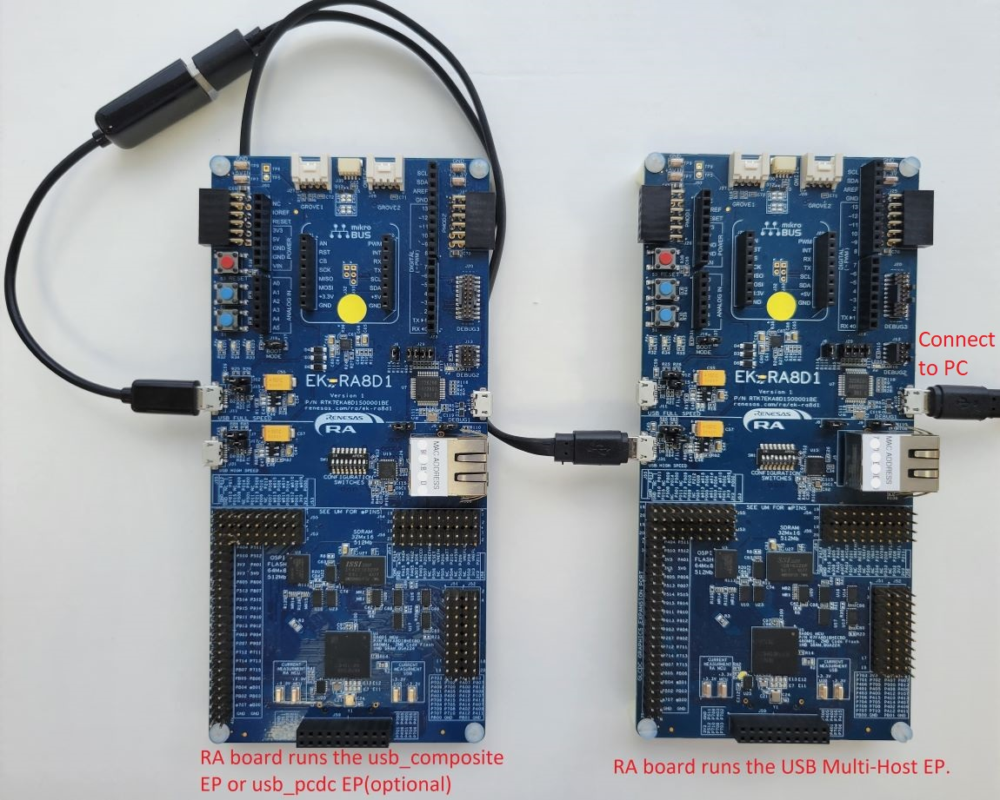

### Software ###
* Renesas Flexible Software Package (FSP): Version 5.8.0
* e2 studio: Version 2025-01
* SEGGER J-Link RTT Viewer: Version 8.12c
* GCC ARM Embedded Toolchain: Version 13.2.1.arm-13-7
* Terminal Console Application: Tera Term or a similar application

## Related Collateral References ##
The following documents can be referred to for enhancing your understanding of 
the operation of this example project:
- [FSP User Manual on GitHub](https://renesas.github.io/fsp/)
- [FSP Known Issues](https://github.com/renesas/fsp/issues)

# Project Notes #

## System Level Block Diagram ##

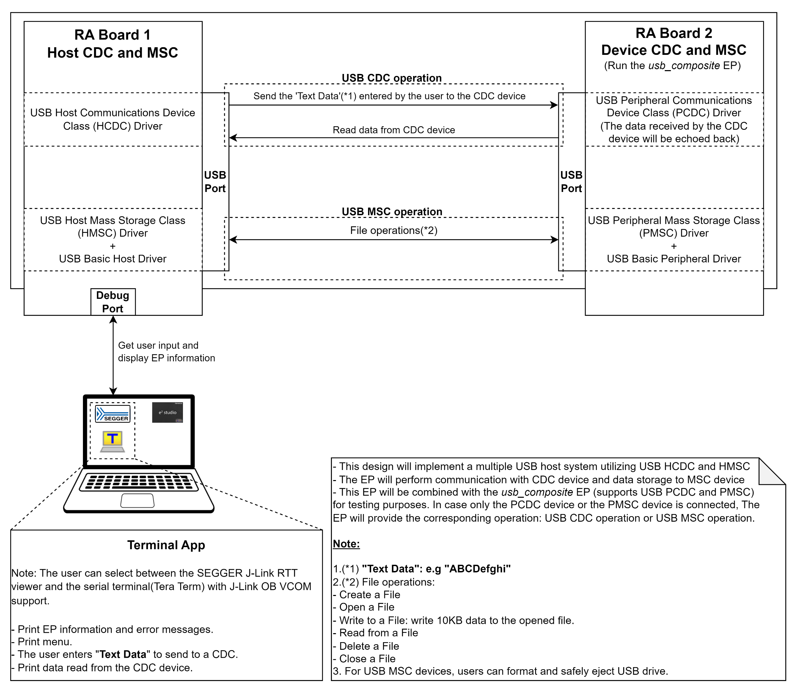  

## FSP Modules Used ##
List all the various modules that are used in this example project. Refer to the FSP User Manual for further details on each module listed below.

| Module Name | Usage  | Searchable Keyword (using New Stack > Search) |
|-------------|-----------------------------------------------|-----------------------------------------------|
| FreeRTOS+FAT | The FreeRTOS+FAT port provides notifications for insertion and removal of removable media and provides initialization functions required by FreeRTOS+FAT.  | rm_freertos_plus_fat |
| Block Media USB | Middleware to implement the block media interface on USB mass storage devices.  | rm_block_media_usb |
| USB HMSC | This module provides a USB Host Mass storage class support on RA device. Using USB HMSC in combination with a file system it is possible to communicate with USB storage devices. | r_usb_hmsc |
| USB Basic Driver | USB driver operates in combination with the device class drivers provided by Renesas to form a complete USB stack. | r_usb_basic |
| FreeRTOS Heap 4 | FreeRTOS Heap is required for FreeRTOS standard Library Functions. | FreeRTOS heap 4 |
| USB HCDC | USB HCDC is used for data transfer to and from a CDC peripheral device. | r_usb_hcdc |
| DMAC Transfer | DMAC is used to transfer the USB data to offload MCU usage. | r_dmac |

## Module Configuration Notes ##
This section describes FSP Configurator properties which are important or different than those selected by default. 

|   Module Property Path and Identifier   |   Default Value   |   Used Value   |   Reason   |
| :-------------------------------------: | :---------------: | :------------: | :--------: |
|   configuration.xml -> USB HMSC Thread > Settings > Property > Thread > Stack Size  |   1024   |   4096   |   This is changed to handle its worst-case function call nesting and local variable usage.   |
|   configuration.xml -> USB HMSC Thread > Settings > Property > Common > Memory Allocation > Support Dynamic Allocation |   Disabled   |   Enabled   |   RTOS objects can be created using RAM that is automatically allocated from the FreeRTOS heap.   |
|   configuration.xml -> USB HMSC Thread > Settings > Property > Common > Memory Allocation > Total Heap Size |   0  |   61440   |   This is changed because Dynamic Allocation support is enabled, so application makes use of amount of RAM available in the FreeRTOS heap.   |
|   configuration.xml -> USB HMSC Thread > Settings > Property > Common > General > Use Mutexes. |   Disabled  |   Enabled   |   This is changed to use Mutexes.   |
|   configuration.xml -> USB HMSC Thread > Settings > Property > Common > General > Use Recurisve Mutexes. |   Disabled  |   Enabled   |   This is changed to use Recurisve Mutexes    |
|   configuration.xml -> USB HMSC Thread > FreeRTOS+FAT > FreeRTOS+FAT Port for RA > Settings > Properties > module FreeRTOS+FAT Port for RA > Callback |   NULL   | free_rtos_fat_callback |   As RTOS is used, so the callback function is set and this callback function will notify user about occurrence of usb events. |
|   configuration.xml -> USB HMSC Thread > FreeRTOS+FAT > FreeRTOS+FAT Port for RA > g_basic0 USB > Settings > Properties > Common > DMA Support |   Disabled   | Enabled |   DMAC is used to handle the USB data transfer to offload MCU usage. |
|   configuration.xml -> USB HMSC Thread > FreeRTOS+FAT > FreeRTOS+FAT Port for RA > g_basic0 USB > Settings > Properties > Common > DMA Source Address |   DMA Disabled   | HS Address |  USB basic driver is configured USB Speed as Hi Speed. Accordingly, DMA Source Address should provide with HS Address. |
|   configuration.xml -> USB HMSC Thread > FreeRTOS+FAT > FreeRTOS+FAT Port for RA > g_basic0 USB > Settings > Properties > Common > DMA Destination Address |   Disabled   | HS Address |   USB basic driver is configured USB Speed as Hi Speed. Accordingly, DMA Source Address should provide with HS Address.|
|   configuration.xml -> USB HMSC Thread > FreeRTOS+FAT > FreeRTOS+FAT Port for RA > g_basic0 USB > Settings > Properties > Module g_basic0 USB > USB Speed |   Full Speed   | Hi Speed |   USB Speed is configured as High Speed. |
|   configuration.xml -> USB HMSC Thread > FreeRTOS+FAT > FreeRTOS+FAT Port for RA > g_basic0 USB > Settings > Properties > Module g_basic0 USB > USB Module Number |   USB_IP0 Port  | USB_IP1 Port |   This property is used to specify USB module number to be used as per configured USB speed. |
|   configuration.xml -> USB HMSC Thread > FreeRTOS+FAT > FreeRTOS+FAT Port for RA > g_basic0 USB > g_transfer0 Transfer > Settings > Module g_transfer0 Transfer > Transfer Size |   2  | 4 |   The transfer size of DMA for High Speed requires 4 Bytes. |
|   configuration.xml -> USB HMSC Thread > FreeRTOS+FAT > FreeRTOS+FAT Port for RA > g_basic0 USB > g_transfer0 Transfer > Settings > Module g_transfer0 Transfer > Activation Source |  No ELC Trigger  | USBHS FIFO 1 |   This is an event trigger for DMA transfer 1 instance for source pointer address. |
|   configuration.xml -> USB HMSC Thread > FreeRTOS+FAT > FreeRTOS+FAT Port for RA > g_basic0 USB > g_transfer1 Transfer > Settings > Module g_transfer11 Transfer > Transfer Size |   2  | 4 |  The transfer size of DMA for High Speed requires 4 Bytes.  |
|   configuration.xml -> USB HMSC Thread > FreeRTOS+FAT > FreeRTOS+FAT Port for RA > g_basic0 USB > g_transfer1 Transfer > Settings > Module g_transfer1 Transfer > Activation Source |  No ELC Trigger  | USBHS FIFO 0 |   This is an event trigger for DMA transfer 0 instance for source pointer address. |
|   configuration.xml -> USB HCDC Thread > Settings > Property > Thread > Stack Size  |   1024   |   4096   |   This is changed to handle its worst-case function call nesting and local variable usage.   |
|   configuration.xml -> USB HCDC Thread > Settings > Property > Thread > Priority  |   1  |   2   |   This is changed to set thread priority.   |
|   configuration.xml -> USB HCDC Thread > g_hcdc0 USB HCDC > Settings > Property > Common > Bulk Input Transfer Pipe  |   USB PIPE4   | USB PIPE3 |   This is changed to set the USB pipe used.  |
|   configuration.xml -> USB HCDC Thread > g_hcdc0 USB HCDC > Settings > Property > Common > Bulk Output Transfer Pipe  |   USB PIPE5   | USB PIPE4 |   This is changed to set the USB pipe used.   |

## API Usage ##

The table below lists the FSP provided API used at the application layer by this example project.

| API Name    | Usage                                                                          |
|-------------|--------------------------------------------------------------------------------|
|RM_FREERTOS_PLUS_FAT_Open | Initialize lower layer media device. |
|RM_FREERTOS_PLUS_FAT_MediaInit | Initialize the media device.|
|RM_FREERTOS_PLUS_FAT_DiskInit| Initialize a FreeRTOS+FAT disk structure.|
|RM_FREERTOS_PLUS_FAT_DiskDeinit|Deinitialize a FreeRTOS+FAT disk structure.|
|RM_FREERTOS_PLUS_FAT_Close|Close media device.|
|ff_fopen|Open a file.|
|ff_fclose|Flush then close a file.|
|ff_fread|Read data from a file.|
|ff_fwrite|Write data to a file.|
|ff_remove|Remove (delete, or unlink) a file.|
|FF_Format|Format a partition of a disk.|
|FF_Mount|Mount the Specified partition.|
|FF_FS_Add|Add a mounted partition to the FreeRTOS-Plus-FAT virtual file system.|
|stdioGET_ERRNO|Get the error code.|
|R_USB_HostControlTransfer|	Perform settings and transmission processing when transmitting a setup packet.|
|R_USB_Write|Request USB data write.|
|R_USB_Read|Request USB data read.|
|R_SCI_B_UART_Open|Initialize the UART driver.|
|R_SCI_B_UART_Write|write data to the UART interface.|
|R_SCI_B_UART_Read|Read data to the UART interface.|
|R_SCI_B_UART_Abort|Abort the read process when the USB device is disconnected.|
|R_SCI_B_UART_Close| Deinitialize the UART driver.|
## Verifying operation ##

1. Import the example project.

    By default, the EP supports Serial terminal:

    * Define USE_VIRTUAL_COM=1 macro in Project Properties -> C/C++ Build -> Settings -> Tool Settings -> GNU ARM Cross C Compiler -> Preprocessor

    To use SEGGER J-Link RTT Viewer, please follow the instructions as below:

    * Define USE_VIRTUAL_COM=0 macro in Project Properties -> C/C++ Build -> Settings -> Tool Settings -> GNU ARM Cross C Compiler -> Preprocessor

2. Double click Configuration.xml file, and click Generate Project Content. Next, build the project.
3. Connect the RA MCU debug port to the host PC via a micro USB cable.
4. Open a serial terminal application on the host PC (Tera Term) and connect to the COM Port provided by the J-Link onboard. 
   or Open J-link RTT Viewer (In case user selected SEGGER J-Link RTT Viewer).

   * Note: For using the serial terminal:
        * Please ensure that the connection to the RTT viewer has been terminated if it was previously established.
        * The COM port is provided by the J-Link onboard, with a baud rate of 115200 bps, a data length of 8 bits, no parity check, one stop bit, and no flow control.

5. Debug or flash the EP project to the RA board.
6. After the main menu is displayed on the terminal application, the user can select options to perform USB operations.
  * The below images showcase the output on the Serial terminal application (Tera Term)
    * Option 1: Connecting to the CDC and MSC devices

      The EP information :
      
      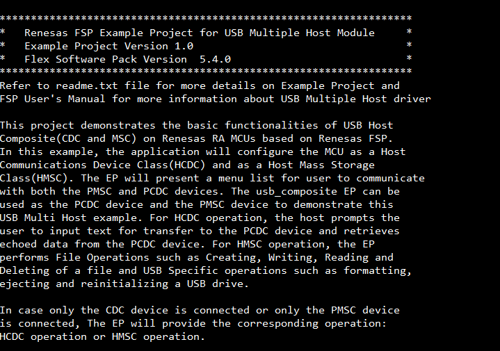

      The CDC and MSC devices are connected: 

      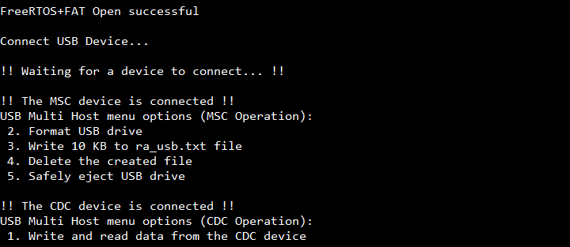

      Write and read operation:

      

      Write 10k data from app_buffer to ra_usb.txt operation:

      
   
      Delete the created file operation:

      

      Format disk: Due to limitations in RAM size on the MCU, it is unable to format the USB drive (FAT16 or FAT32) when testing with the usb_composite EP.

      

      Safety Eject USB drive operation:

        

      Re-initialize USB drive operation:

      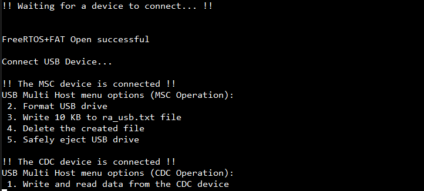  

      Notify USB Device is disconnected without first using the Eject option and waiting for USB to reconnect:

        
  
    * Option 2: Connecting to a USB flash drive

      The MSC device is conneted: 

      

      Format disk:

      

      Write 10k data from app_buffer to ra_usb.txt operation:

      

      Delete the created file operation:

      

      Safety Eject USB drive operation:

        

      Re-initialize USB drive operation:

      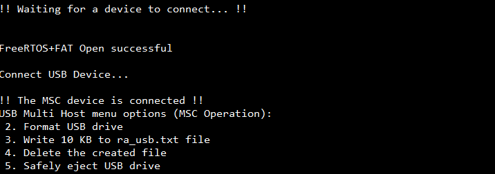  

      Notify USB Device is disconnected without first using the Eject option and waiting for USB to reconnect:

        

    * Option 3: Connecting to CDC device (usb_pcdc EP)

      The CDC device is conneted: 

      

      Get kit information from CDC device operation:

      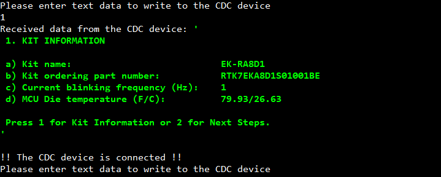

      Get next step information from CDC device operation:

      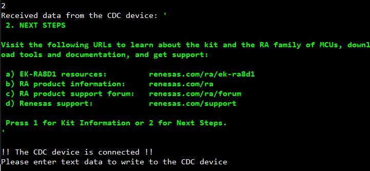

      Remove the CDC device:

      

## Special Topic ##
To change USB speed mode, users can refer to the following configuration:

* USB High-speed configuration with DMAC support:

 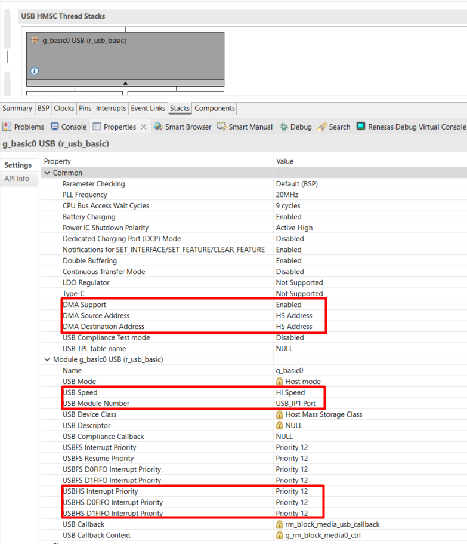

 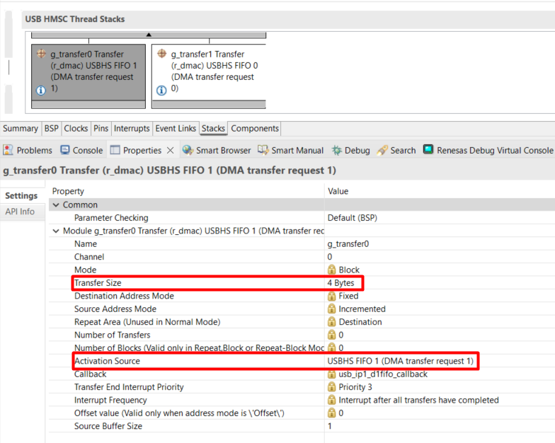

 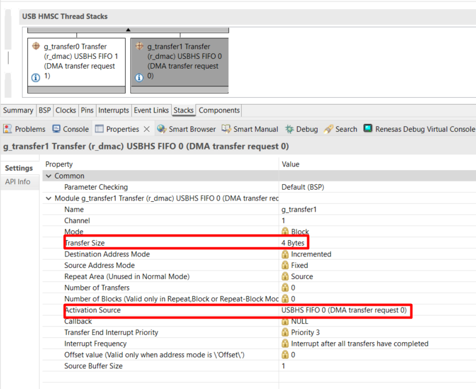

 * USB Full-speed configuration with DMAC support:

 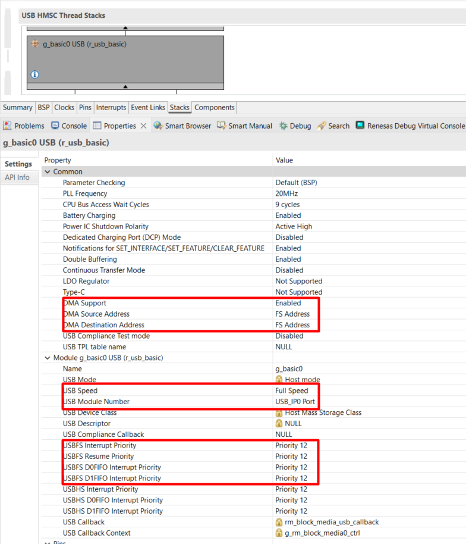

 

 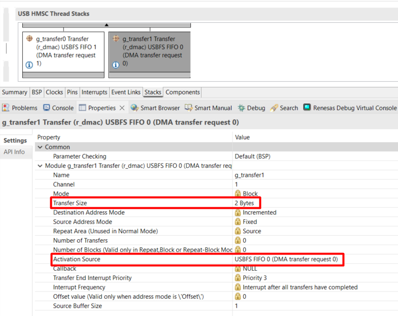

Special notes:

* For HMSC operation:
	1) Format the USB drive(with FAT16/FAT32 file system) before performing any operation. Due to limitations in RAM size on MCU, we are  unable to format(FAT16 or FAT32) the USB drive when testing with composite EP.
	2) Data written can also be manually verified in file ra_usb.txt.
	3) User is expected to execute "safely_eject" option before removing USB else further file operations may fail and USB data
	   may get corrupted.
	4) If USB is removed without "safely_eject" option, user is recommended to perform "safely_eject" and re-initialise USB. 
	   This will make sure no USB operations fail after unexpected removal of USB.
	   