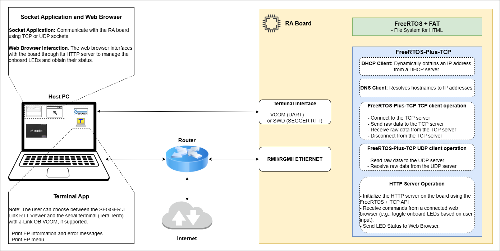
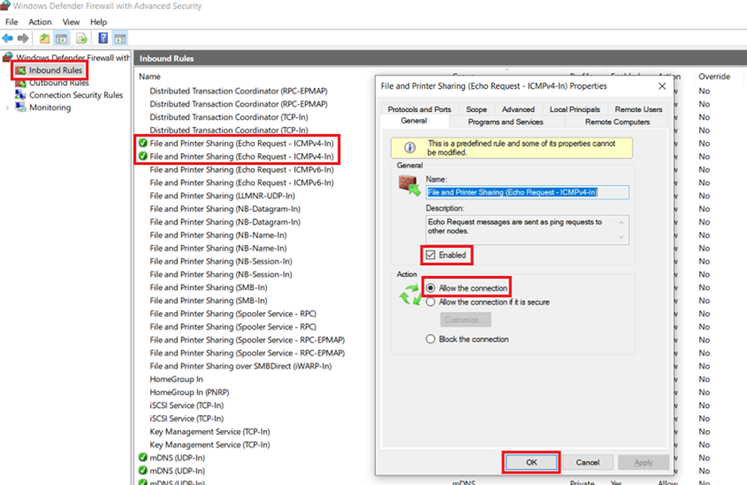
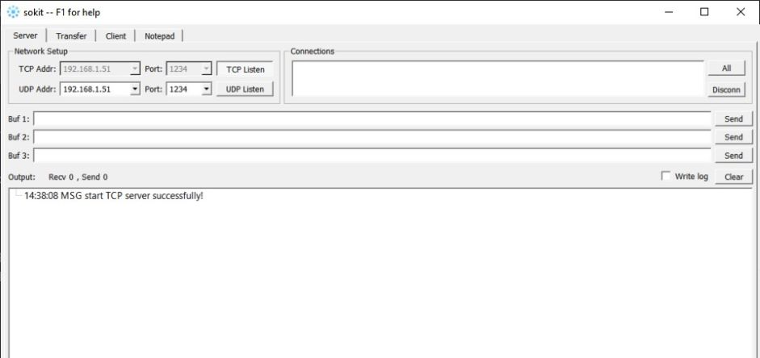
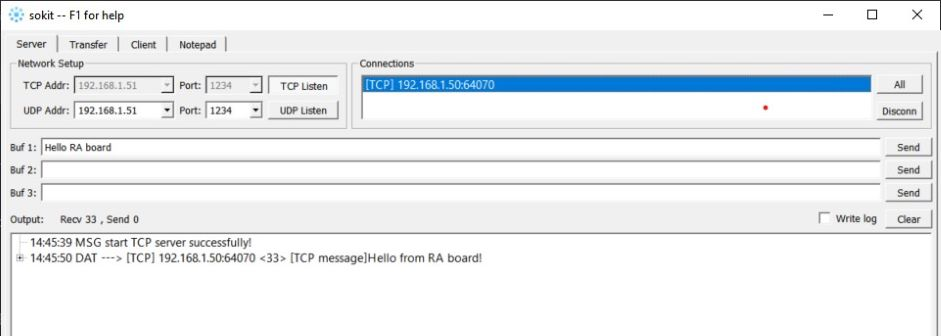
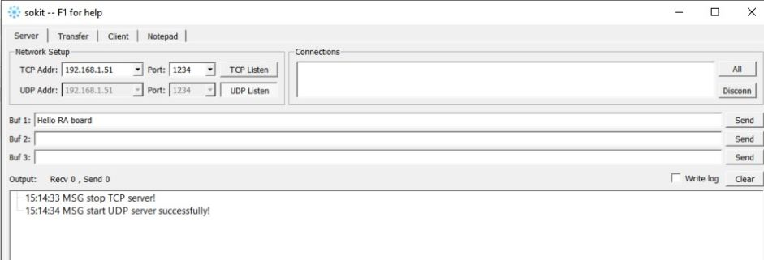
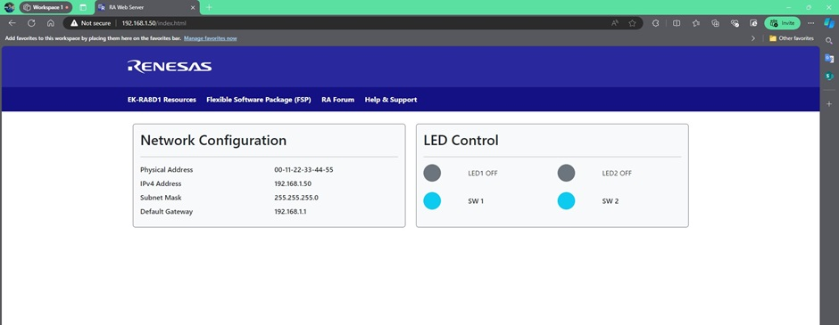

# Introduction #
This example project demonstrates FreeRTOS-Plus-TCP's networking capabilities using the Ethernet interface of the RA MCU. It utilizes the FreeRTOS-Plus-TCP stack to perform various network operations, including sending and receiving data over TCP and UDP protocols. The RA board will automatically obtain an IP address from the network using a DHCP (Dynamic Host Configuration Protocol) client service.

Once the RA board successfully acquires the IP address, users can interact with the system by selecting options from a menu, which is accessible via the RTT Viewer or a terminal application running on the host PC. After the RA board retrieves its IP address from the router, it will display the network configuration details, along with the available menu options, in the terminal application. This enables the user to explore different features and operations supported by the network stack.

Key functionalities in this example include:
* TCP Client Service: Establish a connection with the server, send a request, wait for the server's response, and disconnect upon completion.
* UDP Client Service: Send a message to a server and listen for the response.
* DNS Client Service: Perform a DNS query based on a domain name specified by the user.
* Web HTTP Server: Process HTTP requests from a browser, allowing users to access the homepage, view board network configurations, control onboard LEDs, and check their status.

Note:
* Information can be displayed using either the SEGGER J-Link RTT Viewer or a serial terminal (UART) via J-Link OB VCOM, depending on availability. If J-Link OB VCOM is unsupported, the example project defaults to the SEGGER J-Link RTT Viewer. If supported, it defaults to the serial terminal (UART).
* To use the SEGGER J-Link RTT Viewer instead of the Serial Terminal, please refer to the instructions provided in the Special Topic.

Please refer to the [Example Project Usage Guide](https://github.com/renesas/ra-fsp-examples/blob/master/example_projects/Example%20Project%20Usage%20Guide.pdf) for general information on example projects and [readme.txt](./readme.txt) for specifics of operation.

## Required Resources ##
To build and run the FreeRTOS Network Example project, the following resources are needed.

### Software ###
* Renesas Flexible Software Package (FSP): Version 6.2.0
* e2 studio: Version 2025-10
* SEGGER J-Link RTT Viewer: Version 8.74
* LLVM Embedded Toolchain for ARM: Version 18.1.3
* Terminal Console Application: Tera Term or a similar application
* Socket Application: sokit version 1.3, etc.
* Browser Application: Microsoft Edge, Google Chrome, etc.

### Hardware ###
* Supported RA boards: EK-RA8D1, EK-RA6M3, EK-RA6M3G, EK-RA6M4, EK-RA6M5, EK-RA8M1, EK-RA8P1, EK-RA8D2
* 1 x Ethernet router with an internet connection.
* 2 x Ethernet cables to connect the RA board and the host PC to the router.
* 1 x Type-C USB cable for programming, debugging, and status display on the terminal (Tera Term or SEGGER RTT J-Link Viewer).

### Hardware Connections ###
* Power on the Router: Ensure the router is powered on and properly connected to the internet. Verify that the router’s LAN ports 
	are active and available for connections.
* Connect the RA Board to the Router: Take an Ethernet cable and connect one end to the Ethernet port on the RA board, 
	and the other end to one of the router's available LAN ports. This connection allows the RA board to communicate with 
	the network and obtain an IP address via DHCP.
* Connect the Host PC to the Router: Using a second Ethernet cable, connect the host PC to another LAN port on the same router. 
	This step ensures that both the RA board and the host PC are on the same network, enabling communication between them 
	for debugging and menu operations.
* Connect the RA Board to the Host PC: Using a Type-C USB cable, connect the RA board to the host PC. This connection is necessary 
	for programming the RA board, enabling debugging, and displaying runtime information in the terminal or RTT Viewer on the host PC.
* By following these steps, you'll establish proper hardware connections between the RA board, the router, and the host PC, 
	ensuring smooth network communication and debugging capabilities.
* For EK-RA8D1: Set the configuration switches (SW1) as below.

  | SW1-1 PMOD1 | SW1-2 TRACE | SW1-3 CAMERA | SW1-4 ETHA | SW1-5 ETHB | SW1-6 GLCD | SW1-7 SDRAM | SW1-8 I3C |
  |-------------|-------------|--------------|------------|------------|------------|-------------|-----------|
  | OFF | OFF | OFF | OFF | ON | OFF | OFF | OFF |

* For EK-RA8M1: Remove jumper J61 to enable Ethernet B.

## Related Collateral References ##
The following documents can be referred to for enhancing your understanding of the operation of this example project:
- [FSP User Manual on GitHub](https://renesas.github.io/fsp/)
- [FSP Known Issues](https://github.com/renesas/fsp/issues)

# Project Notes #

## System Level Block Diagram ##



## FSP Modules Used ##
List all the various modules that are used in this example project. Refer to the FSP User Manual for further details on each module listed below.

| Module Name | Usage  | Searchable Keyword (using New Stack > Search) |
|-------------|-----------------------------------------------|-----------------------------------------------|
| FreeRTOS+FAT | This module provides a FAT file system for managing files on block devices. | FreeRTOS+FAT |
| FreeRTOS+FAT Port for RA | This module provides the hardware port layer for FreeRTOS+FAT file system. | rm_freertos_plus_fat |
| Block Media SPI Flash | Middleware to implement the block media interface on SPI flash memory. | rm_block_media_spi |
| FreeRTOS+TCP | This module implements a lightweight TCP/IP stack for enabling network communication. | FreeRTOS+TCP |
| FreeRTOS+TCP Wrapper to r_ether | This module provides the network interface required to use FreeRTOS Plus TCP with the Ethernet (r_ether) driver. | rm_freertos_plus_tcp |
| Ethernet | This module performs Ethernet frame transmission and reception using an Ethernet controller. | r_ether |
| OSPI Flash | Utilized for block media storage and file system implementation. | r_ospi_b |

For EK-RA6M3, EK-RA6M3G, EK-RA6M4, EK-RA6M5:

| Module Name | Usage | Searchable Keyword  |
|-------------|-----------------------------------------------|-----------------------------------------------|
| FreeRTOS+FAT | This module provides a FAT file system for managing files on block devices. | FreeRTOS+FAT |
| FreeRTOS+FAT Port for RA | This module provides the hardware port layer for FreeRTOS+FAT file system. | rm_freertos_plus_fat |
| Block Media SPI Flash | Middleware to implement the block media interface on SPI flash memory. | rm_block_media_spi |
| FreeRTOS+TCP | This module implements a lightweight TCP/IP stack for enabling network communication. | FreeRTOS+TCP |
| FreeRTOS+TCP Wrapper to r_ether | This module provides the network interface required to use FreeRTOS Plus TCP with the Ethernet (r_ether) driver. | rm_freertos_plus_tcp |
| Ethernet | This module performs Ethernet frame transmission and reception using an Ethernet controller. | r_ether |
| QSPI Flash | Utilized for block media storage and file system implementation. | r_qspi |

For EK-RA8P1, EK-RA8D2:

| Module Name | Usage | Searchable Keyword  |
|-------------|-----------------------------------------------|-----------------------------------------------|
| FreeRTOS+FAT | This module provides a FAT file system for managing files on block devices. | FreeRTOS+FAT |
| FreeRTOS+FAT Port for RA | This module provides the hardware port layer for FreeRTOS+FAT file system. | rm_freertos_plus_fat |
| Block Media SPI Flash | Middleware to implement the block media interface on SPI flash memory. | rm_block_media_spi |
| FreeRTOS+TCP | This module implements a lightweight TCP/IP stack for enabling network communication. | FreeRTOS+TCP |
| FreeRTOS+TCP Wrapper to r_ether | This module provides the network interface required to use FreeRTOS Plus TCP with the Ethernet (r_ether) driver. | rm_freertos_plus_tcp |
| RMAC | This module performs Ethernet frame transmission and reception using the RMAC controller. | r_rmac |
| OSPI Flash | Utilized for block media storage and file system implementation. | r_ospi_b |

## Module Configuration Notes ##
This section describes FSP Configurator properties which are important or different from those selected by default.

|   Module Property Path and Identifier   |   Default Value   |   Used Value   |   Reason   |
| :-------------------------------------: | :---------------: | :------------: | :--------: |
| configuration.xml > BSP > Properties > Settings > Property > RA Common > Heap size (bytes) | 0 | 0x1000 | Increased heap size for memory management. |
| configuration.xml > Stacks > Threads > Net Thread > Properties > Settings > Property > Thread > Stack size (bytes) | 1024 | 8192 | Increased stack size. |
| configuration.xml > Stacks > Threads > Net Thread > Properties > Settings > Property > Common > Memory Allocation > Support Dynamic Allocation | Disabled | Enabled | Enabled support for dynamic allocation. |
| configuration.xml > Stacks > Threads > Net Thread > Net Thread Stacks > FreeRTOS+TCP > Properties > Settings > Property > Common > DHCP callback function | Disabled | Enabled | Enabled DHCP callback function. |
| configuration.xml > Stacks > Threads > Net Thread > Net Thread Stacks > FreeRTOS+TCP > Properties > Settings > Property > Common > FreeRTOS_select() (and associated) API function is available | Disable | Enable | Enabled to facilitate multiple socket handling. |
| configuration.xml > Stacks > Threads > Net Thread > Net Thread Stacks > FreeRTOS+TCP > Properties > Settings > Property > Common > FreeRTOS_SendPingRequest() is available | Disable | Enable | Enabled to allow ping requests for network connectivity verification. |
| configuration.xml > Stacks > Threads > Net Thread > Net Thread Stacks > FreeRTOS+FAT > Properties > Settings > Property > Common > General > FAT12 Support | Disable | Enable | Enabled FAT12 format. |

Configuration Properties for using the Serial Terminal (UART)

| Interrupt event path | Default Value | Used Value | Reason |
| :------------------: | :-----------: | :--------: | :----: |
| configuration.xml > Interrupts > Interrupts Configuration > New User Event > SCI > SCI8 > SCI8 RXI (Receive data full) | empty | sci_b_uart_rxi_isr | Assign the UART receive ISR (Receive data full) to the interrupt vector table. |
| configuration.xml > Interrupts > Interrupts Configuration > New User Event > SCI > SCI8 > SCI8 TXI (Transmit data empty) | empty | sci_b_uart_txi_isr | Assign the UART transfer ISR (Transmit data empty) to the interrupt vector table. |
| configuration.xml > Interrupts > Interrupts Configuration > New User Event > SCI > SCI8 > SCI8 TEI (Transmit end) | empty | sci_b_uart_tei_isr | Assign the UART transfer ISR (Transmit end) to the interrupt vector table. |
| configuration.xml > Interrupts > Interrupts Configuration > New User Event > SCI > SCI8 > SCI8 ERI (Receive error) | empty | sci_b_uart_eri_isr | Assign the UART receive ISR (Receive error) to the interrupt vector table. |

| Clock path | Default Value | Used Value | Reason |
| :--------: | :-----------: | :--------: | :----: |
| configuration.xml > Clocks > Clocks Configuration | SCICLK Src: PLL2R | SCICLK Src: PLL2R | Enable operating clock for SCI module by PLL2R clock source. |

## API Usage ##

The table below lists the FSP provided API used at the application layer by this example project.

| No. | API                           | Description                                                   |
|-----|-------------------------------|--------------------------------------------------------------------------------|
| 1   | FreeRTOS_IPInit               | This API is used to initialize the FreeRTOS+TCP network stack. |
| 2   | FreeRTOS_gethostbyname        | This API is used to resolve a domain name into an IP address. |
| 3   | FreeRTOS_IsNetworkUp          | This API is used to check the current status of the network connection. |
| 4   | R_RMAC_LinkProcess            | This API is used to check the status of the Ethernet link. |
| 5   | FreeRTOS_GetAddressConfiguration | This API is used to get the current IPv4 address configuration. |
| 6   | FreeRTOS_inet_addr            | This API is used to convert the IP address from "w.x.y.z" (dotted decimal) format to the 32-bit format. |
| 7   | FreeRTOS_SendPingRequest      | This API is used to send an ICMP ping request to a remote host. |
| 8   | FreeRTOS_socket               | This API is used to create a socket in the FreeRTOS+TCP stack. |
| 9   | FreeRTOS_setsockopt           | This API is used to configure various options for a socket. |
| 10  | FreeRTOS_connect              | This API is used to initiate a connection from a TCP client socket to a remote server. |
| 11  | FreeRTOS_send                 | This API is used to send data over an already connected TCP socket. |
| 12  | FreeRTOS_recv                 | This API is used to receive data from a connected TCP socket. |
| 13  | FreeRTOS_shutdown             | This API is used to terminate the connection on a specified socket. |
| 14  | FreeRTOS_closesocket          | This API is used to close a socket in the FreeRTOS+TCP stack. |
| 15  | FreeRTOS_sendto               | This API is used to send data over a UDP socket. |
| 16  | FreeRTOS_recvfrom             | This API is used to receive data from a UDP socket. |
| 17  | FreeRTOS_inet_ntoa            | This API is used to convert the IP address to a string. |
| 18  | RM_FREERTOS_PLUS_FAT_Open     | This API is used to initialize the lower-layer media device. |
| 19  | RM_FREERTOS_PLUS_FAT_MediaInit | This API is used to initialize the media device. |
| 20  | RM_FREERTOS_PLUS_FAT_DiskInit | This API is used to initialize a FreeRTOS+FAT disk structure. |
| 21  | FF_Mount                      | This API is used to mount the specified partition. |
| 22  | FF_FS_Add                     | This API is used to add the disk to the file system. |
| 23  | RM_FREERTOS_PLUS_FAT_DiskDeinit | This API is used to de-initialize a FreeRTOS+FAT disk structure. |
| 24  | RM_FREERTOS_PLUS_FAT_Close    | This API is used to close the media device. |
| 25  | ff_fopen                      | This API is used for opening files within a FAT file system. |
| 26  | ff_fwrite                     | This API is used for writing data to an open file within a FAT file system. |
| 27  | ff_fclose                     | This API is used for closing files within a FAT file system. |

## Verifying Operation ##
1. Import the example project.
2. Double click Configuration.xml file, and click Generate Project Content. Next, build the project (Keep the project path short to prevent errors during the build process).
3. Connect the RA MCU debug port to the host PC via a Type-C USB cable.  
Note: Before performing test, please confirm that the host PC has enabled the inbound rule '**File and Printer Sharing (Echo Request - ICMPv4-In)**' for accept ping request from RA MCU to TCP server: **Windows Defender Firewall -> Advanced settings -> Inbound Rules -> Enable File and Printer Sharing (Echo Request - ICMPv4-In).**  

4. Open a serial terminal application on the host PC (Tera Term) and connect to the COM Port provided by the J-Link onboard or Open J-link RTT Viewer (In case the user selected SEGGER J-Link RTT Viewer).
    * Note: For using the serial terminal:
      * Please ensure that the connection to the RTT viewer has been terminated if it was previously established.
      * Please ensure that 'Local echo' is checked to echo back characters typed in serial terminal.
      * The COM port is provided by the J-Link onboard, with a baud rate of 115200 bps, a data length of 8 bits, no parity check, one stop bit, and no flow control.
5. Debug or flash the EP to the RA board.
6. After the main menu is displayed on the terminal application (Tera Term), the user can select options to perform EP operations.
    * Initialize Ethernet IP and obtain a dynamic IP address if DHCP is enabled.

      

    * Once the RA board successfully acquires the IP address, a menu will be show for user selection.

      

    * Send a ping request to the specified IP address.

      

    * Launch a socket application (e.g., Sokit version 1.3) on the host PC. Configure the TCP address and port, then click TCP Listen to create a TCP server.  
    Note: The IP address of System on which sokit is running must be entered under TCP Addr section, so that it runs TCP Server over this entered IP of host PC on network. Suggestion is to TCP server in PC should listen at a port number greater than 10000
      
      
    
      Use the RA board to transmit a TCP message to this server.

      
      
      On the host PC, after receiving the TCP message from the RA board, select the TCP connection and send a response to the RA board.

      

      The message from the host PC will be displayed on the terminal.

      

    * Configure the UDP address and port, then click UDP Listen to create a UDP server.
      
      
    
      Use the RA board to transmit a UDP message to this server.

      
      
      On the host PC, after receiving the UDP message from the RA board, select the UDP connection and send a response to the RA board.

      

      The message from the host PC will be displayed on the terminal.

      

    * Perform a DNS query based on a domain name specified by the user.

      

    * Start a simple HTTP server on the RA board and launch a web browser application to access the webpage.

      

      

    * The user clicks on SW1 or SW2 to toggle the LED on the board.

      

## Special Topic ##

Special notes:
* Information can be displayed using either the SEGGER J-Link RTT Viewer or a serial terminal (UART) via J-Link OB VCOM, depending on availability. If J-Link OB VCOM is unsupported, the example project defaults to the SEGGER J-Link RTT Viewer; if supported, it defaults to the serial terminal (UART).
  * To configure display options:
    * **For UART via J-Link OB VCOM**: Define `USE_VIRTUAL_COM=1`
    * **For J-Link RTT Viewer**: Define `USE_VIRTUAL_COM=0`
  * The board supports J-Link OB VCOM: EK-RA8D1, EK-RA8M1, EK-RA8P1, EK-RA8D2.
    
  Set this in **Project Properties** -> **C/C++ Build** -> **Settings** -> **Tool Settings** -> **Compiler** -> **Includes** -> **Macro Defines (-D)**.

* The HTTP server retrieves web resources from the `web.bin` file located at `Getting_started_with_FreeRTOS_Network_ek_ra8d1_ep/e2studio/src/web.bin`. This file is a FAT12-formatted binary image that encapsulates web assets such as HTML and images. To create `web.bin` in a Linux environment, such as Windows Subsystem for Linux (WSL), follow these steps:
  1. **Create an empty binary file (`web.bin`)**  
     ```bash
     dd if=/dev/zero of=web.bin bs=4096 count=32
     ```

  2. **Format the binary file as a FAT12 filesystem**  
     ```bash
     mkdosfs -F 12 -S 4096 -s 1 web.bin
     ```

  3. **Mount the FAT12 filesystem**  
     ```bash
     mkdir -p /mnt/web_bin
     sudo mount -o loop web.bin /mnt/web_bin
     ```

  4. **Copy resources into the filesystem**  
     ```bash
     sudo cp -r /path/to/web/resources/* /mnt/web_bin/
     ```

  5. **Unmount the filesystem**  
     ```bash
     sudo umount /mnt/web_bin
     ```
