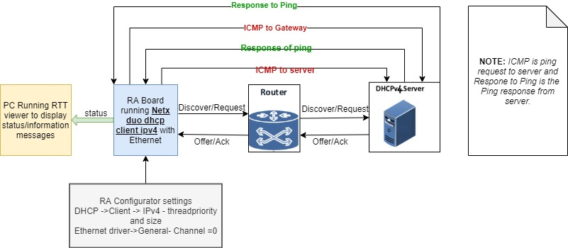
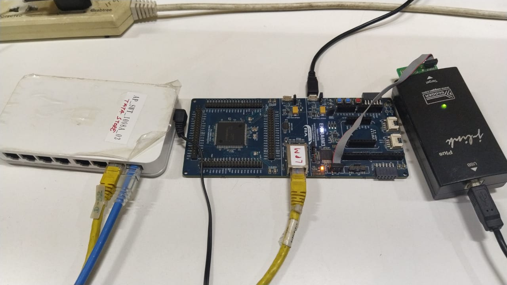
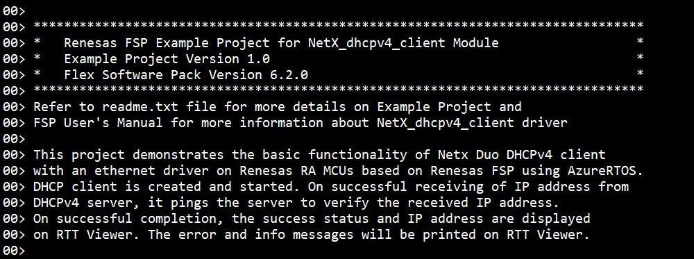
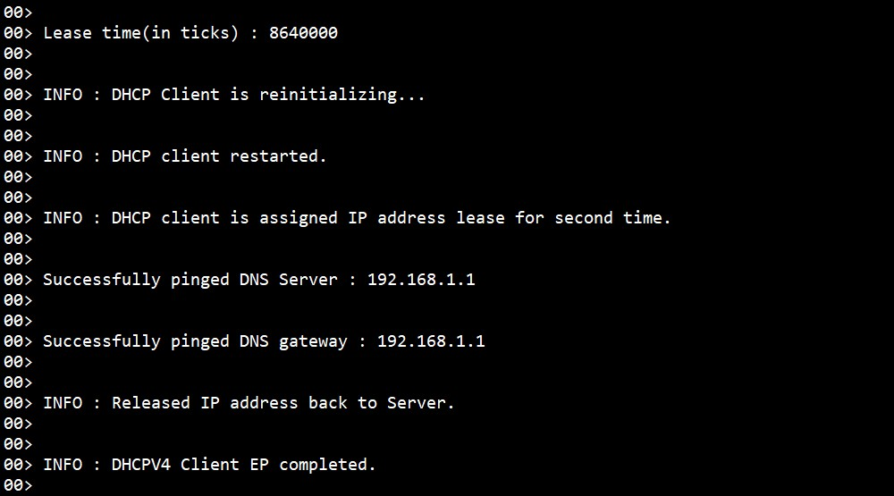

# Introduction #

This project demonstrates the basic functionality of Netx Duo DHCPv4 client with an ethernet driver on Renesas RA MCUs based on Renesas FSP using AzureRTOS. DHCP client is created and started. On successful receiving of IP address from DHCPv4 server, it pings the server to verify the received IP address. On successful completion, the success status and IP address are displayed on the RTT Viewer. The error and info messages will be printed on RTT Viewer.

NetX Duo DHCP Client is compliant with [RFC2132](https://tools.ietf.org/html/rfc2132), [RFC2131](https://tools.ietf.org/html/rfc2131).

Please refer to the [Example Project Usage Guide](https://github.com/renesas/ra-fsp-examples/blob/master/example_projects/Example%20Project%20Usage%20Guide.pdf) for general information on example projects and [readme.txt](./readme.txt) for specifics of operation.

## Required Resources ##
To build and run the NetX DHCPv4 client example project, the following resources are needed.

### Software ###
Refer to software requirements mentioned in [Example Project Usage Guide](https://github.com/renesas/ra-fsp-examples/blob/master/example_projects/Example%20Project%20Usage%20Guide.pdf)

### Hardware ###
Supported RA boards: EK-RA6M3, EK-RA6M4, EK-RA6M5, EK-RA8M1, EK-RA8D1, MCK-RA8T1, EK-RA8D2
* 1 x Renesas RA board.
* 1 x Type-C USB cable for programming and debugging.
* 1 x Ethernet/LAN cable (Ethernet cable CAT5/6).
* 1 x Ethernet switch.

### Hardware Connections ###
* For EK-RA6M3, EK-RA6M4, EK-RA6M5:
    * Connect the RA board USB device port to the host machine via a micro USB cable.
    * Connect LAN cable on RA board at ethernet port and other end connect to Ethernet switch/router.

* For EK-RA8M1:
    * Connect the RA board USB device port to the host machine via a micro USB cable.
    * Connect LAN cable on RA board at ethernet port and other end connect to Ethernet switch/router.
    * Remove jumper J61 to enable Ethernet B.

* For EK-RA8D1:
    * Connect the RA board USB device port to the host machine via a micro USB cable.
    * Connect LAN cable on RA board at ethernet port and other end connect to Ethernet switch/router.
    * Set the configuration switches (SW1) as below:
        * CAUTION: Do not enable SW1-4 and SW1-5 together. 

        | SW1-1 PMOD1 | SW1-2 TRACE | SW1-3 CAMERA | SW1-4 ETHA | SW1-5 ETHB | SW1-6 GLCD | SW1-7 SDRAM | SW1-8 I3C |
        |-------------|-------------|--------------|------------|------------|------------|-------------|-----------|
        | OFF | OFF | OFF | OFF | ON | OFF | OFF | OFF |

* For MCK-RA8T1, EK-RA8D2:
    * Connect the RA board USB device port to the host machine via a Type-C USB cable.
    * Connect LAN cable on RA board at ethernet port and other end connect to Ethernet switch/router.

## Related Collateral References ##
The following documents can be referred to for enhancing your understanding of the operation of this example project:
- [FSP User Manual on GitHub](https://renesas.github.io/fsp/)
- [FSP Known Issues](https://github.com/renesas/fsp/issues)

# Project Notes #

## System Level Block Diagram ##

## FSP Modules Used ##
List all the various modules that are used in this example project. Refer to the FSP User Manual for further details on each module listed below.

| Module Name | Usage  | Searchable Keyword (using New Stack > Search) |
|-------------|-----------------------------------------------|-----------------------------------------------|
| NetX Duo DHCP IPV4 Client | DHCPv4 module is used to obtain IP addresses, network parameters and to automate the process of configuring devices on IP networks, thus allowing them to use network services such as DNS, NTP, and any communication protocol based on UDP or TCP. | dhcp |

## Module Configuration Notes ##
This section describes FSP Configurator properties which are important or different from those selected by default.

|   Module Property Path and Identifier   |   Default Value   |   Used Value   |   Reason   |
| :-------------------------------------: | :---------------: | :------------: | :--------: |
| configuration.xml > BSP > Properties > Settings > Property > RA Common > Main stack size (bytes) | 0x400 | 0x1000 | Main program thread stack is configured to store the local variables of different functions in the code. |
| configuration.xml > BSP > Properties > Settings > Property > RA Common > Heap size (bytes) | 0 | 0x2000 | Heap size is required for standard library functions to be used. |
| configuration.xml > Stacks > Threads > DHCP Client Thread > Properties > Settings > Property > Thread > Stack size (bytes) | 1024 | 2048 | This is changed to handle its worst-case function call nesting and local variable usage. |
| configuration.xml > Stacks > Threads > DHCP Client Thread > Properties > Settings > Property > Thread > Priority | 1 | 3 | DHCP Client thread priority is lowered to allow the IP thread to process incoming packets at the fastest rate possible. |
| configuration.xml > Stacks > Threads > DHCP Client Thread > DHCP Client Thread Stacks > g_dhcp_client0 Azure RTOS NetX Duo DHCP IPv4 Client > Properties > Settings > Property > Common > DHCP > Client > IPv4 > Persistent client state | Disable | Enable | Persistent client state property is enabled to obtain a record of the current client state. |
| configuration.xml > Stacks > Threads > RTT_Thread > Properties > Settings > Property > Thread > Priority | 1 | 4 | RTT thread priority is lowered to allow the DHCP Client and IP threads to process incoming packets at the fastest rate possible. |

## API Usage ##

The table below lists the DHCP Client API used at the application layer by this example project.

| API Name    | Usage                                                                          |
|-------------|--------------------------------------------------------------------------------|
| nx_ip_driver_direct_command | This API is used to issue command to network driver. |
| nx_dhcp_state_change_notify | This API is used to notify application of DHCP state change. |
| nx_dhcp_start | This API is used to start DHCP processing. |
| nx_ip_address_get | This API is used to retrieve IP address and network mask. |
| nx_dhcp_server_address_get | This API is used to get the DHCP Client’s DHCP server IP address. |
| nx_icmp_ping | This API is used to send ping request to specified IP address. |
| nx_packet_release | This API is used to release previously allocated packet. | 
| nx_dhcp_client_get_record | This API is used to obtain a record of the current client state. | 
| nx_dhcp_stop | This API is used to stop DHCP processing. | 
| nx_dhcp_reinitialize | This API is used to clear the DHCP client network parameters. | 
| nx_ip_status_check | This API is used to check status of an IP instance. | 
| nx_dhcp_user_option_retrieve | This API is used to retrieve a DHCP option from last server responds. | 
| nx_dhcp_release | This API is used to release the IP address back to the Server. | 
| nx_dhcp_delete | This API is used to delete a DHCP instance. |

## Verifying operation ##
* Import, build and debug the EP (see section Starting Development of **FSP User Manual**). After running the EP, open J-Link RTT Viewer to see the output.
* Before running the example project, refer to the steps below for hardware connections:
    * Connect RA MCU debug port to the host PC via a Type-C USB cable.
    * Connect an Ethernet cable to the J15 connector on RA board via ethernet switch/hub which is connected to Router or LAN where DHCP server is residing.
    * A DHCP server needs to exist on the network to assign an IP address to the RA board running this DHCP client example project.

The image below showcases the hardware connection setup required for running the EP:

The images below showcase the output on J-Link RTT Viewer:

