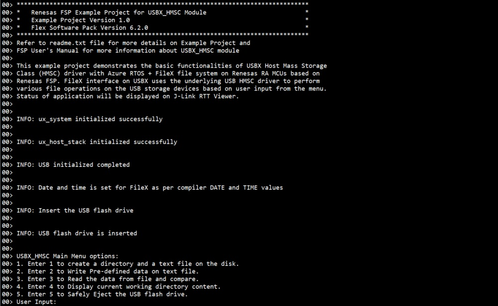
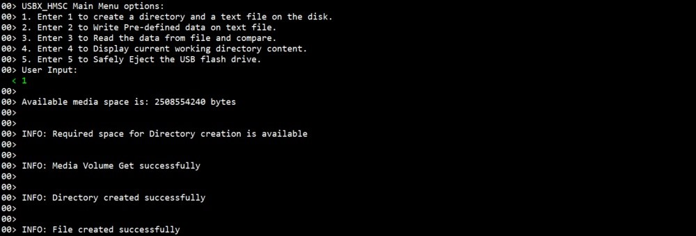
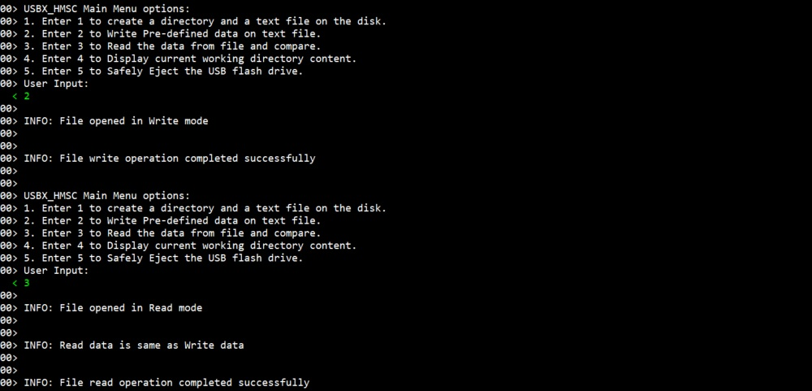
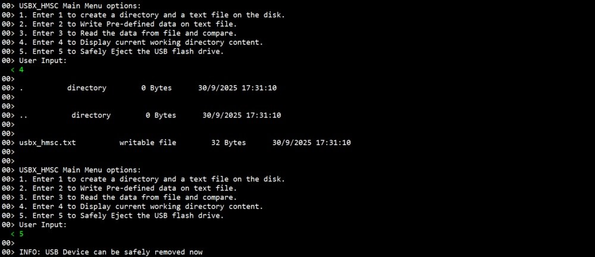

# Introduction #
This example project demonstrates the basic functionalities of USBX Host Mass Storage Class (HMSC) driver with Azure RTOS + FileX file system on Renesas RA MCUs based on Renesas FSP. FileX interface on USBX uses the underlying USB HMSC driver to perform various file operations on the USB storage devices based on user input from the menu. Status of application will be displayed on J-Link RTT Viewer.

Please refer to the [Example Project Usage Guide](https://github.com/renesas/ra-fsp-examples/blob/master/example_projects/Example%20Project%20Usage%20Guide.pdf) for general information on example projects and [readme.txt](./readme.txt) for specifics of operation.

## Required Resources ## 
To build and run the USBX HMSC example project, the following resources are needed.

### Software ###
* Renesas Flexible Software Package (FSP): Version 6.2.0
* e2 studio: Version 2025-10
* SEGGER J-Link RTT Viewer: Version 8.74
* LLVM Embedded Toolchain for ARM: Version 18.1.3
* Refer to the software required section in [Example Project Usage Guide](https://github.com/renesas/ra-fsp-examples/blob/master/example_projects/Example%20Project%20Usage%20Guide.pdf)

### Hardware ###
* Supported RA boards: EK-RA4M2, EK-RA4M3, EK-RA6M3, EK-RA6M4, EK-RA6M5, EK-RA8M1, EK-RA8D1, MCK-RA8T1, EK-RA4L1, EK-RA8E2, EK-RA8P1, EK-RA8D2
   * 1 x Renesas RA board.
   * 1 x Type-C USB cable for programming and debugging.
   * 1 x USB Type-C OTG cable.
   * 1 x USB flash drive.

### Hardware Connections ###
   * For EK-RA4M2, EK-RA4M3, EK-RA6M3, EK-RA6M3G, EK-RA6M4, EK-RA6M5, EK-RA8M1, EK-RA8D1 (Full-Speed):
		* Set jumper J12 to pins 1-2.
		* Remove the jumper from J15.
		* Connect the USB flash drive to the J11 connector using a micro USB OTG cable.

   * For MCK-RA8T1 (Full-Speed):
		* Set jumper JP9 to pins 1-2.
		* Remove the jumper from JP10.
		* Connect the USB flash drive to the CN14 connector using a Type-C USB OTG cable.

   * For EK-RA4L1 (Full-Speed):
		* Turn OFF S4-4 to select USB host mode.
		* Set J17 jumper to pins 2-3, set J7 jumper to use P407 for USBFS VBUS.
		* Connect the USB flash drive to the J11 connector using a Type-C USB OTG cable.

   * For EK-RA8E2, EK-RA8P1, EK-RA8D2 (Full-Speed):
		* Connect the USB flash drive to the J11 connector using a Type-C USB OTG cable.

   * For EK-RA6M3 (High-Speed):
		* Set jumper J7 to pins 1-2.
		* Remove the jumper from J17.
		* Connect the USB flash drive to the J6 connector using a micro USB OTG cable.

   * For EK-RA6M5, EK-RA8M1, EK-RA8D1 (High-Speed):
		* For EK-RA8D1, the user needs to turn OFF SW1-6 to use USBHS.
		* Set jumper J7 to pins 1-2.
		* Remove the jumper from J17.
		* Connect the USB flash drive to the J31 connector using a micro USB OTG cable.

   * For EK-RA8P1, EK-RA8D2 (High-Speed):
		* Connect the USB flash drive to the J7 connector using a Type-C USB OTG cable.

   **Note:** By default, USBX HMSC example project runs in High-Speed mode (If the RA board supports High-Speed mode).

## Related Collateral References ##
The following documents can be referred to for enhancing your understanding of the operation of this example project:
- [FSP User Manual on GitHub](https://renesas.github.io/fsp/)
- [Microsoft Azure USBX Host Class API ](https://docs.microsoft.com/en-us/azure/rtos/usbx/usbx-host-stack-5)
- [FSP Known Issues](https://github.com/renesas/fsp/issues)

# Project Notes #
## System Level Block Diagram ##
High level block diagram of the system is shown below:
 

## FSP Modules Used ##
List all the various modules that are used in this example project. Refer to the FSP User Manual for further details on each module listed below.

| Module Name | Usage | Searchable Keyword  |
|-------------|-----------------------------------------------|-----------------------------------------------|
| FileX on USBX | Using FileX with the USBX HMSC driver, the user can perform various file operations and store data on a USB flash drive. | USBX |
| USBX HMSC | This module enables USBX Host Mass Storage Class (HMSC) support on RA devices. When used with a file system, it allows communication with USB storage devices. | HMSC |
| USB Basic Driver | USB driver operates in combination with the device class drivers provided by Renesas to form a complete USB stack. | r_usb_basic |
| DMAC Transfer | DMAC is used to transfer USB data at a faster rate without involving the CPU. | r_dmac |

## Module Configuration Notes ##
This section describes FSP Configurator properties which are important or different from those selected by default.

**Common Configuration properties**
|   Module Property Path and Identifier   |   Default Value   |   Used Value   |   Reason   |
| :-------------------------------------: | :---------------: | :------------: | :--------: |
| configuration.xml > Stacks > Threads > HMSC Thread > Properties > Settings > Property > Common > Timer > Timer Ticks Per Second | 100 | 1000 | The default UX_PERIODIC_RATE ticks should be 1000 indicating 1 tick per millisecond. |
| configuration.xml > Stacks > Threads > HMSC Thread > Properties > Settings > Property > Thread > Priority | 1 | 14 | The HMSC thread priority is lowered to allow other USB operations to run at a faster rate. |
| configuration.xml > Stacks > Threads > RTT Thread > Properties > Settings > Property > Thread > Priority | 1 | 15 | The RTT thread priority is lowered to allow USBX HMSC data to be processed at the fastest rate possible. |
| configuration.xml > Stacks > Threads > HMSC Thread > g_basic0 USB (r_usb_basic) > Properties > Settings > Property > Common > DMA/DTC Support | DMA Disabled | DMA Enabled | DMA is enabled to offload MCU processing and improve the efficiency of data transfers. |

**Configuration Properties for using USBHS**
|   Module Property Path and Identifier   |   Default Value   |   Used Value   |   Reason   |
| :-------------------------------------: | :---------------: | :------------: | :--------: |
| configuration.xml > Stacks > Threads > HMSC Thread > HMSC Thread Stacks > g_basic0 USB (r_usb_basic) > Properties > Settings > Property > Common > DMA/DTC Source Address| DMA Disabled | HS Address | The USB basic driver is set to High-Speed mode. As a result, the DMA source address uses the corresponding High-Speed USB base address. |
| configuration.xml > Stacks > Threads > HMSC Thread > HMSC Thread Stacks > g_basic0 USB (r_usb_basic) > Properties > Settings > Property > Common > DMA/DTC Destination Address| DMA Disabled | HS Address | USB basic driver is configured USB speed as High Speed (Default). Accordingly, DMA Destination Address is provided with HS Address. |
| configuration.xml > Stacks > Threads > HMSC Thread > HMSC Thread Stacks > g_basic0 USB (r_usb_basic) > Properties > Settings > Property > Module g_basic0 USB (r_usb_basic) > USB Speed| Full-Speed | Hi-Speed | This property is used to configure USB speed. |
| configuration.xml > Stacks > Threads > HMSC Thread > HMSC Thread Stacks > g_basic0 USB (r_usb_basic) > Properties > Settings > Property > Module g_basic0 USB (r_usb_basic) > USB Module Number | USB_IP0 Port | USB_IP1 Port | This property specifies the USB module number to be used according to the configured USB speed. |
| configuration.xml > Stacks > Threads > HMSC Thread > HMSC Thread Stacks > g_transfer0 Transfer (r_dmac) > Properties > Settings > Property > Module g_transfer0 Transfer (r_dmac) > Activation Source | No ELC Trigger | USBHS FIFO 1 (DMA Transfer request 1) | This is an event trigger for DMA transfer 0 instance for destination pointer address. |
| configuration.xml > Stacks > Threads > HMSC Thread > HMSC Thread Stacks > g_transfer1 Transfer (r_dmac) > Properties > Settings > Property > Module g_transfer1 Transfer (r_dmac) > Activation Source | No ELC Trigger | USBHS FIFO 0 (DMA Transfer request 0) | This is an event trigger for DMA transfer 1 instance for source pointer address. |
| configuration.xml > Stacks > Threads > HMSC Thread > HMSC Thread Stacks > g_transfer1 Transfer (r_dmac) > Properties > Settings > Property > Module g_transfer1 Transfer (r_dmac) > Transfer Size | 2 Bytes | 4 Bytes | This is used to select DMAC transfer size. |
| configuration.xml > Stacks > Threads > HMSC Thread > HMSC Thread Stacks > g_transfer0 Transfer (r_dmac) > Properties > Settings > Property > Module g_transfer0 Transfer (r_dmac) > Transfer Size | 2 Bytes | 4 Bytes | This is used to select DMAC transfer size. |

**Configuration Properties for using USBFS**
|   Module Property Path and Identifier   |   Default Value   |   Used Value   |   Reason   |
| :-------------------------------------: | :---------------: | :------------: | :--------: |
| configuration.xml > Stacks > Threads > HMSC Thread > HMSC Thread Stacks > g_basic0 USB (r_usb_basic) > Properties > Settings > Property > Common > DMA/DTC Source Address | DMA Disabled | FS Address | USB basic driver is configured USB Speed as Full-Speed. Accordingly, DMA Source Address is provided with FS Address. |
| configuration.xml > Stacks > Threads > HMSC Thread > HMSC Thread Stacks > g_basic0 USB (r_usb_basic) > Properties > Settings > Property > Common > DMA/DTC Destination Address| DMA Disabled | FS Address | USB basic driver is configured USB speed as Full-Speed. Accordingly, DMA Destination Address is provided with FS Address. |
| configuration.xml > Stacks > Threads > HMSC Thread > HMSC Thread Stacks > g_basic0 USB (r_usb_basic) > Properties > Settings > Property > Module g_basic0 USB (r_usb_basic) > USB Speed| Full-Speed | Full-Speed | This property is used to configure USB speed. |
| configuration.xml > Stacks > Threads > HMSC Thread > HMSC Thread Stacks > g_basic0 USB (r_usb_basic) > Properties > Settings > Property > Module g_basic0 USB (r_usb_basic) > USB Module Number | USB_IP0 Port | USB_IP0 Port | This property specifies the USB module number to be used according to the configured USB speed. |
| configuration.xml > Stacks > Threads > HMSC Thread > HMSC Thread Stacks > g_transfer0 Transfer (r_dmac) > Properties > Settings > Property > Module g_transfer0 Transfer (r_dmac) > Activation Source | No ELC Trigger | USBFS FIFO 1 (DMA/DTC transfer request 1) | This is an event trigger for DMA transfer 0 instance for destination pointer address. |
| configuration.xml > Stacks > Threads > HMSC Thread > HMSC Thread Stacks > g_transfer1 Transfer (r_dmac) > Properties > Settings > Property > Module g_transfer1 Transfer (r_dmac) > Activation Source | No ELC Trigger | USBFS FIFO 0 (DMA/DTC transfer request 0) | This is an event trigger for DMA transfer 1 instance for source pointer address. |
| configuration.xml > Stacks > Threads > HMSC Thread > HMSC Thread Stacks > g_transfer0 Transfer (r_dmac) > Properties > Settings > Property > Module g_transfer0 Transfer (r_dmac) > Transfer Size | 2 Bytes | 2 Bytes | This is used to select DMAC transfer size. |
| configuration.xml > Stacks > Threads > HMSC Thread > HMSC Thread Stacks > g_transfer1 Transfer (r_dmac) > Properties > Settings > Property > Module g_transfer1 Transfer (r_dmac) > Transfer Size | 2 Bytes | 2 Bytes | This is used to select DMAC transfer size. |

The table below lists the FSP provided API used at the application layer by this example project.

| API Name    | Usage                                                                          |
|-------------|--------------------------------------------------------------------------------|
| _ux_system_initialize | This API is used to initialize the USBX system. |
| fx_system_initialize | This API is used to initialize the FileX System component. |
| ux_host_stack_initialize | This API is used to initialize the USBX device stack. |
| fx_system_date_set | This API is used to set the system date. |
| fx_system_time_set | This API is used to set the system time. |
| R_USB_Open | This API is used to open the USB basic driver. |
| fx_media_extended_space_available | This API is used to check media space available. |
| fx_media_volume_get | This API is used to retrieve media volume name. |
| fx_directory_create | This API is used to create a subdirectory in the current directory or in the path provided in directory name. |
| fx_directory_default_set | This API is used to set the default directory of the media. |
| fx_file_create | This API is used to create the specified file in the default directory with specified name. |
| fx_file_open | This API is used to open the specified file for either reading or writing. |
| fx_file_truncate | This API is used to truncate the size of the file to the specified size. |
| fx_file_write | This API is used to write bytes from the specified buffer starting at the file's current position. |
| fx_file_close | This API is used to close the specified file. |
| fx_media_flush | This API is used to flush all cached sectors and directory entries of any modified files to the physical media. |
| fx_file_read | This API is used to read bytes from the file and stores them in the supplied buffer. |
| fx_directory_first_full_entry_find | This API is used to get first directory entry with full information. |
| fx_directory_next_full_entry_find | This API is used to get next directory entry with full information. |
| fx_media_close | This API is used to close the specified media. |
| ux_host_stack_uninitialize | This API is used to de-initialize all the host code for USBX. |

* Callback:  
ux_host_usr_event_notification callback function is called to identify the USB events and perform operation as per the received events, also there are only two events available in the EP, they are used to signal the HMSC that USB communication can be started.
1. When the event UX_FSP_DEVICE_INSERTION is received the USBX_HMSC checks for the MSC class interface and sets the event flag to perform the USBX_HMSC operations (e.g., create directory, write, read, eject, display).
2. When the event UX_FSP_DEVICE_REMOVAL is received the USBX_HMSC will clear the event flag and wait for the USB_INSERTION event.

## Verifying operation ##
1. Import, generate and build the EP.
2. Download USBX HMSC project into the RA board which will act as host device.
3. Open RTT Viewer and perform host device operation as per menu option.
4. The images below showcase the output on J-Link RTT Viewer for USBX HMSC:

 
 
 
 
 
 
 

## Special Topics ##
* The user is expected to execute the "Eject" option before removing USB else further file operations may fail and USB data may get corrupted.
* Operation is not guaranteed for any user input value other than integer or char types (e.g., float, special characters) through J-Link RTT Viewer input.
