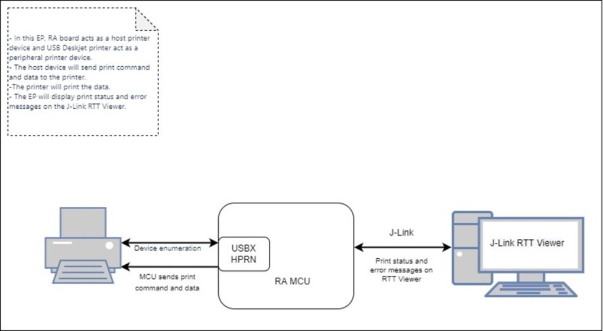
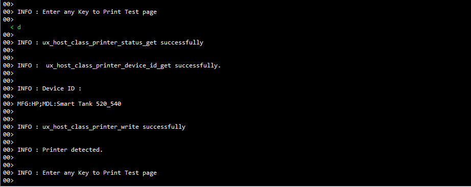
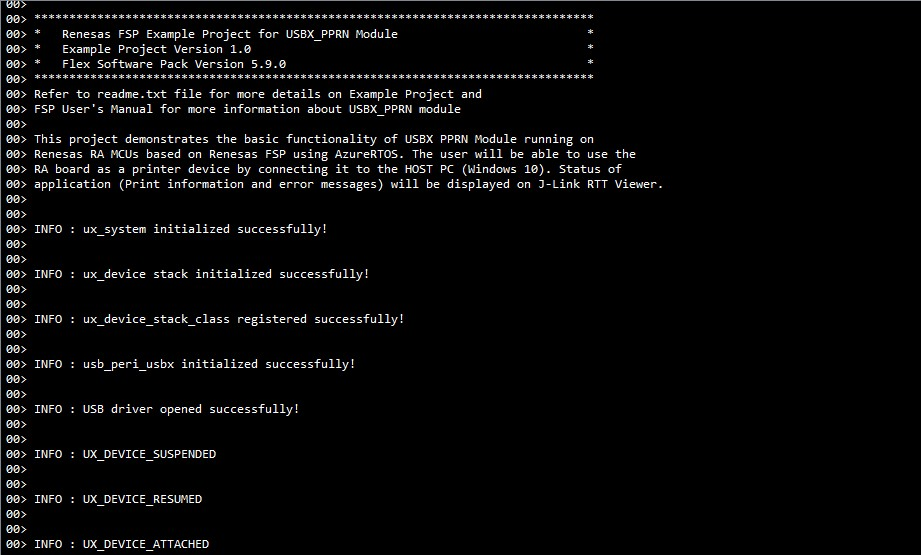
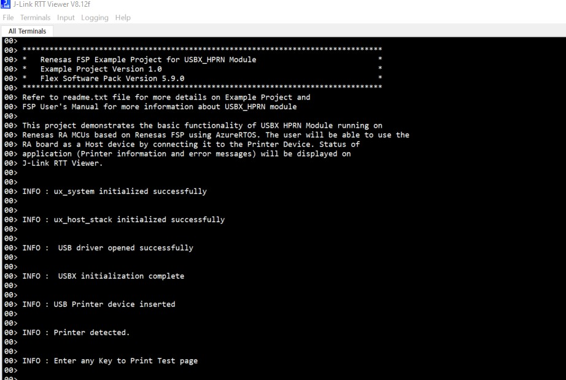
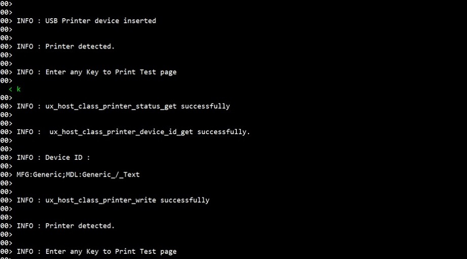
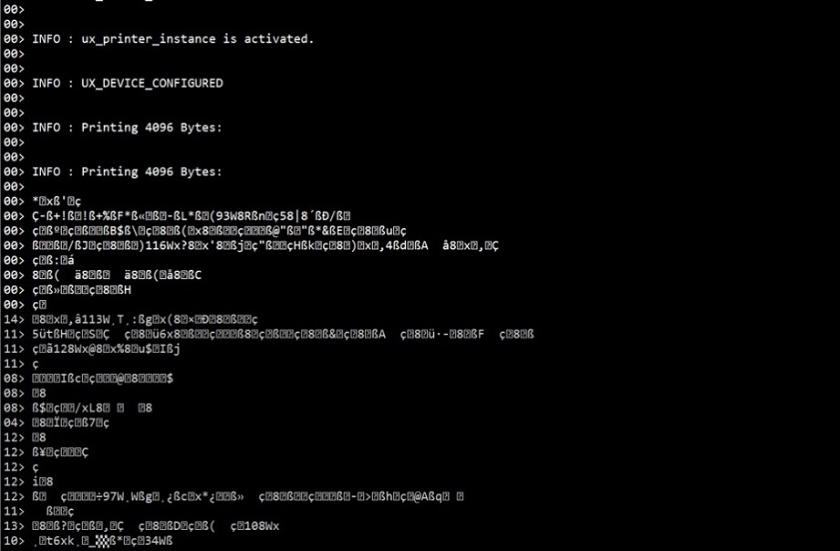

# Introduction #

The sample code accompanying this file shows the operation of a USBX Host Printer on a RA MCU using Azure RTOS. 
An RA MCU board will be connected to the PC where the RA board will act as a host printer and the printer
will act as a peripheral device. A print command for a test file will be sent from the RA MCU, and printing data will be 
transferred from the RA MCU to printer. The RA MCU will display printer information, error and info messages will be printed on J-Link RTT Viewer.

Please refer to the [Example Project Usage Guide](https://github.com/renesas/ra-fsp-examples/blob/master/example_projects/Example%20Project%20Usage%20Guide.pdf) 
for general information on example projects and [readme.txt](./readme.txt) for specifics of the operation.

## Required Resources ##
To build and run the USBX Peripheral Printer example project, the following resources are needed.

### Hardware ###
Supported RA boards: EK-RA6M5, EK-RA6M3, EK-RA6M4, EK-RA8M1, EK-RA8D1, MCK-RA8T1, EK-RA4L1, EK-RA8E2.
* 1 x Renesas RA board.
* 1 x Type-C USB cable (For programming and debugging).
* 1 x OTG cable (For connecting printer).
* 1 x Printer device (With USB interface).
* 1 x Printer's USB cable for connecting the Printer to board via USB.

Refer to [readme.txt](./readme.txt) for information on how to connect the hardware.

### Software ###
Refer to software requirements mentioned in [Example Project Usage Guide](https://github.com/renesas/ra-fsp-examples/blob/master/example_projects/Example%20Project%20Usage%20Guide.pdf)

## Related Collateral References ##
The following documents can be referred to for enhancing your understanding of 
the operation of this example project:
- [FSP User Manual on GitHub](https://renesas.github.io/fsp/)
- [FSP Known Issues](https://github.com/renesas/fsp/issues)

# Project Notes #

## System Level Block Diagram ##

## FSP Modules Used ##
List all the various modules that are used in this example project. Refer to the FSP User Manual for further details on each module listed below.

| Module Name | Usage  | Searchable Keyword (using New Stack > Search) |
| :---------: | :---------------: | :------------: |
| USBX HPRN   | This module provides USBX Host Printer class support on RA device. | hprn |

## Module Configuration Notes ##
This section describes FSP Configurator properties that are important or different from those selected by default. 

**Common Configuration Properties**

|   Module Property Path and Identifier   |   Default Value   |   Used Value   |   Reason   |
| :-------------------------------------: | :---------------: | :------------: | :--------: |
|   configuration.xml > BSP > Properties > Settings > Property > RA Common > Main stack size (bytes)| 0x400 |0x1000| Main Program thread stack is configured to store the local variables of different functions in the code. |
|   configuration.xml > BSP > Properties > Settings > Property > RA Common > Heap Size (bytes)| 0 |0x400| Heap size is required for standard library functions to be used. |
|   configuration.xml > Stacks > USBX HPRN Thread > Properties > Settings > Property > Common > Timer > Timer Ticks Per Second |100 | 1000 |The default ticks should be 1000 indicating 1 tick per millisecond.  |
|   configuration.xml > Stacks > USBX HPRN Thread > Properties > Settings > Property > Thread > Priority  |   1   |   15   |   USBX HPRN Thread priority is lowered to allow the other USB operations to be serviced at a faster rate.   |
|   configuration.xml > Stacks > RTT Thread > Properties > Settings > Property > Thread > Priority  |   1   |   16   |   RTT thread priority is lowered to allow the internal thread taking priority. |
|   configuration.xml > Stacks > RTT Thread > Properties > Settings > Property > Thread > Stack Size (bytes)| 1024 | 4096 | The size of the RTT Thread Stack is increased so that data from any type of file can be printed on the J-Link RTT Viewer. |
|   configuration.xml > Stacks > USBX HPRN Thread Stacks > g_basic Instance > Properties > Settings > Property > Common > DMA/DTC Support| DMA Disabled | DMA Enabled |DMAC is used to handle the USB data transfer to offload MCU usage.|

**Configuration Properties if USB Speed as High Speed**

|   Module Property Path and Identifier   |   Default Value   |   Used Value   |   Reason   |
| :-------------------------------------: | :---------------: | :------------: | :--------: |
| configuration.xml > Stacks > USBX HPRN Thread Stacks > g_basic USB (r_usb_basic) Instance > Properties > Settings > Property > Common > DMA/DTC Source Address| DMA Disabled | HS Address | USB basic driver is configured **USB Speed** as **Hi Speed**. Accordingly, DMA/DTC Source Address should provide with **HS Address**.|
| configuration.xml > Stacks > USBX HPRN Thread Stacks > g_basic USB (r_usb_basic) Instance > Properties > Settings > Property > Common > DMA/DTC Destination Address| DMA Disabled | HS Address | USB basic driver is configured **USB speed** as **Hi Speed**. Accordingly, DMA/DTC Destination Address should provided with **HS Address**.|
| configuration.xml > Stacks > USBX HPRN Thread Stacks > g_basic USB (r_usb_basic) Instance > Properties > Settings > Property > Module g_basic USB Driver on r_usb_basic > USB Speed| Full Speed | Hi Speed | USB Speed is configured as **Hi Speed**. According to the USB Speed, DMA settings should be updated.|
| configuration.xml > Stacks > USBX HPRN Thread Stacks > g_basic USB (r_usb_basic) Instance > Properties > Settings > Property > Module g_basic USB Driver on r_usb_basic > USB Module Number| USB_IP0 Port | USB_IP1 Port | This property is used to specify USB module number to be used as per configured USB speed.|
| configuration.xml > Stacks > USBX HPRN Thread Stacks > g_transfer0 Transfer Driver on r_dmac Instance > Properties > Settings > Property > Module g_transfer0 Transfer driver > Transfer Size| 2 | 4 |The transfer size of DMA for **High Speed** requires **4 Bytes**.|
| configuration.xml > Stacks > USBX HPRN Thread Stacks > g_transfer0 Transfer Driver on r_dmac Instance > Properties > Settings > Property > Module g_transfer0 Transfer driver > Activation Source| No ELC Trigger | USBHS FIFO 1 (DMA/DTC Transfer request 1)   |This is an event trigger for DMA transfer 0 instance for destination pointer address. |
| configuration.xml > Stacks > USBX HPRN Thread Stacks > g_transfer1 Transfer Driver on r_dmac Instance > Properties > Settings > Property > Module g_transfer1 Transfer driver > Transfer Size| 2 | 4 |The transfer size of DMA for **High Speed** requires **4 Bytes**.
| configuration.xml > Stacks > USBX HPRN Thread Stacks > g_transfer1 Transfer Driver on r_dmac Instance > Properties > Settings > Property > Module g_transfer1 Transfer driver > Activation Source| No ELC Trigger | USBHS FIFO 0 (DMA/DTC Transfer request 0)  |This is an event trigger for DMA transfer 1 instance for source pointer address.|

**Configuration Properties if USB Speed as Full Speed.**

|   Module Property Path and Identifier   |   Default Value   |   Used Value   |   Reason   |
| :-------------------------------------: | :---------------: | :------------: | :--------: |
| configuration.xml > Stacks > USBX HPRN Thread Stacks > g_basic USB (r_usb_basic) Instance > Properties > Settings > Property > Common > DMA/DTC Source Address| DMA Disabled | FS Address | USB basic driver is configured **USB Speed** as **Full Speed**. Accordingly, DMA/DTC Source Address should provide with **FS Address**.|
| configuration.xml > Stacks > USBX HPRN Thread Stacks > g_basic USB (r_usb_basic) Instance > Properties > Settings > Property > Common > DMA/DTC Destination Address| DMA Disabled | FS Address | USB basic driver is configured **USB speed** as **Full Speed**. Accordingly, DMA/DTC Destination Address should provided with **FS Address**.|
| configuration.xml > Stacks > USBX HPRN Thread Stacks > g_basic USB (r_usb_basic) Instance > Properties > Settings > Property > Module g_basic USB Driver on r_usb_basic > USB Speed| Full Speed | Full Speed | USB Speed is configured as **Full Speed**. According to the USB Speed, DMA settings should be updated.|
| configuration.xml > Stacks > USBX HPRN Thread Stacks > g_basic USB (r_usb_basic) Instance > Properties > Settings > Property > Module g_basic USB Driver on r_usb_basic > USB Module Number| USB_IP0 Port | USB_IP0 Port | This property is used to specify USB module number to be used as per configured USB speed.|
| configuration.xml > Stacks > USBX HPRN Thread Stacks > g_transfer0 Transfer Driver on r_dmac Instance > Properties > Settings > Property > Module g_transfer0 Transfer driver > Transfer Size| 2 | 2 |The transfer size of DMA for **Full Speed** requires **2 Bytes**.|
| configuration.xml > Stacks > USBX HPRN Thread Stacks > g_transfer0 Transfer Driver on r_dmac Instance > Properties > Settings > Property > Module g_transfer0 Transfer driver > Activation Source| No ELC Trigger | USBFS FIFO 1 (DMA/DTC Transfer request 1)  |This is an event trigger for DMA transfer 0 instance for destination pointer address. |
| configuration.xml > Stacks > USBX HPRN Thread Stacks > g_transfer1 Transfer Driver on r_dmac Instance > Properties > Settings > Property > Module g_transfer1 Transfer driver > Transfer Size| 2 | 2 |The transfer size of DMA for **Full Speed** requires **2 Bytes**.
| configuration.xml > Stacks > USBX HPRN Thread Stacks > g_transfer1 Transfer Driver on r_dmac Instance > Properties > Settings > Property > Module g_transfer1 Transfer driver > Activation Source| No ELC Trigger | USBFS FIFO 0 (DMA/DTC Transfer request 0)  |This is an event trigger for DMA transfer 1 instance for source pointer address.|

## API Usage ##

The table below lists the FSP provided API used at the application layer by this example project.

| API Name    | Usage                                                                          |
|-------------|--------------------------------------------------------------------------------|
|[ux_system_initialize](https://learn.microsoft.com/en-us/azure/rtos/usbx/usbx-host-stack-2#usbx-installation)| This API is used to initialize the USBX system. |
|[ux_host_stack_initialize](https://learn.microsoft.com/en-us/azure/rtos/usbx/usbx-host-stack-4#ux_host_stack_initialize)| This API is used to initialize the USBX device stack. |
|[R_USB_Open](https://renesas.github.io/fsp/group___u_s_b_x.html)| This API opens the USB basic driver. |
|ux_host_class_printer_status_get|This API obtains the printer status.|
|ux_host_class_printer_device_id_get|This API retrieves printer information such as printer name.|
|ux_host_class_printer_write|This API writes printer data to the printer interface. It only returns when there is either an error or when the transfer is complete.|

## Verifying operation ##

If the USB speed configuration needs to be changed, import the EP and perform necessary changes in the project configuration. Please see the Module Configuration Notes section for more details.

**Generate the Printing data array**

The project is developed using a printing array generated for an HP-2130 Deskjet printer. The following is the procedure for generating and converting .pcl/.prn to a hex array for your printer:

1. On a Windows machine, install the required drivers for the printer to be used. Print a test page to make sure the driver works properly.

2. To convert a testing document to .pcl/.prn file, open it using an editor, MS word, etc, and press Ctrl+P or select print from the File menu option.

3. In Printer section, select the connected printer and check the "Print to File" option.

4. Click "Print" and save the file in .pcl/.prn format into the system.

5. Convert the .pcl/.prn file data into hex data using below mentioned link:
	http://tomeko.net/online_tools/file_to_hex.php?lang=en
	
6. The new hex data obtained from step 5 should be replaced the print_tes_page[] array used in /src/usbx_hprn_entry.c in the example project.

7. Generate, build, and download the USBX_hprn project to the RA board.

8. Connect the printer to the RA MCU board as mentioned in readme file.

9. Check the printer device status, should be ready for printing.

10. Open J-Link RTT Viewer to verify the initialization status.

    Below images show the output on J-Link RTT Viewer:

12. Once the USB initialization is complete, it shows the printer device details and asks for a key press, to send the printing data from RA MCU to printer.

13. Once all the data is sent to the printer, it shows the completion status on J-Link RTT Viewer. 

The below images show the printing status on J-Link RTT Viewer and the page printed by an HP-2130 Deskjet printer:

**Verify with USBX_pprn EP if compatible printer is not available**

1. Generate, build, and download the USBX_pprn project to the first RA board.

2. Run USBX_pprn EP and open J-Link RTT Viewer to verify the initialization status. Below images show the output on J-Link RTT Viewer of USBX_pprn:

3. Generate, build, and download the USBX_hprn project to the second RA board.

4. Run USBX_hprn EP and open J-Link RTT Viewer to verify the initialization status. Below images show the output on J-Link RTT Viewer of USBX_hprn:

5. Connect the USB cable to the appropriate USB port between the first RA board running USBX_pprn and the second RA board running USBX_hprn, and then follow the guidelines from the J-Link RTT Viewer on the USBX_hprn board as described below:

6. Verify output on J-Link RTT Viewer of USBX_pprn:

