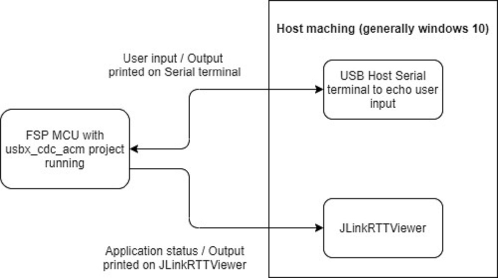
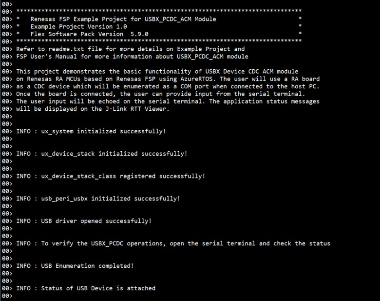
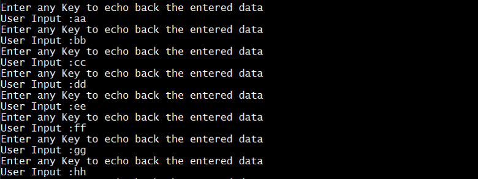
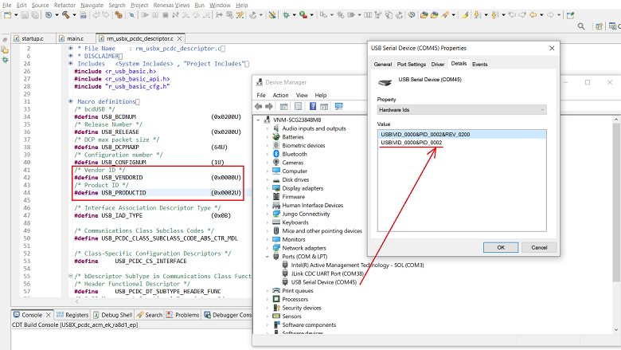

# Introduction #
This project demonstrates the basic functionality of USBX Device CDC ACM module on Renesas RA MCUs based on Renesas FSP using AzureRTOS. The user will use a RA board as a CDC device which will be enumerated as a COM port when connected to the host PC. Once the board is connected, the user can provide input from the serial terminal. The user input will be echoed on the serial terminal. The application status messages will be displayed on the J-Link RTT Viewer.

Please refer to the [Example Project Usage Guide](https://github.com/renesas/ra-fsp-examples/blob/master/example_projects/Example%20Project%20Usage%20Guide.pdf) 
for general information on example projects and [readme.txt](./readme.txt) for specifics of operation.

## Required Resources ##
To build and run the USBX PCDC ACM example project, the following resources are needed.

### Software ###
1. Refer to the software required section in [Example Project Usage Guide](https://github.com/renesas/ra-fsp-examples/blob/master/example_projects/Example%20Project%20Usage%20Guide.pdf)
2. Refer to [Special Topics](#special-topics) for more information of USBX pcdc setup.

### Hardware ###
Supported RA boards: EK-RA4M2, EK-RA4M3, EK-RA6M1, EK-RA6M2, EK-RA6M3, EK-RA6M4, EK-RA6M5, EK-RA8M1, EK-RA8D1, MCK-RA8T1, EK-RA4L1, EK-RA8E2
* 1 x RA board.
* 2 x Type-C USB device cables.
* 1 x PC with at least 2 USB ports (1 for debug and 1 for COM port).

### Hardware Connections ###
* For EK-RA6M1, EK-RA6M2 (Full Speed)
  1. Connect the micro USB end of the micro USB device cable to micro-AB USB (DEBUG USB) port (J11) of the respective board. 
  2. Connect the micro USB end of the micro USB device cable to micro-AB USB Full Speed port (J9) of the board. Connect the other end of this cable to USB port of the host PC.

* For EK-RA6M4, EK-RA4M2, EK-RA4M3 (Full Speed)
  1. Jumper J12 placement is pins 2-3.
  2. Connect Jumper J15 pins.
  3. Connect the micro USB end of the micro USB device cable to micro-AB USB Full Speed port (J11) of the board. Connect the other end of this cable to USB port of the host PC.

* For EK-RA6M3 (High Speed)
	1. Jumper J7: Connect pins 2-3.
    2. Connect Jumper J17 pins.
	3. Connect the micro USB end of the micro USB device cable to micro-AB USB High Speed port (J6) of the board. Connect the other end of this cable to USB port of the host PC.

* For EK-RA6M5, EK-RA8M1, EK-RA8D1 (High Speed)
	1. Jumper J7: Connect pins 2-3.
    2. Connect Jumper J17 pins.
	3. Connect the micro USB end of the micro USB device cable to micro-AB USB High Speed port (J31) of the board. Connect the other end of this cable to USB port of the host PC.
	* Note: For EK-RA8D1, the user must turn OFF SW1-6 to use USBHS.

* For MCK-RA8T1 (Full Speed)
	1. Jumper JP9: Connect pins 2-3.
    2. Connect Jumper JP10 pins.
	3. Connect the Type-C USB end of the Type-C USB device cable to Type-C USB Full Speed port (CN14) of the board. Connect the other end of this cable to USB port of the host PC.

* For EK-RA4L1 (Full Speed)
	1. Turn ON S4-4 to select USB device mode.
	2. Set J17 jumper to pins 2-3, Set J7 jumper to use P407 for USBFS VBUS.
	3. Connect the RA board USB FS port (J11) to the PC via Type-C USB cable.
	4. Connect the RA board USB debug port (J10) to the PC via Type-C USB cable for EP debugging.

* For EK-RA8E2 (Full Speed)
	1. Connect the RA board USB FS port (J11) to the PC via Type-C USB cable.
	2. Connect the RA board USB debug port (J10) to the PC via Type-C USB cable for EP debugging.
## Related Collateral References ##
The following documents can be referred to for enhancing your understanding of 
the operation of this example project:
- [FSP User Manual on GitHub](https://renesas.github.io/fsp/)
- [FSP Known Issues](https://github.com/renesas/fsp/issues)

# Project Notes #

## System Level Block Diagram ##
 High level block diagram  

## FSP Modules Used ##
List all the various modules that are used in this example project. Refer to the FSP User Manual for further details on each module listed below.

| Module Name | Usage | Searchable Keyword  |
|-------------|-----------------------------------------------|-----------------------------------------------|
|USBX PCDC |USBX PCDC is used communicate with Host machine to perform write/read operations from the user input and echoed the same on serial terminal. | USBX PCDC|
|USB Basic Driver |USB driver is required for hardware configuration on RA MCU. |r_usb_basic|
|DMAC Transfer |DMAC is used to transfer the usb data for faster process.  | r_dmac  |

## Module Configuration Notes ##
This section describes FSP Configurator properties which are important or different than those selected by default. 

**Common Configuration Properties**
|   Module Property Path and Identifier   |   Default Value   |   Used Value   |   Reason   |
| :-------------------------------------: | :---------------: | :------------: | :--------: |
| configuration.xml -> Stacks -> PCDC ACM Thread -> Properties > Settings > Property > Common > Timer > Timer Ticks Per Second | 100 | 1000 | The default ticks should be 1000 indicating 1 tick per millisecond.|
| configuration.xml -> Stacks -> PCDC ACM Thread -> Properties > Settings > Property > Thread > Priority | 1 | 15 | PCDC ACM thread priority is lowered to allow the other usb operations at faster rate.|
| configuration.xml -> Stacks -> RTT Thread -> Properties > Settings > Property > Thread > Priority | 1 | 16 | RTT thread priority is lowered to allow the USBX PCDC ACM data process at the fastest rate possible.|
| configuration.xml -> Stacks -> PCDC ACM Thread -> g_basic0 USB (r_usb_basic) > Properties > Settings > Property > Common > DMA/DTC Support | DMA Disable | DMA Enable | DMA is used to offload CPU usage, to transfer the usb data for faster process.|

**Configuration Properties if USB Speed as High Speed**
|   Module Property Path and Identifier   |   Default Value   |   Used Value   |   Reason   |
| :-------------------------------------: | :---------------: | :------------: | :--------: |
| configuration.xml -> Stacks -> PCDC ACM Thread -> g_basic0 USB (r_usb_basic) > Properties > Settings > Property > Common > DMA/DTC Source Address| DMA Disabled | HS Address | USB basic driver is configured **USB Speed** as **Hi Speed**. Accordingly, DMA Source Address should provide with **HS Address**.|
| configuration.xml -> Stacks -> PCDC ACM Thread -> g_basic0 USB (r_usb_basic) > Properties > Settings > Property > Common > DMA/DTC Destination Address| DMA Disabled | HS Address | USB basic driver is configured **USB speed** as **Hi Speed**. Accordingly, DMA Destination Address should provided with **HS Address**.|
| configuration.xml -> Stacks -> PCDC ACM Thread -> g_basic0 USB (r_usb_basic) > Properties > Settings > Property > Module g_basic0 USB (r_usb_basic) > USB Speed| Full Speed | Hi Speed | USB Speed is configured as **Hi Speed**. According to the USB Speed, DMA settings should be updated.|
| configuration.xml -> Stacks -> PCDC ACM Thread -> g_basic0 USB (r_usb_basic) > Properties > Settings > Property > Module g_basic0 USB (r_usb_basic) > USB Module Number| USB_IP0 Port | USB_IP1 Port | This property is used to specify USB module number to be used as per configured USB speed.|
| configuration.xml -> Stacks -> PCDC ACM Thread -> g_transfer0 Transfer (r_dmac) > Properties > Settings > Property > Module g_transfer0 Transfer (r_dmac) > Transfer Size| 2 | 4 |The transfer size of DMA for **High Speed** requires **4 Bytes**.|
| configuration.xml -> Stacks -> PCDC ACM Thread -> g_transfer0 Transfer (r_dmac) > Properties > Settings > Property > Module g_transfer0 Transfer (r_dmac) > Activation Source| No ELC Trigger | USBHS FIFO 1 (DMA/DTC transfer request 1)  |This is an event trigger for DMA transfer 0 instance for destination pointer address. |
| configuration.xml -> Stacks -> PCDC ACM Thread Stacks -> g_transfer1 Transfer (r_dmac) > Properties > Settings > Property > Module g_transfer1 Transfer (r_dmac) > Transfer Size| 2 | 4 |The transfer size of DMA for **High Speed** requires **4 Bytes**.
| configuration.xml -> Stacks -> PCDC ACM Thread -> g_transfer1 Transfer (r_dmac) > Properties > Settings > Property > Module g_transfer1 Transfer (r_dmac) > Activation Source| No ELC Trigger | USBHS FIFO 0 (DMA/DTC transfer request 0)  |This is an event trigger for DMA transfer 1 instance for source pointer address.|

**Configuration Properties if USB Speed as Full Speed**
|   Module Property Path and Identifier   |   Default Value   |   Used Value   |   Reason   |
| :-------------------------------------: | :---------------: | :------------: | :--------: |
| configuration.xml -> Stacks -> PCDC ACM Thread -> g_basic0 USB (r_usb_basic) > Properties > Settings > Property > Common > DMA/DTC Source Address| DMA Disabled | FS Address | USB basic driver is configured **USB Speed** as **Full Speed**. Accordingly, DMA Source Address should provide with **FS Address**.|
| configuration.xml -> Stacks -> PCDC ACM Thread -> g_basic0 USB (r_usb_basic) > Properties > Settings > Property > Common > DMA/DTC Destination Address| DMA Disabled | FS Address | USB basic driver is configured **USB speed** as **Full Speed**. Accordingly, DMA Destination Address should provided with **FS Address**.|
| configuration.xml -> Stacks -> PCDC ACM Thread -> g_transfer0 Transfer (r_dmac) > Properties > Settings > Property > Module g_transfer0 Transfer (r_dmac) > Activation Source| No ELC Trigger | USBFS FIFO 1 (DMA/DTC transfer request 1)  |This is an event trigger for DMA transfer 0 instance for destination pointer address. |
| configuration.xml -> Stacks -> PCDC ACM Thread -> g_transfer1 Transfer (r_dmac) > Properties > Settings > Property > Module g_transfer1 Transfer (r_dmac) > Activation Source| No ELC Trigger | USBFS FIFO 0 (DMA/DTC transfer request 0)  |This is an event trigger for DMA transfer 1 instance for source pointer address.|

Refer to [User Callback Handlers](#user-callback-handlers) section for user callback

The table below lists the FSP provided API used at the application layer by this example project.

| API Name    | Usage                                                                          |
|-------------|--------------------------------------------------------------------------------|
|[ux_system_initialize](https://docs.microsoft.com/en-us/azure/rtos/usbx/usbx-device-stack-2#initialization-of-usbx-resources)|This API is used to initialize the USBX system.|
|[ux_device_stack_initialize](https://docs.microsoft.com/en-us/azure/rtos/usbx/usbx-device-stack-4#ux_device_stack_initialize)|This API is used to initialize the USBX device stack.|
|[ux_device_stack_class_register](https://docs.microsoft.com/en-us/azure/rtos/usbx/usbx-device-stack-4#ux_device_stack_class_register)|This API is used to register the slave class to the slave stack.|
|usb_peri_usbx_initialize|This API is used to initialize the usb module.|
|[ux_device_class_cdc_acm_write](https://docs.microsoft.com/en-us/azure/rtos/usbx/usbx-device-stack-5#ux_device_class_cdc_acm_write)|This API is used to write to the CDC class.|
|[ux_device_class_cdc_acm_read](https://docs.microsoft.com/en-us/azure/rtos/usbx/usbx-device-stack-5#ux_device_class_cdc_acm_read) |This API is used to read from the CDC class.|
|R_USB_Open|This API is used to open the USB basic driver.|

Refer to [USBX Device Class Considerations](https://docs.microsoft.com/en-us/azure/rtos/usbx/usbx-device-stack-5#usb-device-cdc-acm-class) for more details of API used.

## Verifying operation ##
Import, Build and Debug the EP (see section Starting Development of FSP User Manual). After running the EP, open J-Link RTT Viewer to see the output status of the EP.
Open any serial terminal (preferably Tera Term) for providing the user input to view the echoed data.

**Note:** To view the echoed data, **local echo** in serial terminal should be enabled. The user can enable it through [Setup] -> [Terminal...] -> Check [Local echo].

1. The output on **J-Link RTT Viewer**:  
 

2. The sample output on **Serial Terminal**:  
 
 
3. The device enumeration in Device Manager. The user can update the Vendor ID and Product ID of their own devices in descriptor file:  
 

### Special Topics 
#### Developing Descriptor
1. Refer the **Descriptor** section in [Device Class (rm_usbx_port)](https://renesas.github.io/fsp/group___u_s_b_x.html) for developing the descriptor. We can take a template file of required USB combination from the mentioned path in above link and use the same in the source folder by removing the **.template** file extension.

#### User Callback Handlers
1. **usbx_status_callback()** which handles the USB Attached and Removed events.
2. **ux_cdc_device0_instance_activate()** and **ux_cdc_device0_instance_deactivate()** which handles the device stack enumeration events.

#### USBX_PCDC Example Project Limitations
1. Limitation in **ZLP**: When the data transfer is an exact multiple of MaxPacketSize (requested_length), **ZLP handler** should be added after the USB Write call to indicate the end of transfer.
