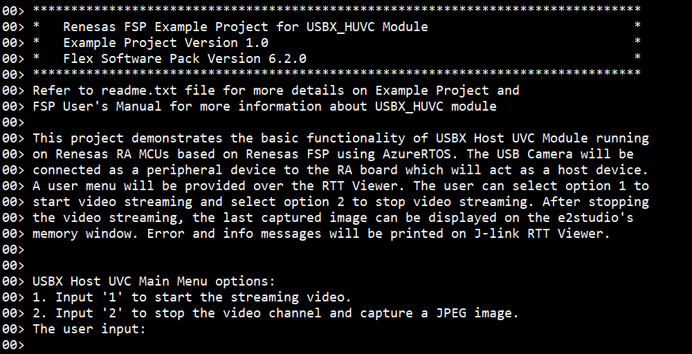
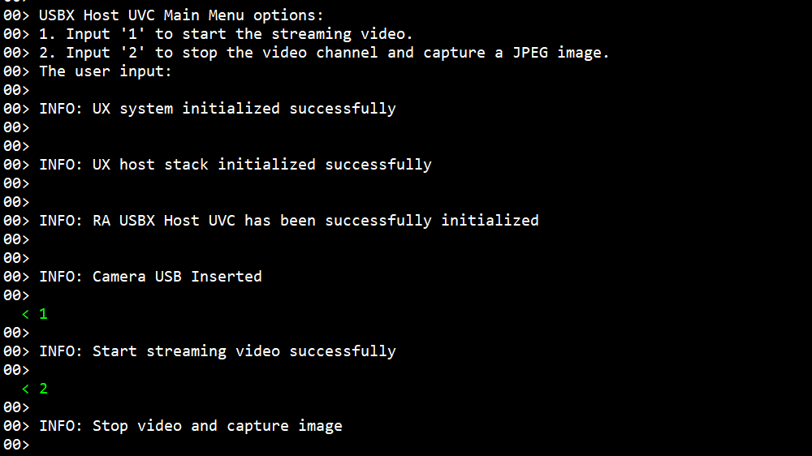
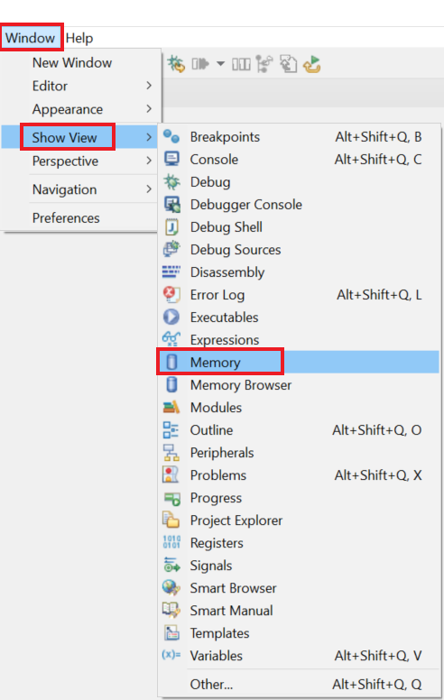
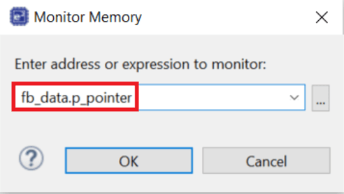
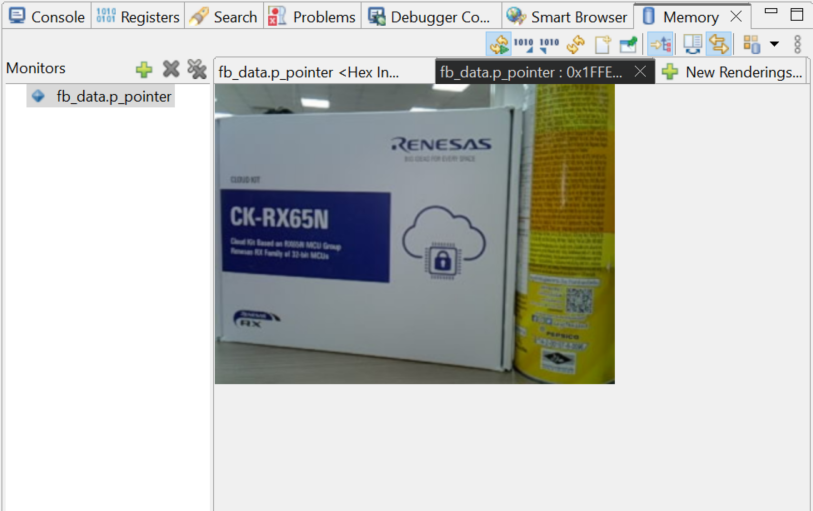

# Introduction #
This example project demonstrates the operation of USBX Host UVC Module running on Renesas RA MCUs based on Renesas FSP using AzureRTOS. The USB camera will be connected as a peripheral device to the RA board which will act as a host device. A user menu will be provided over the RTT Viewer. The User can select option 1 to start video streaming and select option 2 to stop video streaming. After stopping the video streaming, the last captured image can be displayed on the e2studio's memory window. Error and info messages will be printed on J-link RTT Viewer.

Please refer to the [Example Project Usage Guide](https://github.com/renesas/ra-fsp-examples/blob/master/example_projects/Example%20Project%20Usage%20Guide.pdf) for general information on example projects and [readme.txt](./readme.txt) for specifics of the operation.

## Required Resources ##
To build and run the USBX Host UVC example project, the following resources are needed.

### Software ###
Refer to software requirements mentioned in [Example Project Usage Guide](https://github.com/renesas/ra-fsp-examples/blob/master/example_projects/Example%20Project%20Usage%20Guide.pdf)

### Hardware ###
* Supported RA boards: EK-RA6M3, EK-RA6M5, EK-RA8M1, EK-RA8D1, EK-RA8P1, EK-RA8M2.
    * 1 x Renesas RA board.
    * 1 x Type-C USB cable for programming and debugging.
    * 1 x OTG Type-C cable.
    * 1 x USB video camera [(Logitech C310 HD Webcam)](https://www.amazon.com/Logitech-Widescreen-Correction-Noise-Reducing-FaceTime/dp/B003LVZO8S?th=1)
    * 1 x Host PC.

### Hardware Connections ###
* For EK-RA6M3, EK-RA6M5, EK-RA8M1 and EK-RA8D1:
    * Note: For EK-RA8D1, the user needs to turn off SW1-6 to use USBHS.
    * Jumper J7: Connect pins 1-2.
    * Remove Jumper J17 pins.
    * Connect micro-AB USB Debug port (J10) of the board to USB port of the host PC via a micro USB cable.
    * Connect the USB video camera to the micro-AB USB High-Speed (J31) of the board via an OTG cable.

* For EK-RA8P1, EK-RA8M2:
    * Note: For EK-RA8M2, the user must place jumper J6 on pins 2-3, J8 on pins 1-2, J9 on pins 2-3, and J29 on pins 1-2, 3-4, 5-6, 7-8 to use the on-board debug functionality.
    * Connect Type-C USB Debug port (J10) of the board to USB port of the host PC via a Type-C USB cable.
    * Connect the USB video camera to the Type-C USB High-Speed (J7) of the board via an OTG cable.

## Related Collateral References ##
The following documents can be referred to for enhancing your understanding of 
the operation of this example project:
- [FSP User Manual on GitHub](https://renesas.github.io/fsp/)
- [FSP Known Issues](https://github.com/renesas/fsp/issues)

# Project Notes #

## System Level Block Diagram ##

## FSP Modules Used ##
List all the various modules that are used in this example project. Refer to the FSP User Manual for further details on each module listed below.

| Module Name | Usage | Searchable Keyword (using New Stack > Search) |
| :---------: | :---------------: | :------------: |
| Azure RTOS USBX HUVC | This module provides USBX Host Video Class support on RA device. | HUVC |
| Azure RTOS USBX Port | This USB driver works by combining USBX and r_usb_basic module. | rm_usbx_port |
| USB Basic Driver | The USB module operates in combination with the device class drivers provided by Renesas to form a complete USB stack. | r_usb_basic |
| DMAC Transfer | DMAC is used to transfer the USB data to offload MCU usage. | r_dmac |

## Module Configuration Notes ##
This section describes FSP Configurator properties that are important or different from those selected by default. 

**Common Configuration Properties**

|   Module Property Path and Identifier   |   Default Value   |   Used Value   |   Reason   |
| :-------------------------------------: | :---------------: | :------------: | :--------: |
| configuration.xml > BSP > Properties > Settings > Property > RA Common > Main Stack size (bytes)| 0x400 | 0x400 | Main Program thread stack is configured to store the local variables of different functions in the code. |
| configuration.xml > BSP > Properties > Settings > Property > RA Common > Heap size (bytes) | 0 | 0 | Heap size is required for standard library functions to be used. |
| configuration.xml > Stacks > Threads > USB Camera Thread > Properties > Settings > Property > Common > Timer > Timer Ticks Per Second | 100 | 1000 | The default ticks should be 1000 indicating 1 tick per millisecond. |
| configuration.xml > Stacks > Threads > USB Camera Thread > Properties > Settings > Property > Thread > Priority | 1 | 21 | USB Camera Thread priority is lowered to allow the other USB operations to be serviced at a faster rate. |
| configuration.xml > Stacks > Threads > USB Camera Thread > Properties > Settings > Property > Thread > Stack size (bytes) | 1024 | 0x3000 | The size of the RTT Thread Stack is default to prevent memory overflow. |
| configuration.xml > Stacks > Threads > RTT Thread > Properties > Settings > Property > Thread > Priority | 1 | 20 | RTT Thread priority is lowered to allow the internal thread taking priority. |
| configuration.xml > Stacks > Threads > RTT Thread > Properties > Settings > Property > Thread > Stack size (bytes) | 1024 | 4096 | The size of the RTT Thread Stack is default to prevent memory overflow. |
| configuration.xml > Stacks > Threads > USB Camera Thread > g_basic0 USB (r_usb_basic) > Properties > Settings > Property > Module g_basic0 USB (r_usb_basic) > USB Speed | Full Speed | Hi Speed | USB Speed is configured as **Hi Speed**. |
| configuration.xml > Stacks > Threads > USB Camera Thread > g_basic0 USB (r_usb_basic) > Properties > Settings > Property > Module g_basic0 USB (r_usb_basic) > USB Module Number | USB_IP0 Port | USB_IP1 Port | This property is used to specify USB module number to be used as per configured USB speed. |
| configuration.xml > Stacks > Threads > USB Camera Thread > g_basic0 USB (r_usb_basic) > Properties > Settings > Property > Module g_basic0 USB (r_usb_basic) > USBHS Interrupt Priority | Not Support | Priority 12 | Select the interrupt priority used by the main USBHS ISR. |
| configuration.xml > Stacks > Threads > USB Camera Thread > g_basic0 USB (r_usb_basic) > Properties > Settings > Property > Module g_basic0 USB (r_usb_basic) > USBHS D0FIFO Interrupt Priority| Not Support | Priority 12 | Select the interrupt priority used by the USBHS D0FIFO ISR. |
| configuration.xml > Stacks > Threads > USB Camera Thread > g_basic0 USB (r_usb_basic) > Properties > Settings > Property > Module g_basic0 USB (r_usb_basic) > USBHS D1FIFO Interrupt Priority | Not Support | Priority 12 | Select the interrupt priority used by the USBHS D1FIFO ISR. |
| configuration.xml > Stacks > Threads > USB Camera Thread > g_basic0 USB (r_usb_basic) > Properties > Settings > Property > Common > DMA/DTC Support | Disabled | Enabled | Enable or disable DMA support for the USB module. |
| configuration.xml > Stacks > Threads > USB Camera Thread > g_basic0 USB (r_usb_basic) > Properties > Settings > Property > Common > DMA/DTC Source Address | DMA Disabled | HS Address | Set this to match the speed mode when DMA is enabled. |
| configuration.xml > Stacks > Threads > USB Camera Thread > g_basic0 USB (r_usb_basic) > Properties > Settings > Property > Common > DMA/DTC Destination Address | DMA Disabled | HS Address | Set this to match the speed mode when DMA is enabled. |
| configuration.xml > Stacks > Threads > USB Camera Thread > g_transfer0 Transfer > Properties > Settings > Property > Module g_transfer0 Transfer (r_dmac) > Transfer Size | 2 Bytes | 4 Bytes | Select the transfer size. |
| configuration.xml > Stacks > Threads > USB Camera Thread > g_transfer0 Transfer > Properties > Settings > Property > Module g_transfer0 Transfer (r_dmac) > Activation Source | No ELC Trigger | USBHS FIFO 1 (DMA transfer request 1) | Select the DMAC transfer start event. |
| configuration.xml > Stacks > Threads > USB Camera Thread > g_transfer1 Transfer > Properties > Settings > Property > Module g_transfer1 Transfer (r_dmac) > Transfer Size | 2 Bytes | 4 Bytes | Select the transfer size. |
| configuration.xml > Stacks > Threads > USB Camera Thread > g_transfer1 Transfer > Properties > Settings > Property > Module g_transfer1 Transfer (r_dmac) > Activation Source | No ELC Trigger | USBHS FIFO 0 (DMA transfer request 0) | Select the DMAC transfer start event. |

## API Usage ##

The table below lists the FSP provided API used at the application layer by this example project.

| API Name    | Usage                                                                          |
|-------------|--------------------------------------------------------------------------------|
| ux_system_initialize | This API is used to initialize the USBX system. |
| ux_host_stack_initialize | This API is used to initialize the USB host stack. |
| ux_host_class_video_transfer_callback_set | This function is used to set the video transfer callback function. |
| tx_semaphore_put | This API is used to place an instance in counting semaphore. |
| tx_semaphore_get | This API is used to get instance from counting semaphore. |
| tx_thread_sleep | This API is used to suspend the current thread for a specified time. |
| tx_event_flags_get | This API is used to get event flags from event flags group. |
| tx_event_flags_set | This API is used to set event flags in an event flags group. |
| tx_queue_send | This API is used to send message to message queue. |
| tx_queue_receive | This API is used to get message from message queue. |
| tx_byte_release | This API is used to release bytes back to memory pool. |
| tx_thread_info_get | This API is used to retrieve information about thread |
| ux_host_class_video_frame_parameters_set | This API is used to set the video parameters for the video device. |
| ux_host_class_video_max_payload_get | This API is used to return the maximum payload size for a given video parameter setting. |
| ux_host_class_video_start | This API is used to start the video streaming. |
| ux_host_class_video_stop | This API is used to stop the current video channel. |
| ux_host_class_video_transfer_buffer_add | This API is used to add a buffer for video transfer requests. |
| ux_utility_memory_compare | This API is used to compare two memory blocks. |
| ux_utility_string_length_get | This function is used to derive the length of a NULL-terminated string. |
| ux_host_stack_uninitialize | This API is used to un-initialize all the host code for USB. |
| ux_system_uninitialize | This API is used to un-initialize the various control data structures for the USBX system. |
| R_USB_Open | This API is used to open the USB basic driver. |
| R_USB_Close | This API is used to close the USB basic driver. |

## User Callback Handlers ##
| Callback Name    | Usage                                                                          |
|------------------|--------------------------------------------------------------------------------|
| ux_host_usr_event_notification | This function is used to handle the USB Attach and Removed events. |
| uvc_transfer_request_done_callback | This function is invoked to indicate the transfer completion to the USB camera. |

## Verifying operation ##
    
1. Import, generate, build, and download the USBX HUVC project to the RA board.
2. Open J-Link RTT Viewer to verify the initialization status.  
    The image below shows the output on J-Link RTT Viewer:  

3. Once the USB initialization is complete, the user enters '1' to start the streaming video and then enters '2' to stop the video channel and capture a JPEG image.  

4. After stopping the video channel, the last captured image can be displayed via the memory window view on e2studio.

- Click [Windows] → [Show View] → [Memory] to open the Memory view.  

- In "Memory Monitor" pane, click icon  to add monitor: "fb_data.p_pointer" and click [OK] to proceed.  

- Click "New Renderings…" in Memory Rendering pane. Select "Image" and click "Add Rendering(s)" to display JPEG images. e2studio will decode and display the image only if a valid JPEG file header is found at the specified memory address.

- Click icon  to enable the "Real-time Refresh"  

- Example:  

## Special Notes on attach and detach the Camera: ##
* Camera attach and detach events are detected by the program.
* If the user disconnects the camera while the image is being streamed, an MCU reset is required.
* If the camera is disconnected when image capture is stopped, the application can handle repeated attach and detach operations.