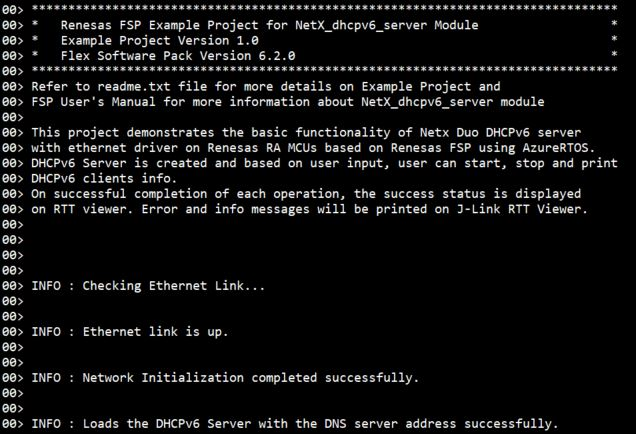
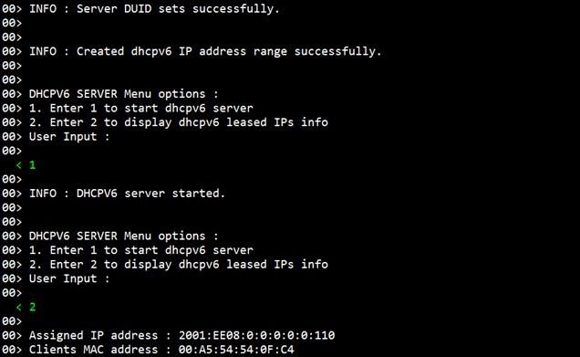

# Introduction #

The sample code accompanying this file shows the operation of a NetX Duo DHCPv6 Server on a RA MCU using Azure RTOS. In this sample code, a NetX Duo IP instance is created with IP address as (default 0.0.0.0 - Not assigned). The Server is always configured with the IP address, In this EP 2001.EE08.0.0.0.0.0.2 is the IP address of the Board (DHCP Server). The NetX stack is enabled for UDP, ICMP, ARP, IPv6, ICMPv6. DHCP Server uses the UDP protocol to receive DHCP Client requests and transmit responses. DHCP Server creates its packet pool based on the settings minimum packet payload size and number of packets in the packet pool. It creates pool of IPv6 addresses from the given range, and set server DUID. The DNS IPv6 address is updated for DHCPv6 server database, so that when the Clients request for IP address, DHCPv6 server also provides the DNS server info the clients.

Once the DHCPv6 Server is running and has created client records and assigned IP addresses, it periodically checks the time remaining on each of the client IP leases. If a lease expires, the server simply removes the client record from the client record table and returns that IP address back to the pool of assignable IP addresses. No message is sent to the client.

The status messages, client's info, and the code flow informational messages as part of the initialization are displayed on the J-link RTT Viewer.

**Note:** Range of IPv6 address for clients are from 2001.EE08.0.0.0.0.0.110 to 2001.EE08.0.0.0.0.0.150.

NetX Duo DHCPv6 Server is compliant with [RFC3315](https://tools.ietf.org/html/rfc3315), [RFC3646](https://tools.ietf.org/html/rfc3646), and related RFCs.

Please refer to the [Example Project Usage Guide](https://github.com/renesas/ra-fsp-examples/blob/master/example_projects/Example%20Project%20Usage%20Guide.pdf) for general information on example projects and [readme.txt](./readme.txt) for specifics of the operation.

## Required Resources ##
To build and run the NetX DHCPv6 Server example project, the following resources are needed.

### Software ###
Refer to software requirements mentioned in [Example Project Usage Guide](https://github.com/renesas/ra-fsp-examples/blob/master/example_projects/Example%20Project%20Usage%20Guide.pdf)

### Hardware ###
Supported RA boards: EK-RA6M3, EK-RA6M4, EK-RA6M5, EK-RA8D1, EK-RA8M1, MCK-RA8T1, EK-RA8P1
* 1 x Renesas RA Board.
* 1 x Type-C USB cable for programming and debugging.
* 1 x Ethernet/LAN cable (Ethernet cable CAT5/6).

### Hardware Connections ###
* For EK-RA6M3, EK-RA6M4, EK-RA6M5:
    * Connect the RA board USB device port to the host machine via a micro USB cable.
    * Connect the Ethernet port on RA board to the Ethernet port of PC/another RA board on which DHCPv6 Client is residing via a LAN cable.

* For EK-RA8M1:
    * Connect the RA board USB device port to the host machine via a micro USB cable.
    * Connect the Ethernet port on RA board to the Ethernet port of PC/another RA board on which DHCPv6 Client is residing via a LAN cable.
    * Remove jumper J61 to enable Ethernet B.
    
* For EK-RA8D1: 
    * Connect the RA board USB device port to the host machine via a micro USB cable.
    * Connect the Ethernet port on RA board to the Ethernet port of PC/another RA board on which DHCPv6 Client is residing via a LAN cable.
    * Set the configuration switches (SW1) as below to avoid potential failures:
        * CAUTION: Do not enable SW1-4 and SW1-5 together. 

        | SW1-1 PMOD1 | SW1-2 TRACE | SW1-3 CAMERA | SW1-4 ETHA | SW1-5 ETHB | SW1-6 GLCD | SW1-7 SDRAM | SW1-8 I3C |
        |-------------|-------------|--------------|------------|------------|------------|-------------|-----------|
        | OFF | OFF | OFF | OFF | ON | OFF | OFF | OFF |

* For MCK-RA8T1, EK-RA8P1:
    * Connect the RA board USB device port to the host machine via a Type-C USB cable.
    * Connect the Ethernet port on RA board to the Ethernet port of PC/another RA board on which DHCPv6 Client is residing via a LAN cable.

## Related Collateral References ##
The following documents can be referred to for enhancing your understanding of the operation of this example project:
- [FSP User Manual on GitHub](https://renesas.github.io/fsp/)
- [FSP Known Issues](https://github.com/renesas/fsp/issues)

# Project Notes #

## System Level Block Diagram ##

## FSP Modules Used ##
List all the various modules that are used in this example project. Refer to the FSP User Manual for further details on each module listed below.

| Module Name | Usage  | Searchable Keyword (using New Stack > Search) |
|-------------|-----------------------------------------------|-----------------------------------------------|
| NetX Duo DHCP IPv6 Server | DHCPv6 Server module is used to provide and assign dynamic global IPv6 address automatically, default gateways, and other network parameters to DHCPv6 Client devices. | dhcp |

## Module Configuration Notes ##
This section describes FSP Configurator properties that are important or different from those selected by default. 

|   Module Property Path and Identifier   |   Default Value   |   Used Value   |   Reason   |
| :-------------------------------------: | :---------------: | :------------: | :--------: |
| configuration.xml > BSP > Properties > Settings > Property > RA Common > Heap size (bytes) | 0 | 0x400 | Heap size is required for standard library functions to be used as per FSP requirements. |
| configuration.xml > Stacks > Threads > DHCPv6 Thread > Properties > Settings > Property > Thread > priority | 1 | 2 | DHCPv6 server thread priority is lowered to allow the IP thread to process incoming packets at the fastest rate possible. |
| configuration.xml > Stacks > Threads > RTT_Thread > Properties > Settings > Property > Thread > priority  | 1 | 3 | RTT thread priority is lowered to allow the DHCP server and IP threads to process incoming packets at the fastest rate possible. |
| configuration.xml > Stacks > Thread > DHCPv6 Thread > DHCPv6 Thread Stacks > g_ether0 Ethernet MAC (r_rmac) > Properties > Settings > Property > Module g_ether0 Ethernet MAC (r_rmac) > General > MAC address | 00:11:22:33:44:55 | 00:11:22:33:44:66 | Sets the MAC address, as server and client can not use same MAC address. |
| configuration.xml > Stacks > Thread > DHCPv6 Thread > DHCPv6 Thread Stacks > g_layer3_switch0 Switch (r_layer3_switch) > Properties > Settings > Property > Module g_layer3_switch0 Switch (r_layer3_switch) > Port > Port 1 > MAC address | 00:11:22:33:44:55 | 00:11:22:33:44:66 | Sets the MAC address for Port 1. |

## API Usage ##

The table below lists the DHCPv6 Server API used at the application layer by this example project.

| API Name    | Usage                                                                          |
|-------------|--------------------------------------------------------------------------------|
| nx_dhcpv6_create_dns_address | This API is used to create a DNS IPv6 address. |
| nx_dhcpv6_set_server_duid | This API is used to set server DUID. |
| nx_dhcpv6_create_ip_address_range | This API is used to create the DHCPv6 IP address range. |
| nx_dhcpv6_server_start | This API is used to start DHCPv6 Server processing. |

## Verifying Operation ##
* Import, build and download the EP (see section Starting Development of **FSP User Manual**). After running the EP, open RTT Viewer to see the output.  
* Before running the example project, refer to the steps below for hardware connections:
    * Connect the USB Debug port on the RA board to the host PC via a Type-C USB cable.
    * Connect the Ethernet port on RA board to the Ethernet port of PC/another RA board on which DHCPv6 Client is residing via a LAN cable.

**Steps to be followed when using another RA board as DHCPv6 Client:**
* After confirming all necessary hardware connections, run the DHCPv6 Server example project (EP) on the RA board. Then, start the server using the appropriate menu option.
* Once the server is running, execute the DHCPv6 Client EP on another RA board and monitor the output and status information using the RTT Viewer.

The image below shows the hardware connection setup required to run the example project:

The images below show the output on J-Link RTT Viewer:

## Special Topics ##
If the example project is not functioning correctly in terms of network connectivity or IP assignment, please re-check [readme.txt](./readme.txt).
