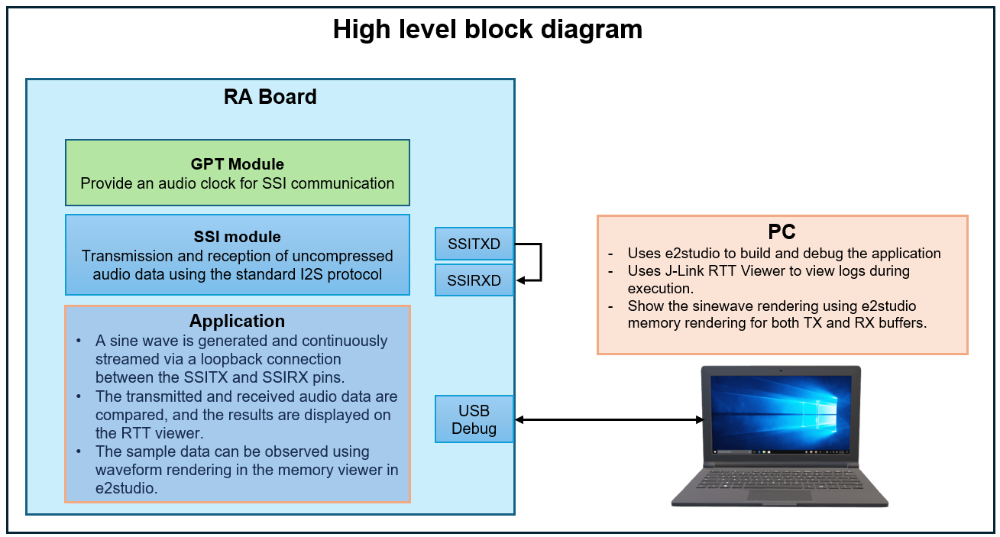
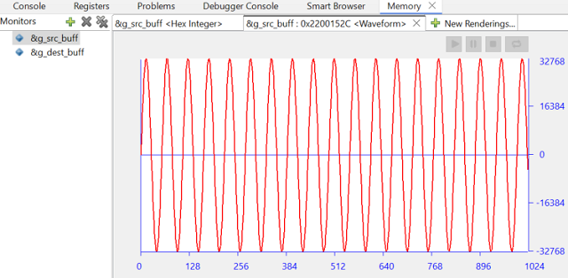
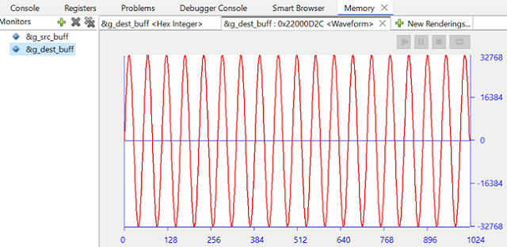
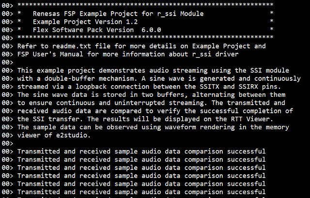

# Introduction #
This example project demonstrates audio streaming using the SSI module with a double-buffer mechanism. A sine wave is generated and continuously streamed via a loopback connection between the SSITX and SSIRX pins. The sine wave data is stored in two buffers, alternating between them to ensure continuous and uninterrupted streaming. The transmitted and received audio data are compared to verify the successful completion of the SSI transfer. The results will be displayed on the RTT Viewer. The sample data can be observed using waveform rendering in the memory viewer of e2studio.

Please refer to the [Example Project Usage Guide](https://github.com/renesas/ra-fsp-examples/blob/master/example_projects/Example%20Project%20Usage%20Guide.pdf) for general information on example projects and [readme.txt](./readme.txt) for specifics of operation.

## Required Resources ##
To build and run the SSI example project, the following resources are needed.

### Software ###
* Renesas Flexible Software Package (FSP): Version 6.0.0
* e2 studio: Version 2025-04.1
* SEGGER J-Link RTT Viewer: Version 8.44a
* LLVM Embedded Toolchain for ARM: Version 18.1.3

Refer to software requirements mentioned in [Example Project Usage Guide](https://github.com/renesas/ra-fsp-examples/blob/master/example_projects/Example%20Project%20Usage%20Guide.pdf)

### Hardware ###
* Supported RA boards: EK-RA4E2, EK-RA4L1, EK-RA4M1, EK-RA4M2, EK-RA4M3, EK-RA6E2, EK-RA6M1, EK-RA6M2, EK-RA6M3, EK-RA6M3G, EK-RA6M4, EK-RA6M5, EK-RA8D1, EK-RA8E2, EK-RA8M1, FPB-RA6E1, FPB-RA8E1, EK-RA2L2, EK-RA8P1.
   * 1 x Renesas RA board.
   * 1 x Type-C USB cable.
   * 1 x Host PC.
   * 1 x Jumper wire (For EK-RA4E2, FPB-RA6E1: 2 x Jumper wires).

### Hardware Connections: ###
Pin and Jumper Settings:  
* For EK-RA4E2:
   * Connect SSITXD P301 (J2:24) <--> SSIRXD P302 (J2:23).
   * Connect GPT1 P105 (J2:34) <--> AUDIO_CLK P100 (J2:39).

* For EK-RA4L1:
   * Connect SSITXD P405 (J2:42) <--> SSIRXD P406 (J2:38).

* For EK-RA4M1:
   * Connect SSITXD P405 (J2:31) <--> SSIRXD P406 (J2:15).

* For EK-RA4M2:
   * Connect SSITXD P405 (J1:7) <--> SSIRXD P406 (J1:10).

* For EK-RA6E2:
   * Connect SSITXD P301 (J2:24) <--> SSIRXD P302 (J2:23).

* For EK-RA6M1:
   * Connect SSITXD P405 (J1:16) <--> SSIRXD P406 (J1:18).

* For EK-RA6M2:
   * Connect SSITXD P405 (J1:6) <--> SSIRXD P406 (J1:8).

* For EK-RA6M3, EK-RA6M3G:
   * Connect SSITXD P405 (J3:13) <--> SSIRXD P406 (J3:16).
   * Cut E14 to get signal output for SSITXD pin and SSIRXD pin.

* For EK-RA4M3, EK-RA6M4:
   * Connect SSITXD P405 (J1:7) <--> SSIRXD P406 (J1:8).

* For EK-RA6M5:
   * Connect SSITXD P405 (J1:8) <--> SSIRXD P406 (J3:9)
   * Cut E22 to get signal output for SSITXD pin and SSIRXD pin.

* For EK-RA8D1:
   * Connect SSITXD P405 (J51:8) <--> SSIRXD P406 (J51:5).
   * Turn OFF SW1-3 and SW1-5 to get signal output for SSITXD pin and SSIRXD pin.

* For EK-RA8E2:
   * Connect SSITXD P114 (J14:10) <--> SSIRXD P115 (J14:8).

* For EK-RA8M1:
   * Connect SSITXD P405 (J56:29) <--> SSIRXD P406 (J56:27).
   * Install jumper J61 to get signal output for SSITXD pin and SSIRXD pin.

* For FPB-RA6E1:
   * Connect SSITXD P405 (J3:6) <--> SSIRXD P406 (J3:7).
   * Connect GPT2 P103 (J4:22) <--> AUDIO_CLK P402 (J3:3).

* For FPB-RA8E1:
   * Connect SSITXD P405 (J4:14) <--> SSIRXD P406 (J4:13).

* For EK-RA2L2:
   * Connect SSITXD P409 (J2:7) <--> SSIRXD P408 (J2:8).

* For EK-RA8P1:
   * Connect SSITXD P114 (J37:21) <--> SSIRXD P115 (J37:22).

## Related Collateral References ##
Please refer to the [Example Project Usage Guide](https://github.com/renesas/ra-fsp-examples/blob/master/example_projects/Example%20Project%20Usage%20Guide.pdf) for general information on example projects and [readme.txt](./readme.txt) for specifics of operation.

# Project Notes #

## System Level Block Diagram ##
High level block diagram

## FSP Modules Used ##
List of all the various modules that are used in this ssi_ep example project. Refer to the FSP User Manual for more details on each module listed below.

| Module Name | Usage  | Searchable Keyword (using New Stack > Search) |
|-------------|-----------------------------------------------|-----------------------------------------------|
| I2S | SSI driver. | r_ssi |
| Timer, General PWM | Provide an audio clock for SSI communication. | r_gpt |

## Module Configuration Notes ##
This section describes FSP Configurator properties that are important or different from those selected by default. 

**Common Configuration Properties**

|   Module Property Path and Identifier   |   Default Value   |   Used Value   |   Reason   |
| :-------------------------------------: | :---------------: | :------------: | :--------: |
| configuration.xml > BSP > Properties > Settings > Property > RA Common > Main stack size (bytes) | 0x400 | 0x400 | Change stack size to accommodate function usage in the EP and avoid any runtime errors. |
| configuration.xml > BSP > Properties > Settings > Property > RA Common > Heap size (bytes) | 0 | 0x400 | Change heap size to accommodate function usage in the EP and avoid any runtime errors. |

**Configuration Properties for SSI**

|   Module Property Path and Identifier   |   Default Value   |   Used Value   |   Reason   |
| :-------------------------------------: | :---------------: | :------------: | :--------: |
| configuration.xml > Stacks > g_i2s I2S (r_ssi) > Properties > Settings > Property > Common > DTC Support | Enabled | Enabled | Enable DTC support for the module. |
| configuration.xml > Stacks > g_i2s I2S (r_ssi) > Properties > Settings > Property > Module g_i2s I2S (r_ssi) > Channel| 0 | 0 | Specify the I2S channel. |
| configuration.xml > Stacks > g_i2s I2S (r_ssi) > Properties > Settings > Property > Module g_i2s I2S (r_ssi) > Operating Mode (Master/Slave) | Master Mode | Master Mode | Specify if the MCU is I2S master or slave. |
| configuration.xml > Stacks > g_i2s I2S (r_ssi) > Properties > Settings > Property > Module g_i2s I2S (r_ssi) > Bit Depth | 16 Bits | 16 bits | Select the bit depth of one sample of audio data. |
| configuration.xml > Stacks > g_i2s I2S (r_ssi) > Properties > Settings > Property > Module g_i2s I2S (r_ssi) > Word Length | 16 Bits| 16 bits | This property is used to specify Word Length. |
| configuration.xml > Stacks > g_i2s I2S (r_ssi) > Properties > Settings > Property > Module g_i2s I2S (r_ssi) > WS Continue Mode | Disabled | Disabled | This property is used to enable/disable WS Continue Mode. |
| configuration.xml > Stacks > g_i2s I2S (r_ssi) > Properties > Settings > Property > Module g_i2s I2S (r_ssi) > Bit Clock Source (available only in Master mode) | External AUDIO_CLK | Internal AUDIO_CLK | This property is used to set Bit Clock Source. |
| configuration.xml > Stacks > g_i2s I2S (r_ssi) > Properties > Settings > Property > Module g_i2s I2S (r_ssi) >  Bit Clock Divider (available only in Master mode) | Audio Clock / 1 | Audio Clock/2 | This property is used to set Bit Clock Divider. |
| configuration.xml > Stacks > g_i2s I2S (r_ssi) > Properties > Settings > Property > Module g_i2s I2S (r_ssi) > Callback | NULL | i2s_callback | Defined user callback for SSI events. |
| configuration.xml > Stacks > g_i2s I2S (r_ssi) > Properties > Settings > Property > Module g_i2s I2S (r_ssi) > Transmit Interrupt Priority | Disabled | Priority 2 | This property is used to set Transmit Interrupt Priority. |
| configuration.xml > Stacks > g_i2s I2S (r_ssi) > Properties > Settings > Property > Module g_i2s I2S (r_ssi) > Receive Interrupt Priority  | Disabled  | Priority 2 | This property is used to set Receive Interrupt Priority. |
| configuration.xml > Stacks > g_i2s I2S (r_ssi) > Properties > Settings > Property > Module g_i2s I2S (r_ssi) > Idle/Error Interrupt Priority  | Disabled  | Priority 2 | This property is used to set Idle/Error Interrupt Priority. |

**Configuration Properties for GPT**

|   Module Property Path and Identifier   |   Default Value   |   Used Value   |   Reason   |
| :-------------------------------------: | :---------------: | :------------: | :--------: |
| configuration.xml > Stacks > g_timer Timer, General PWM (r_gpt) > Properties > Settings > Property > Module g_timer Timer, General PWM (r_gpt) > General > Channel | 0 | 2 | Channel of GPT to get audio clock for SSI communication |
| configuration.xml > Stacks > g_timer Timer, General PWM (r_gpt) > Properties > Settings > Property > Module g_timer Timer, General PWM (r_gpt) > General > Period | 0x10000 | 1411200 | Period to get audio clock for SSI communication |
| configuration.xml > Stacks > g_timer Timer, General PWM (r_gpt) > Properties > Settings > Property > Module g_timer Timer, General PWM (r_gpt) > General > Period Unit | Raw Counts | Hertz | Unit of the period specified above |

## API Usage ##

The table below lists the basic APIs used at the application layer by this example project.

| API Name    | Usage                                                                          |
|-------------|--------------------------------------------------------------------------------|
|R_SSI_Open| This API is used to open the SSI instance. |
|R_SSI_Stop| This API is used to stop SSI. |
|R_SSI_WriteRead| This API is used to write from source buffer and reads data into destination buffer. |
|R_SSI_Close| This API is used to close the SSI instance. |
|R_GPT_Open| This API is used to initialize the General PWM configured as SSI Audio Clock. |
|R_GPT_Start| This API is used to start SSI Audio Clock. |
|R_GPT_Close| This API is used to stop the SSI Audio Clock. |

## Verifying operation ##
* Connect USB cables and connecting wires as mentioned in the **Hardware Connection** section.
* Import, Build and Debug the EP (*see section Starting Development* of **FSP User Manual**). After running the EP, open waveform rendering in memory viewer to see the output of sampled data. One can also check the buffer by adding it to the expression tab.

### Setting up waveform rendering ###
* While debugging the project, enter the memory view and add "g_src_buff" (transmitted data) and "g_dest_buff" (received data) as variables to monitor.
* Then click on New Rendering -> Waveform -> Waveform properties
* Set the waveform properties as Data Size to 16 bit, user-specified minimum and maximum values for Y-axis on signal generator, Channel to Mono, Buffer Size as 2048.

   
**Note:** User can add the buffer address of each channel in the memory to view the waveform of each channel connected.
  
The images below showcase the output of waveform rendering for SSI:

* Waveform Rendering of SSI source buffer (g_src_buff):

* Waveform Rendering of SSI destination buffer (g_dest_buff):
   * Note: 
      * The `g_dest_buff` buffer is cleared before new incoming data is stored, which may cause differences between the waveform viewed in **Memory View** and the capture image below. This is expected behavior due to the double-buffering mechanism used in streaming.
      * For accurate validation, the user should set a breakpoint at **line 143** (This code line used memcmp function to compare `g_src_buff` and `g_dest_buff`) in `...\e2studio\src\ssi_ep.c` to validate the waveform.

* Open an instance of J-Link RTT Viewer to see the output status of the example project.
* The transaction/status messages will be displayed in J-Link RTT Viewer as depicted below:

SSI RTT Viewer Log

## Special Topics ##
### Calculate Audio Clock Frequency ###
* The audio clock source comes from an internal connection to the GPT timer output, so the user can change the "Period" to get a different audio sample rate.
* The bit clock frequency is the product of the sampling frequency, number of channels and bits per system word:
   * bit_clock (Hz) = sampling_frequency (Hz) * channels * system_word_bits
* I2S data always has 2 channels.
* For example, the bit clock for transmitting 2 channels of 16-bit data (using a 16-bit system word) at 22050 Hz would be:
   * 22050 * 2 * 16 = 705600Hz
* The audio clock frequency is used to generate the bit clock frequency. It must be a multiple of the bit clock frequency. Refer to the Bit Clock Divider configuration for divider options. The input audio clock frequency must be:
   * audio_clock (Hz) = desired_bit_clock (Hz) * bit_clock_divider
   * To get a bit clock of 705600Hz from an audio clock of 1411200Hz, select the divider Audio Clock/2.
