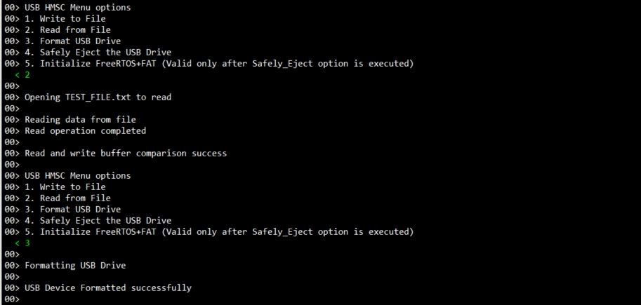
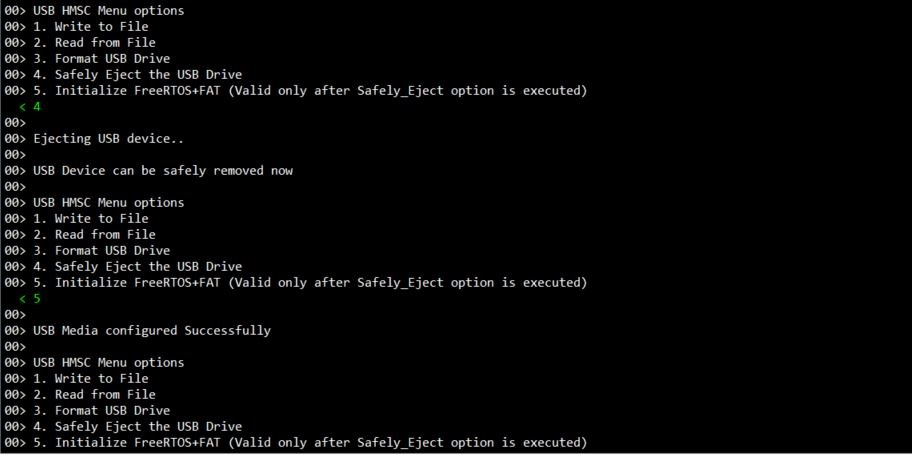

# Introduction #
This example project demonstrates basic functionalities of USB Host Mass Storage Class (HMSC) driver with FreeRTOS+FAT file system using baremetal on Renesas RA MCUs based on Renesas FSP. FreeRTOS+FAT uses the underlying Block media driver which utilizes USB HMSC driver to perform file operations on the USB storage devices. Error and EP status messages will be printed on J-Link RTT Viewer.

Please refer to the [Example Project Usage Guide](https://github.com/renesas/ra-fsp-examples/blob/master/example_projects/Example%20Project%20Usage%20Guide.pdf) for general information on example projects and [readme.txt](./readme.txt) for specifics of operation.

## Required Resources ##
To build and run the example project, the following resources are needed.

### Software ###
* Renesas Flexible Software Package (FSP): Version 6.0.0
* e2 studio: Version 2025-04.1
* SEGGER J-Link RTT Viewer: Version 8.44a
* LLVM Embedded Toolchain for ARM: Version 18.1.3

Refer to software requirements mentioned in [Example Project Usage Guide](https://github.com/renesas/ra-fsp-examples/blob/master/example_projects/Example%20Project%20Usage%20Guide.pdf)

### Hardware ###
* Supported RA boards: EK-RA4M2, EK-RA4M3, EK-RA6M3, EK-RA6M3G, EK-RA6M4, EK-RA6M5, EK-RA8D1, EK-RA8M1, MCK-RA8T1, EK-RA4L1, EK-RA8E2, EK-RA8P1
  * 1 x Renesas RA board.
  * 1 x Type-C USB cable for programming and debugging.
  * 1 x Type-C USB OTG cable.
  * 1 x USB flash drive.

### Hardware Connections: ###
* For EK-RA6M3, EK-RA6M3G (High-Speed):
  * Jumper J7: Connect pins 1-2.
  * Remove Jumper J17 pins.
  * Connect the USB flash drive to the J6 connector using a micro USB OTG cable.
			
* For EK-RA8M1, EK-RA6M5 (High-Speed):
  * Jumper J7: Connect pins 1-2.
  * Remove Jumper J17 pins.
  * Connect the USB flash drive to the J31 connector using a micro USB OTG cable.

* For EK-RA8P1 (High-Speed):
  * Connect the USB flash drive to the J7 connector using a Type-C USB OTG cable.
 
* For EK-RA4M2, EK-RA4M3, EK-RA6M3, EK-RA6M3G, EK-RA6M4, EK-RA6M5, EK-RA8D1, EK-RA8M1 (Full-Speed):
  * Jumper J12 placement is pins 1-2.
  * Remove Jumper J15 pins.
  * Connect the USB flash drive to the J11 connector using a micro USB OTG cable.

* For MCK-RA8T1 (Full-Speed):
  * Jumper JP9 placement is pins 1-2.
  * Remove Jumper J10 pins.
  * Connect the USB flash drive to the CN14 connector using a Type-C USB OTG cable.

* For EK-RA4L1 (Full-Speed):
  * Set J17 jumper to pins 2-3, Set J7 jumper to use P407 for USBFS VBUS.
  * The user must turn OFF S4-4 to select USB Host Controller mode.
  * Connect the USB flash drive to the J11 connector using a Type-C USB OTG cable.

* For EK-RA8E2, EK-RA8P1 (Full-Speed):
  * Connect the USB flash drive to the J11 connector using a Type-C USB OTG cable.

## Related Collateral References ##
The following documents can be referred to for enhancing your understanding of the operation of this example project:
- [FSP User Manual on GitHub](https://renesas.github.io/fsp/)
- [FSP Known Issues](https://github.com/renesas/fsp/issues)

# Project Notes #

## System Level Block Diagram ##

Note: Menu option 5 is valid only after menu option 4 is executed.

## FSP Modules Used ##
List all the various modules that are used in this example project. Refer to the FSP User Manual for further details on each module listed below.

| Module Name | Usage  | Searchable Keyword (using New Stack > Search) |
|-------------|-----------------------------------------------|-----------------------------------------------|
| FreeRTOS+FAT | This module provides the hardware port layer for FreeRTOS+FAT file system and the file system can be used using APIs. FreeRTOS+FAT stack is used to enable media driver to perform I/O operations on media connected by user through a Baremetal Application. | freertos |

## Module Configuration Notes ##
This section describes FSP Configurator properties that are important or different from those selected by default.

**Common Configuration Properties**

|   Module Property Path and Identifier   |   Default Value   |   Used Value   |   Reason   |
| :-------------------------------------: | :---------------: | :------------: | :--------: |
| configuration.xml > BSP > Properties > Settings > Property > RA Common > Main stack size (bytes) | 0 | 0x800 | Modified main stack size to accommodate function call operations according to FSP User Manual. |
| configuration.xml > BSP > Properties > Settings > Property > RA Common > Heap size (bytes) | 0 | 0x800| Change heap size to accommodate file operations in the EP and avoid any runtime errors according to FSP User Manual. |
| configuration.xml > Stacks > FreeRTOS+FAT > Properties > Settings > Property > Common > Long Function Names > LFN Support | Disabled | Enabled | This support is enabled to use wide range of file names. |
| configuration.xml > Stacks > FreeRTOS+FAT > Properties > Settings > Property > Common > Long Function Names > Shortname Case | Disabled | Enabled | This support is enabled to recognise case bits while using short names. |
| configuration.xml > Stacks > FreeRTOS+FAT Port for RA (rm_freertos_plus_fat) > Properties > Settings > Property > Module FreeRTOS+FAT Port for RA (rm_freertos_plus_fat) > Total number of sectors | 31293440 | 31293440 | Total number of sectors modified based on the connected device. |

**Configuration Properties if USB Speed as High Speed**

|   Module Property Path and Identifier   |   Default Value   |   Used Value   |   Reason   |
| :-------------------------------------: | :---------------: | :------------: | :--------: |
| configuration.xml > Stacks > g_basic0 USB (r_usb_basic) > Properties > Settings > Property > Common > DMA/DTC Source Address | DMA Disabled | HS Address | USB basic driver is configured **USB Speed** as **Hi Speed**. Accordingly, DMA Source Address should be provided with **HS Address**. |
| configuration.xml > Stacks > g_basic0 USB (r_usb_basic) > Properties > Settings > Property > Common > DMA/DTC Destination Address| DMA Disabled | HS Address | USB basic driver is configured **USB speed** as **Hi Speed**. Accordingly, DMA Destination Address should be provided with **HS Address**. |
| configuration.xml > Stacks > g_basic0 USB (r_usb_basic) > Properties > Settings > Property > Module g_basic0 USB (r_usb_basic) > USB Speed | Full Speed | Hi Speed | USB Speed is configured as **Hi Speed**.|
| configuration.xml > Stacks > g_basic0 USB (r_usb_basic) > Properties > Settings > Property > Module g_basic0 USB (r_usb_basic) > USB Module Number | USB_IP0 Port | USB_IP1 Port | This property is used to specify USB module number to be used as per configured USB speed. |
| configuration.xml > Stacks > g_transfer0 Transfer (r_dmac) > Properties > Settings > Property > Module g_transfer0 Transfer (r_dmac) > Transfer Size | 2 Bytes | 4 Bytes | The transfer size of DMA for **High Speed** requires **4 Bytes**. |
| configuration.xml > Stacks > g_transfer0 Transfer (r_dmac) > Properties > Settings > Property > Module g_transfer0 Transfer (r_dmac) > Activation Source | No ELC Trigger | USBHS FIFO 1 (DMA Transfer request 1) |This is an event trigger for DMA transfer 0 instance for destination pointer address. |
| configuration.xml > Stacks > g_transfer1 Transfer (r_dmac) > Properties > Settings > Property > Module g_transfer1 Transfer (r_dmac) > Transfer Size | 2 Bytes | 4 Bytes | The transfer size of DMA for **High Speed** requires **4 Bytes**. |
| configuration.xml > Stacks > g_transfer1 Transfer (r_dmac) > Properties > Settings > Property > Module g_transfer1 Transfer (r_dmac) > Activation Source | No ELC Trigger | USBHS FIFO 0 (DMA Transfer request 0) |This is an event trigger for DMA transfer 1 instance for source pointer address. |

**Configuration Properties if USB Speed as Full Speed**

|   Module Property Path and Identifier   |   Default Value   |   Used Value   |   Reason   |
| :-------------------------------------: | :---------------: | :------------: | :--------: |
| configuration.xml > Stacks > g_basic0 USB (r_usb_basic) > Properties > Settings > Property > Common > DMA/DTC Source Address | DMA Disabled | FS Address | USB basic driver is configured **USB Speed** as **Full Speed**. Accordingly, DMA Source Address should be provided with **FS Address**. |
| configuration.xml > Stacks > g_basic0 USB (r_usb_basic) > Properties > Settings > Property > Common > DMA/DTC Destination Address | DMA Disabled | FS Address | USB basic driver is configured **USB speed** as **Full Speed**. Accordingly, DMA Destination Address should be provided with **FS Address**. |
| configuration.xml > Stacks > g_basic0 USB (r_usb_basic) > Properties > Settings > Property > Module g_basic0 USB (r_usb_basic) > USB Speed | Full Speed | Full Speed | USB Speed is configured as **Full Speed**. |
| configuration.xml > Stacks > g_basic0 USB (r_usb_basic) > Properties > Settings > Property > Module g_basic0 USB (r_usb_basic) > USB Module Number | USB_IP0 Port | USB_IP0 Port | This property is used to specify USB module number to be used as per configured USB speed. |
| configuration.xml > Stacks > g_transfer0 Transfer (r_dmac) > Properties > Settings > Property > Module g_transfer0 Transfer (r_dmac) > Transfer Size | 2 Bytes | 2 Bytes | The transfer size of DMA for **Full Speed** requires **2 Bytes**. |
| configuration.xml > Stacks > g_transfer0 Transfer (r_dmac) > Properties > Settings > Property > Module g_transfer0 Transfer (r_dmac) > Activation Source | No ELC Trigger | USBFS FIFO 1 (DMA/DTC Transfer request 1) | This is an event trigger for DMA transfer 0 instance for destination pointer address. |
| configuration.xml > Stacks > g_transfer1 Transfer (r_dmac) > Properties > Settings > Property > Module g_transfer1 Transfer (r_dmac) > Transfer Size | 2 Bytes | 2 Bytes | The transfer size of DMA for **Full Speed** requires **2 Bytes**. |
| configuration.xml > Stacks > g_transfer1 Transfer (r_dmac) > Properties > Settings > Property > Module g_transfer1 Transfer (r_dmac) > Activation Source | No ELC Trigger | USBFS FIFO 0 (DMA/DTC Transfer request 0) | This is an event trigger for DMA transfer 1 instance for source pointer address. |

## API Usage ##
The table below lists the USB basic APIs used at the application layer by this example project.

| API Name    | Usage                                                                          |
|-------------|--------------------------------------------------------------------------------|
| RM_FREERTOS_PLUS_FAT_Open | This function is used to initialize lower layer media device. |
| RM_FREERTOS_PLUS_FAT_Close | This function is used to close media device. |
| RM_FREERTOS_PLUS_FAT_MediaInit | This function is used to initialize the media device. |
| RM_FREERTOS_PLUS_FAT_DiskInit | This function is used to initialize a FreeRTOS+FAT disk structure. |
| RM_FREERTOS_PLUS_FAT_DiskDeinit | This function is used to deinitialize a FreeRTOS+FAT disk structure. |
| FF_Mount | This function is used to mount the disk. |
| FF_FS_Add | This function is used to add the disk to the file system. |
| FF_Format | This function is used to format the disk. |
| ff_fopen | This function is used to open a file in the FAT file system. |
| ff_stat | This function is used to populate the stat structure members like cluster number, device details, size of object, mode of file or directory. |
| ff_fread | This function is used to read data from the current read/write position within an open file. |
| ff_fwrite | This function is used to write data to the current read/write position within an open file. |
| ff_fclose | This function is used to flush then closes a file. |

## Verifying Operation ##
* Import, build and debug the EP (see section Starting Development of **FSP User Manual**).
* Connect hardware properly as mentioned in the **Hardware Connections** section above.
* Run the EP, then open J-Link RTT Viewer to see the menu and output status of the EP.
* Based on the user input the relevant file operation is performed.
* The status messages will be displayed in J-Link RTT Viewer as depicted below:

Note: "TEST_FILE.txt" is the file created while calling File Open before performing a write operation

