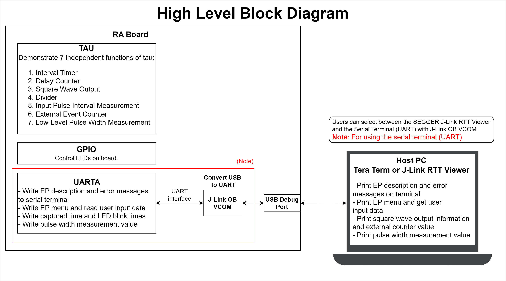
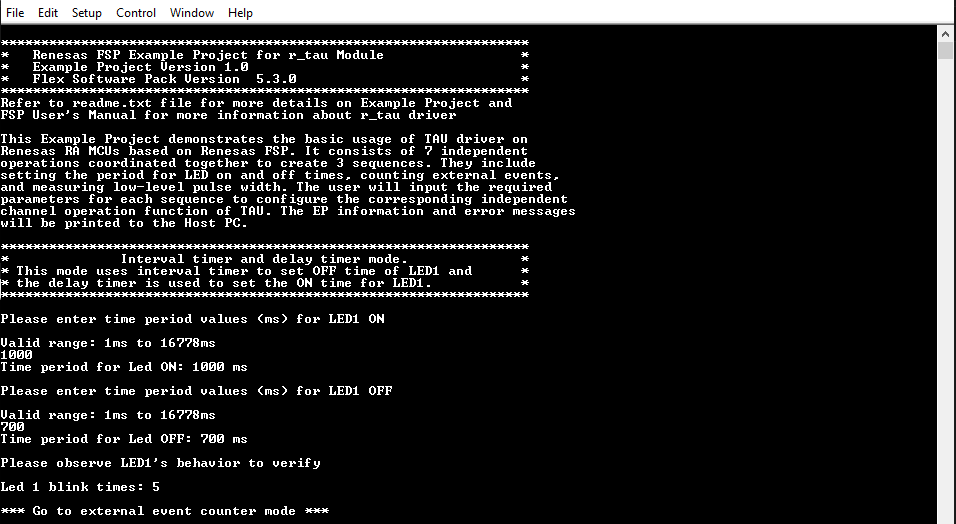
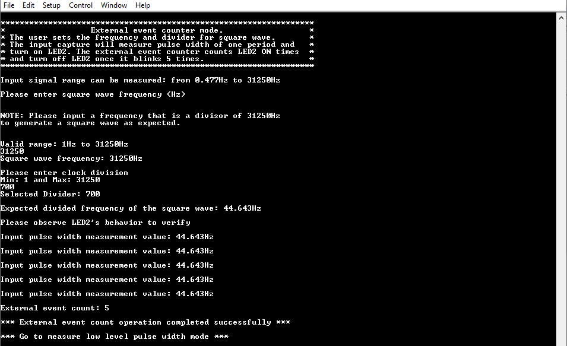
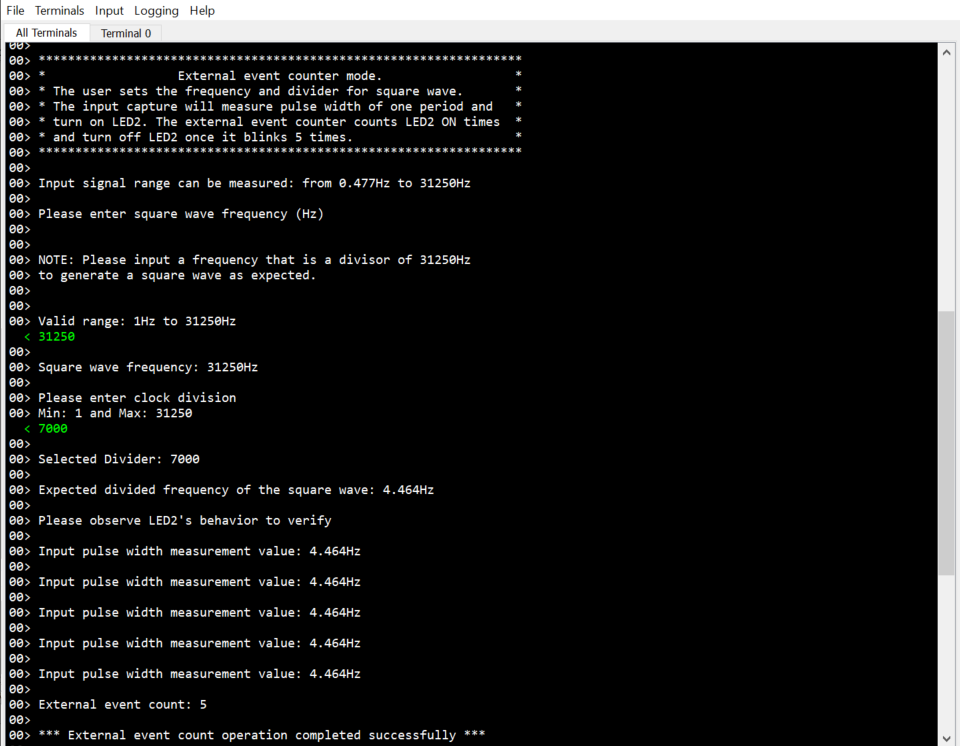

# Introduction #

This Example Project demonstrates the basic usage of TAU driver on Renesas RA MCUs based on Renesas FSP. It consists of 7 independent operations coordinated together to create 3 sequences. They include setting the period for LED on and off times, counting external events, and measuring low-level pulse width. The user will input the required parameters for each sequence to configure the corresponding independent channel operation function of TAU. The EP information and error messages will be printed to the Host PC.

**NOTE:** To display information, users can select between the SEGGER J-Link RTT Viewer and the Serial Terminal (UART) with J-Link OB VCOM. By default, the Example Project information is printed to the host PC via the Serial Terminal. To utilize SEGGER RTT instead of the Serial Terminal, please follow the instructions in "Verifying Operation" section.

Please refer to the [Example Project Usage Guide](https://github.com/renesas/ra-fsp-examples/blob/master/example_projects/Example%20Project%20Usage%20Guide.pdf) 
for general information on example projects and [readme.txt](./readme.txt) for specifics of operation.

## Required Resources ## 
To build and run the TAU Example Project, the following resources are needed.

### Hardware ###
Supported RA Boards: FPB-RA0E1
* 1 x Renesas RA board.
* 1 x USB Type C cable.
* 5 x Jumper cable (both ends female).
* 1 x Host PC.

### Hardware Connections ###
* FPB-RA0E1:
  * Connect RA board to Host PC by USB Type C cable.
  * For using the Serial Terminal (UART):     
    * The soldering bridge E4 must be closed.
    * Populate R10 with a resistor ranging from 0 to 150 ohms.
  * Pin connection:
    * P008-LED1 (J2-Pin 30) <--------> P112-TI03 (J2-Pin 20)
    * P110-T001 (J2-Pin 19) <--------> P213-TI00 (J1-Pin 5)
    * P212-TO00 (J1-Pin 6) &ensp;<--------> P100-TI04 (J2-Pin 24)
    * P009-LED2 (J2-Pin 29) <--------> P103-TI05 (J2-Pin 21)
    * P102-T006 (J2-Pin 22) <--------> P101-TI07 (J2-Pin 23)

### Software ###
* Renesas Flexible Software Package (FSP)
* e2 studio: Version 2024-04
* SEGGER J-Link RTT Viewer: Version 7.96a (For using the SEGGER J-Link RTT Viewer)
* GCC ARM Embedded Toolchain: Version 13.2.1.arm-13-7
* Terminal Console Application: Tera Term or a similar application (For using the Serial Terminal (UART))

Refer to the software required section in [Example Project Usage Guide](https://github.com/renesas/ra-fsp-examples/blob/master/example_projects/Example%20Project%20Usage%20Guide.pdf) for basic information on setting up and using the above software.

## Related Collateral References ##
The following documents can be referred to for enhancing your understanding of 
the operation of this example project:
- [FSP User Manual on GitHub](https://renesas.github.io/fsp/)
- [FSP Known Issues](https://github.com/renesas/fsp/issues)

# Project Notes #

## System Level Block Diagram ##
High level block diagram of the system is shown below:
 

## FSP Modules Used ##
List all the various modules that are used in this example project. Refer to the FSP User Manual for further details on each module listed below.

| Module Name | Usage | Searchable Keyword  |
|-------------|-----------------------------------------------|-----------------------------------------------|
| TAU | Operating 16-bit timer with 7 modes: Interval Timer, Delay Counter, Square Wave Output, Divider, Input Pulse Interval Measurement, External Event Counter, Low Level Pulse Width Measurement | r_tau |
| I/O Port | I/O Port is used to control LEDs onboard| r_ioport|

## Module Configuration Notes ##
This section describes FSP Configurator properties which are important or different than those selected by default. 

**Configuration Properties for using TAU**

|   Module Property Path and Identifier   |   Default Value   |   Used Value   |   Reason   |
|-----------------------------------------|-------------------|----------------|------------|
| configuration.xml > g_interval_timer Timer, Independent Channel, 16-bit and 8-bit Timer Operation (r_tau) > Settings > Property > Common > Pin Output Support support | Disabled | Enabled | Enable output for both square wave and divider output. |
| configuration.xml > g_interval_timer Timer, Independent Channel, 16-bit and 8-bit Timer Operation (r_tau) > Settings > Property > Common > Pin Input Support support | Disabled | Enabled | Enable input for pulse width measurement, level width measurement, event counting or divider functions. |
| configuration.xml > g_interval_timer Timer, Independent Channel, 16-bit and 8-bit Timer Operation (r_tau) > Settings > Property > Module g_interval_timer Timer, Independent Channel, 16-bit and 8-bit Timer Operation (r_tau) > General > Function | Interval Timer | Interval Timer | The timer array unit can be used as a reference timer to generate TAU0_TMI0n (timer interrupt) at fixed intervals. |
| configuration.xml > g_interval_timer Timer, Independent Channel, 16-bit and 8-bit Timer Operation (r_tau) > Settings > Property > Module g_interval_timer Timer, Independent Channel, 16-bit and 8-bit Timer Operation (r_tau) > General > Operation Clock | CK00 | CK00 | Specify the selection of operation clock. |
| configuration.xml > g_interval_timer Timer, Independent Channel, 16-bit and 8-bit Timer Operation (r_tau) > Settings > Property > Module g_interval_timer Timer, Independent Channel, 16-bit and 8-bit Timer Operation (r_tau) > Interrupts > Callback | NULL | tau_interval_timer_callback | A user callback function. If this callback function is provided, it is called from the interrupt service routine (ISR) each time the timer period. |
| configuration.xml > g_interval_timer Timer, Independent Channel, 16-bit and 8-bit Timer Operation (r_tau) > Settings > Property > Module g_interval_timer Timer, Independent Channel, 16-bit and 8-bit Timer Operation (r_tau) > Interrupts > Interrupt Priority | Disable | Priority 2 | Timer interrupt priority. |
| configuration.xml > g_delay_timer Timer, Independent Channel, 16-bit and 8-bit Timer Operation (r_tau) > Settings > Property > Module g_delay_timer Timer, Independent Channel, 16-bit and 8-bit Timer Operation (r_tau) > General > Function | Interval Timer | Delay Counter | It is possible to start counting down when the valid edge of the TI0n pin input is detected (an external event), and then generate TAU0_TMI0n (a timer interrupt) after any specified interval. |
| configuration.xml > g_delay_timer Timer, Independent Channel, 16-bit and 8-bit Timer Operation (r_tau) > Settings > Property > Module g_delay_timer Timer, Independent Channel, 16-bit and 8-bit Timer Operation (r_tau) > General > Operation Clock | CK00 | CK00 | Specify the selection of operation clock. |
| configuration.xml > g_delay_timer Timer, Independent Channel, 16-bit and 8-bit Timer Operation (r_tau) > Settings > Property > Module g_delay_timer Timer, Independent Channel, 16-bit and 8-bit Timer Operation (r_tau) > Input > Input Source | No input signal | Input signal of TImn Pin | Select input source from TImn Pin |
| configuration.xml > g_delay_timer Timer, Independent Channel, 16-bit and 8-bit Timer Operation (r_tau) > Settings > Property > Module g_delay_timer Timer, Independent Channel, 16-bit and 8-bit Timer Operation (r_tau) > Input > Trigger Edge | Trigger Edge Rising | Trigger Edge Rising | Select the trigger edge. |
| configuration.xml > g_delay_timer Timer, Independent Channel, 16-bit and 8-bit Timer Operation (r_tau) > Settings > Property > Module g_delay_timer Timer, Independent Channel, 16-bit and 8-bit Timer Operation (r_tau) > Interrupts > Callback | NULL | tau_delay_timer_callback | A user callback function. If this callback function is provided, it is called from the interrupt service routine (ISR) each time the timer period. |
| configuration.xml > g_delay_timer Timer, Independent Channel, 16-bit and 8-bit Timer Operation (r_tau) > Settings > Property > Module g_delay_timer Timer, Independent Channel, 16-bit and 8-bit Timer Operation (r_tau) > Interrupts > Interrupt Priority | Disable | Priority 2 | Timer interrupt priority. |
| configuration.xml > g_square_wave_output_sequence2 Timer, Independent Channel, 16-bit and 8-bit Timer Operation (r_tau) > Settings > Property > Module g_square_wave_output_sequence2 Timer, Independent Channel, 16-bit and 8-bit Timer Operation (r_tau) > General > Function | Interval Timer | Square Wave Output | This function can use TO0n to perform a toggle operation as soon as TAU0_TMI0n has been generated, and outputs a square wave with a duty factor of 50%. |
| configuration.xml > g_square_wave_output_sequence2 Timer, Independent Channel, 16-bit and 8-bit Timer Operation (r_tau) > Settings > Property > Module g_square_wave_output_sequence2 Timer, Independent Channel, 16-bit and 8-bit Timer Operation (r_tau) > General > Operation Clock | CK00 | CK01 | Specify the selection of operation clock. |
| configuration.xml > g_square_wave_output_sequence2 Timer, Independent Channel, 16-bit and 8-bit Timer Operation (r_tau) > Settings > Property > Module g_square_wave_output_sequence2 Timer, Independent Channel, 16-bit and 8-bit Timer Operation (r_tau) > Output > Initial Ouput | Disable | Start Level Low | Set the initial output level. |
| configuration.xml > g_divider_timer Timer, Independent Channel, 16-bit and 8-bit Timer Operation (r_tau) > Settings > Property > Module g_divider_timer Timer, Independent Channel, 16-bit and 8-bit Timer Operation (r_tau) > General > Function | Interval Timer | Divider | The timer array unit can be used as a frequency divider that divides a clock input to the TI0n pin and outputs the result from the TO0n pin. |
| configuration.xml > g_divider_timer Timer, Independent Channel, 16-bit and 8-bit Timer Operation (r_tau) > Settings > Property > Module g_divider_timer Timer, Independent Channel, 16-bit and 8-bit Timer Operation (r_tau) > General > Operation Clock | CK00 | CK01 | Specify the selection of operation clock. |
| configuration.xml > g_divider_timer Timer, Independent Channel, 16-bit and 8-bit Timer Operation (r_tau) > Settings > Property > Module g_divider_timer Timer, Independent Channel, 16-bit and 8-bit Timer Operation (r_tau) > Input > Input Source | No input signal | Input signal of TImn Pin | Select input source from TImn Pin |
| configuration.xml > g_divider_timer Timer, Independent Channel, 16-bit and 8-bit Timer Operation (r_tau) > Settings > Property > Module g_divider_timer Timer, Independent Channel, 16-bit and 8-bit Timer Operation (r_tau) > Input > Trigger Edge | Trigger Edge Rising | Trigger Edge Both | Select the trigger edge. |
| configuration.xml > g_divider_timer Timer, Independent Channel, 16-bit and 8-bit Timer Operation (r_tau) > Settings > Property > Module g_divider_timer Timer, Independent Channel, 16-bit and 8-bit Timer Operation (r_tau) > Output > Initial Ouput | Disable | Start Level Low | Set the initial output level. |
| configuration.xml > g_input_capture Timer, Independent Channel, 16-bit and 8-bit Timer Operation (r_tau) > Settings > Property > Module g_input_capture Timer, Independent Channel, 16-bit and 8-bit Timer Operation (r_tau) > General > Function | Interval Timer | Input Pulse Interval Measurement | The count value can be captured at the TI0n valid edge and the interval of the pulse input to TI0n can be measured. |
| configuration.xml > g_input_capture Timer, Independent Channel, 16-bit and 8-bit Timer Operation (r_tau) > Settings > Property >Module g_input_capture Timer, Independent Channel, 16-bit and 8-bit Timer Operation (r_tau) > General > Operation Clock | CK00 | CK01 | Specify the selection of operation clock. |
| configuration.xml > g_input_capture Timer, Independent Channel, 16-bit and 8-bit Timer Operation (r_tau) > Settings > Property >Module g_input_capture Timer, Independent Channel, 16-bit and 8-bit Timer Operation (r_tau) > Input > Input Source | No input signal | Input signal of TImn Pin | Select input source from TImn Pin |
| configuration.xml > g_input_capture Timer, Independent Channel, 16-bit and 8-bit Timer Operation (r_tau) > Settings > Property >Module g_input_capture Timer, Independent Channel, 16-bit and 8-bit Timer Operation (r_tau) > Input > Trigger Edge | Trigger Edge Rising | Trigger Edge Rising | Select the trigger edge. |
| configuration.xml > g_input_capture Timer, Independent Channel, 16-bit and 8-bit Timer Operation (r_tau) > Settings > Property >Module g_input_capture Timer, Independent Channel, 16-bit and 8-bit Timer Operation (r_tau) > Interrupts > Callback | NULL | tau_input_capture_timer_callback | A user callback function. If this callback function is provided, it is called from the interrupt service routine (ISR) each time the timer period. |
| configuration.xml > g_input_capture Timer, Independent Channel, 16-bit and 8-bit Timer Operation (r_tau) > Settings > Property >Module g_input_capture Timer, Independent Channel, 16-bit and 8-bit Timer Operation (r_tau) > Interrupts > Interrupt Priority | Disable | Priority 2 | Timer interrupt priority. |
| configuration.xml > g_external_event_counter_timer Timer, Independent Channel, 16-bit and 8-bit Timer Operation (r_tau) > Settings > Property > Module g_external_event_counter_timer Timer, Independent Channel, 16-bit and 8-bit Timer Operation (r_tau) > General > Function | Interval Timer | External Event Counter | The timer array unit can be used as an external event counter that counts the number of times the valid input edge (external event) is detected in the TI0n pin. When a specified count value is reached, the event counter generates an interrupt. |
| configuration.xml > g_external_event_counter_timer Timer, Independent Channel, 16-bit and 8-bit Timer Operation (r_tau) > Settings > Property > Module g_external_event_counter_timer Timer, Independent Channel, 16-bit and 8-bit Timer Operation (r_tau) > General > Operation Clock | CK00 | CK01 | Specify the selection of operation clock. |
| configuration.xml > g_external_event_counter_timer Timer, Independent Channel, 16-bit and 8-bit Timer Operation (r_tau) > Settings > Property > Module g_external_event_counter_timer Timer, Independent Channel, 16-bit and 8-bit Timer Operation (r_tau) > General > Period | 0x10000 | 5 | Specify the timer period based on the selected units. |
| configuration.xml > g_external_event_counter_timer Timer, Independent Channel, 16-bit and 8-bit Timer Operation (r_tau) > Settings > Property > Module g_external_event_counter_timer Timer, Independent Channel, 16-bit and 8-bit Timer Operation (r_tau) > General > Period Unit | Raw Counts | Raw Counts | Unit of the period. |
| configuration.xml > g_external_event_counter_timer Timer, Independent Channel, 16-bit and 8-bit Timer Operation (r_tau) > Settings > Property > Module g_external_event_counter_timer Timer, Independent Channel, 16-bit and 8-bit Timer Operation (r_tau) > Input > Input Source | No input signal | Input signal of TImn Pin | Select input source from TImn Pin |
| configuration.xml > g_external_event_counter_timer Timer, Independent Channel, 16-bit and 8-bit Timer Operation (r_tau) > Settings > Property > Module g_external_event_counter_timer Timer, Independent Channel, 16-bit and 8-bit Timer Operation (r_tau) > Input > Trigger Edge | Trigger Edge Rising | Trigger Edge Rising | Select the trigger edge. |
| configuration.xml > g_external_event_counter_timer Timer, Independent Channel, 16-bit and 8-bit Timer Operation (r_tau) > Settings > Property > Module g_external_event_counter_timer Timer, Independent Channel, 16-bit and 8-bit Timer Operation (r_tau) > Interrupts > Callback | NULL | tau_input_capture_timer_callback | A user callback function. If this callback function is provided, it is called from the interrupt service routine (ISR) each time the timer period. |
| configuration.xml > g_external_event_counter_timer Timer, Independent Channel, 16-bit and 8-bit Timer Operation (r_tau) > Settings > Property > Module g_external_event_counter_timer Timer, Independent Channel, 16-bit and 8-bit Timer Operation (r_tau) > Interrupts > Interrupt Priority | Disable | Priority 2 | Timer interrupt priority. |
| configuration.xml > g_square_wave_output_sequence3 Timer, Independent Channel, 16-bit and 8-bit Timer Operation (r_tau) > Settings > Property > Module g_square_wave_output_sequence3 Timer, Independent Channel, 16-bit and 8-bit Timer Operation (r_tau) > General > Function | Interval Timer | Square Wave Output | This function can use TO0n to perform a toggle operation as soon as TAU0_TMI0n has been generated, and outputs a square wave with a duty factor of 50%. |
| configuration.xml > g_square_wave_output_sequence3 Timer, Independent Channel, 16-bit and 8-bit Timer Operation (r_tau) > Settings > Property > Module g_square_wave_output_sequence3 Timer, Independent Channel, 16-bit and 8-bit Timer Operation (r_tau) > General > Operation Clock | CK00 | CK01 | Specify the selection of operation clock. |
| configuration.xml > g_square_wave_output_sequence3 Timer, Independent Channel, 16-bit and 8-bit Timer Operation (r_tau) > Settings > Property > Module g_square_wave_output_sequence3 Timer, Independent Channel, 16-bit and 8-bit Timer Operation (r_tau) > Output > Initial Ouput | Disable | Start Level Low | Set the initial output level. |
| configuration.xml > g_measure_low_level_pulse_width Timer, Independent Channel, 16-bit and 8-bit Timer Operation (r_tau) > Settings > Property > Module g_measure_low_level_pulse_width Timer, Independent Channel, 16-bit and 8-bit Timer Operation (r_tau) > General > Function | Interval Timer | Measure Low Level Pulse Width | By starting counting at one edge of the TI0n pin input and capturing the number of counts at another edge, the low-level pulse width of TI0n can be measured. |
| configuration.xml > g_measure_low_level_pulse_width Timer, Independent Channel, 16-bit and 8-bit Timer Operation (r_tau) > Settings > Property > Module g_measure_low_level_pulse_width Timer, Independent Channel, 16-bit and 8-bit Timer Operation (r_tau) > General > Operation Clock | CK00 | CK01 | Specify the selection of operation clock. |
| configuration.xml > g_measure_low_level_pulse_width Timer, Independent Channel, 16-bit and 8-bit Timer Operation (r_tau) > Settings > Property > Module g_measure_low_level_pulse_width Timer, Independent Channel, 16-bit and 8-bit Timer Operation (r_tau) > Input > Input Source | No input signal | Input signal of TImn Pin | Select input source from TImn Pin |
| configuration.xml > g_measure_low_level_pulse_width Timer, Independent Channel, 16-bit and 8-bit Timer Operation (r_tau) > Settings > Property > Module g_measure_low_level_pulse_width Timer, Independent Channel, 16-bit and 8-bit Timer Operation (r_tau) > Input > Trigger Edge | Trigger Edge Rising | Trigger Edge Both | Select the trigger edge. |
| configuration.xml > g_measure_low_level_pulse_width Timer, Independent Channel, 16-bit and 8-bit Timer Operation (r_tau) > Settings > Property > Module g_measure_low_level_pulse_width Timer, Independent Channel, 16-bit and 8-bit Timer Operation (r_tau) > Interrupts > Callback | NULL | tau_measure_low_level_pulse_width_timer_callback | A user callback function. If this callback function is provided, it is called from the interrupt service routine (ISR) each time the timer period. |
| configuration.xml > g_measure_low_level_pulse_width Timer, Independent Channel, 16-bit and 8-bit Timer Operation (r_tau) > Settings > Property > Module g_measure_low_level_pulse_width Timer, Independent Channel, 16-bit and 8-bit Timer Operation (r_tau) > Interrupts > Interrupt Priority | Disable | Priority 2 | Timer interrupt priority. |

**Configuration Properties for using the Serial Terminal (UART)**
|   Configure interrupt event path   |   Default Value   |   Used Value   |   Reason   |
|-----------------------------------------|-------------------|----------------|------------|
| configuration.xml > Interrupts > Interrupts Configuration > New User Event > UARTA > UARTA0 > UARTA0 ERRI | empty | uarta_eri_isr | Assign the UART error ISR (Reception error interrupt) to the interrupt vector table |
| configuration.xml > Interrupts > Interrupts Configuration > New User Event > UARTA > UARTA0 > UARTA0 RXI | empty | uarta_rxi_isr | Assign the UART receive ISR (Reception transfer end) to the interrupt vector table |
| configuration.xml > Interrupts > Interrupts Configuration > New User Event > UARTA > UARTA0 > UARTA0 TXI | empty | uarta_txi_isr | Assign the UART transfer ISR (Transfer completion interrupt) to the interrupt vector table |

|   Configure Clock path   |   Default Value   |   Used Value   |   Reason   |
|-----------------------------------------|-------------------|----------------|------------|
| configuration.xml > Clocks > Clocks Configuration | UARTA Src: Disable | UARTA Src: HOCO | Select HOCO clock source as the source operating clock for UARTA module. |

## API Usage ##
The table below lists the FSP provided API used at the application layer in this example project.

| API Name    | Usage                                                                          |
|-------------|--------------------------------------------------------------------------------|
| R_TAU_Open | This API is used to initialize the timer module and applies configurations. |
| R_TAU_Start| This API is used to start timer. |
| R_TAU_Enable | This API is used to enable external event triggers that start, stop, clear, or capture the counter. |
| R_TAU_Reset | This API is used to reset the counter value to the period minus one. |
| R_TAU_PeriodSet | This API is used to set period value provided. |
| R_TAU_Close | This API is used to stop counter, disables output pins, and clears internal driver data. |
| R_IOPORT_PinWrite | This API is used to control LED state. |
| R_BSP_SoftwareDelay | This API is used to delay a specified period of time. |

For using the Serial Terminal (UART):
| API Name    | Usage                                                                          |
|-------------|--------------------------------------------------------------------------------|
|	R_UARTA_Open | This API is used to initialize UARTA module. |
|	R_UARTA_Write | This API is used to perform a write operation. |
|	R_UARTA_Close | This API is used to de-initialize UARTA module. |

## Verifying operation ##
1. Import, generate and build the EP project. Note that the EP supports the Serial terminal by default.
2. Before running the example project, make sure hardware connections are done.
3. Flash or debug the EP project.
4. Open the terminal application and view output log

For using the Serial Terminal (UART):
* The soldering bridge E4 must be closed.
* Populate R10 with a resistor ranging from 0 to 150 ohms.
* Please ensure that the connection to the RTT viewer has been terminated.
* The settings for the serial terminal are as follows: The COM port is provided by the J-Link onboard, with a baud rate of 115200 bps, a data length of 8 bits, no parity check, one stop bit, and no flow control.
* To echo back what was typed in Tera Term, the user needs to enable it through [Setup] -> [Terminal...] -> Check [Local echo].

  

  

  

For using the SEGGER J-Link RTT Viewer:
* To utilize SEGGER RTT instead of the Serial Terminal, please follow the instructions below:

  * In e2studio: Project -> Properties -> C/C++ Build -> Settings -> Tool Settings -> GNU ARM Cross C Compiler -> Preprocessor -> Modify the macro USE_VIRTUAL_COM=1 to USE_VIRTUAL_COM=0.
  
  

  

  
