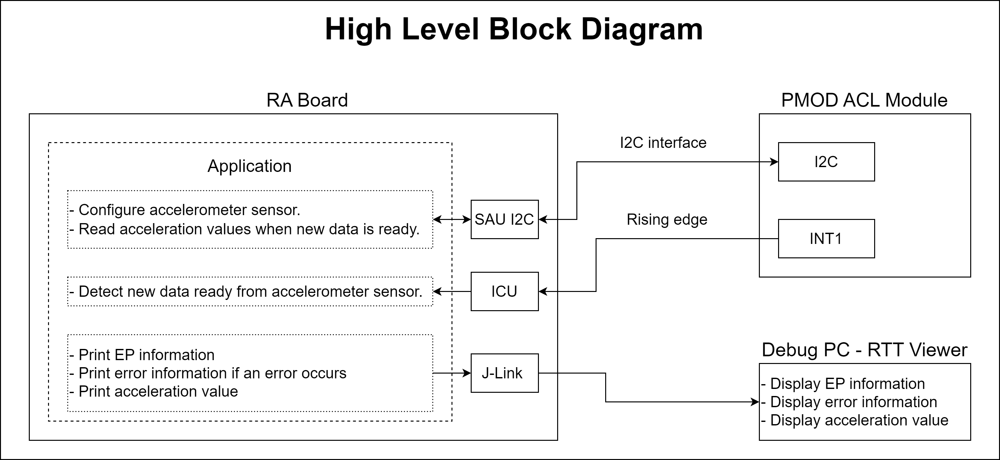
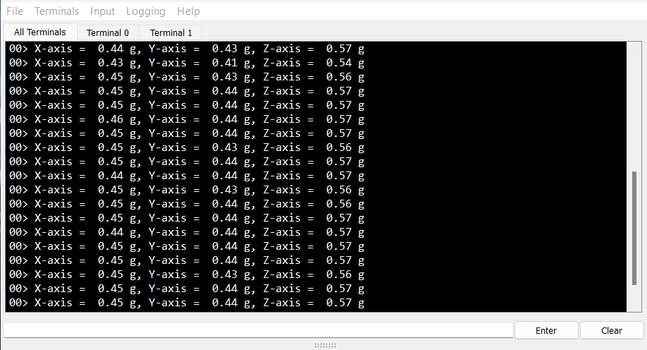

# Introduction #
The example project demonstrates the typical use of the SAU I2C master HAL module APIs. The project initializes the SAU I2C master module with the standard rate of 100 kHz and communicates with the PmodACL Board for ADXL345.

On power-up, after initializing the SAU I2C master module and configuring the ADXL345 sensor, the RA MCU will read the axis acceleration data from the sensor and display it on the RTT Viewer every time new data is detected by an external interrupt.

Please refer to the [Example Project Usage Guide](https://github.com/renesas/ra-fsp-examples/blob/master/example_projects/Example%20Project%20Usage%20Guide.pdf) 
for general information on example projects and [readme.txt](./readme.txt) for specifics of operation.

## Required Resources ## 
To build and run the SAU I2C Master example project, the following resources are needed.

### Software ###
* Renesas Flexible Software Package (FSP): Version 6.1.0
* e2 studio: Version 2025-07
* SEGGER J-Link RTT Viewer: Version 8.58
* GCC ARM Embedded Toolchain: Version 13.2.1.arm-13-7

Refer to the software required section in [Example Project Usage Guide](https://github.com/renesas/ra-fsp-examples/blob/master/example_projects/Example%20Project%20Usage%20Guide.pdf) for basic information on setting up and using the above software.

### Hardware ###
Supported RA Boards: FPB-RA0E1, FPB-RA0E2
* 1 x Renesas RA board.
* 1 x Type-C USB cable for programming and debugging.
* 1 x PmodACL Board (Part Number: 410-097) as a slave device.
* 2 x Resistor (from 1k to 4.7k ohms) used to pull up the I2C bus.
* 1 x Breadboard.
* 8 x Jumper wires (6 x Male-Female, 1 x Male-Male, 1 x Female-Female) used to connect the RA board to the PmodACL and pull up the I2C bus.

### Hardware Connections: ###
* Connect the USB Debug port on the RA board to the host PC via a Type-C USB cable.
* Connect the PmodACL Board to the RA board according to the instructions below for each board type:
* PmodACL:
  * J2 is used for I2C interface.
  * J1 is used for SPI interface and interrupt pins.
* Pull-up Resistors:
  * SDA pin and SCL pin must be connected to external pull-up resistors.
* For FPB-RA0E1:
  | FPB-RA0E1 | PmodACL  |
  |-----------|----------|
  |IRQ4/P109  (J2:18) | INT1 (J1:8)   |
  |SCL20/P112 (J2:20) | SCL  (J2:1/5) |
  |SDA20/P110 (J2:19) | SDA  (J2:2/6) |
  |GND pin            | GND  (J2:3/7) |
  |VCC pin (3V3)      | VCC  (J2:4/8) |
* For FPB-RA0E2:
  | FPB-RA0E2 | PmodACL  |
  |-----------|----------|
  |IRQ4/P109  (J2:2) | INT1 (J1:8)   |
  |SCL20/P112 (J2:5) | SCL  (J2:1/5) |
  |SDA20/P110 (J2:3) | SDA  (J2:2/6) |
  |GND pin           | GND  (J2:3/7) |
  |VCC pin (3V3)     | VCC  (J2:4/8) |

## Related Collateral References ##
The following documents can be referred to for enhancing your understanding of 
the operation of this example project:
- [FSP User Manual on GitHub](https://renesas.github.io/fsp/)
- [FSP Known Issues](https://github.com/renesas/fsp/issues)

# Project Notes #

## System Level Block Diagram ##
High level block diagram of the system is as shown below:
 

## FSP Modules Used ##
List all the various modules that are used in this example project. Refer to the FSP User Manual for further details on each module listed below.

| Module Name | Usage | Searchable Keyword  |
|-------------|-----------------------------------------------|-----------------------------------------------|
| SAU I2C Master | SAU I2C Master is used to communicate with the sensor.| r_sau_i2c |
| External IRQ | External IRQ is used to detect whether sensor data is ready.| r_icu |

## Module Configuration Notes ##
This section describes FSP Configurator properties which are important or different from those selected by default. 

**Configuration Properties for using SAU I2C Master**

|   Module Property Path and Identifier   |   Default Value   |   Used Value   |   Reason   |
|-----------------------------------------|-------------------|----------------|------------|
| configuration.xml > Stacks > g_sau_i2c_master I2C Master (r_sau_i2c) > Properties > Settings > Property > Common > DTC Support | Disabled | Enabled | Enable DTC for support the SAU I2C module. |
| configuration.xml > Stacks > g_sau_i2c_master I2C Master (r_sau_i2c) > Properties > Settings > Property > Module g_sau_i2c_master I2C Master (r_sau_i2c) > General > Channel | 00 | 20 | Use IIC channel 20 to communicate with the PmodACL ADXL345. |
| configuration.xml > Stacks > g_sau_i2c_master I2C Master (r_sau_i2c) > Properties > Settings > Property > Module g_sau_i2c_master I2C Master (r_sau_i2c) > General > Operation clock | CKm0 | CKm0 | Select CK0 as the clock source for IIC00. |
| configuration.xml > Stacks > g_sau_i2c_master I2C Master (r_sau_i2c) > Properties > Settings > Property > Module g_sau_i2c_master I2C Master (r_sau_i2c) > General > Slave Address | 0x00 | 0x1D | Specific slave address of the PmodACL ADXL345. |
| configuration.xml > Stacks > g_sau_i2c_master I2C Master (r_sau_i2c) > Properties > Settings > Property > Module g_sau_i2c_master I2C Master (r_sau_i2c) > General > Rate | Standard | Standard | Select the standard rate of 100 kHz to communicate with the PmodACL ADXL345. |
| configuration.xml > Stacks > g_sau_i2c_master I2C Master (r_sau_i2c) > Properties > Settings > Property > Module g_sau_i2c_master I2C Master (r_sau_i2c) > General > Callback | sau_i2c_master_callback | sau_i2c_master_callback | It is called from the interrupt service routine (ISR) upon IIC transaction completion reporting the transaction status. |
| configuration.xml > Stacks > g_sau_i2c_master I2C Master (r_sau_i2c) > Properties > Settings > Property > Module g_sau_i2c_master I2C Master (r_sau_i2c) > General > Transfer end interrupt priority | Priority 2 | Priority 2 | Select the SAU I2C Master interrupt priority level. |

**Configuration Properties for using External IRQ**

|   Module Property Path and Identifier   |   Default Value   |   Used Value   |   Reason   |
|-----------------------------------------|-------------------|----------------|------------|
| configuration.xml > Stacks > g_external_irq External IRQ (r_icu) > Properties > Settings > Property > Module g_external_irq External IRQ (r_icu) > Channel | 0 | 4 | Use External IRQ channel 4 to detect sensor data is ready. |
| configuration.xml > Stacks > g_external_irq External IRQ (r_icu) > Properties > Settings > Property > Module g_external_irq External IRQ (r_icu) > Trigger | Rising | Rising | Detect data ready by rise edge. |
| configuration.xml > Stacks > g_external_irq External IRQ (r_icu) > Properties > Settings > Property > Module g_external_irq External IRQ (r_icu) > Callback | NULL | external_irq_callback | It is called from the interrupt service routine (ISR) upon a rising edge is detected on the IRQ pin. |
| configuration.xml > Stacks > g_external_irq External IRQ (r_icu) > Properties > Settings > Property > Module g_external_irq External IRQ (r_icu) > Pin Interrupt Priority | Priority 2 | Priority 2 | Select the External IRQ interrupt priority. |

## API Usage ##
The table below lists the FSP provided API used at the application layer by this example project.

| API Name    | Usage                                                                          |
|-------------|--------------------------------------------------------------------------------|
| R_ICU_ExternalIrqOpen | This API is used to initialize an IRQ input pin for use with the external interrupt interface. |
| R_ICU_ExternalIrqEnable | This API is used to enable external interrupt for specified channel. |
| R_ICU_ExternalIrqClose | This API is used to de-initialize the external interrupt channel. |
| R_SAU_I2C_Open | This API is used to initialize the SAU I2C Master module. |
| R_SAU_I2C_Write | This API is used to perform a write operation to the sensor register. |
| R_SAU_I2C_Read | This API is used to perform a read operation from the sensor register. |
| R_SAU_I2C_Close | This API is used to de-initialize the SAU I2C Master module. |
| R_BSP_SoftwareDelay | This API is used to delay a specified period of time. |

## Verifying operation ##
1. Import, generate and build the example project.
2. Connect the PmodACL module to the RA board.
3. Connect the RA board to the Host PC.
4. Flash or debug the EP.
5. Open the RTT Viewer and view output log.
  
  

  

## Special Topics ##
* The files sau_i2c_master_ep.c and sau_i2c_master_ep.h contains the API for initialization, configuration and communication of the PmodACL module.
* For the functioning of the SAU I2C Master:
  1. SDA pin and SCL pin must configure output type as n-ch open drain.
  2. SDA pin and SCL pin must be connected to external pull-up resistors.
  3. The value of the external pull-up resistor depends on the I2C bus speed. In this EP, the I2C bus is configured at standard speed of 100 kHz, so the recommended external pull-up resistor value is from 1k to 4.7k ohms.
