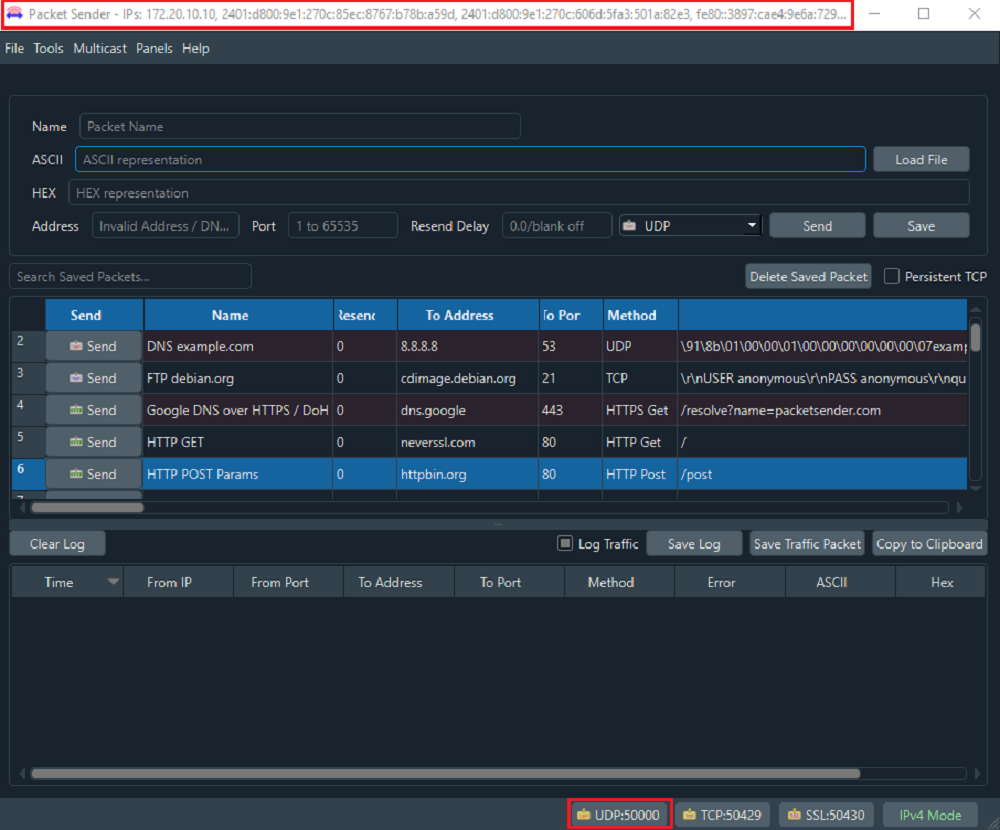
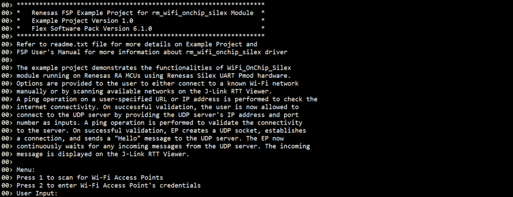
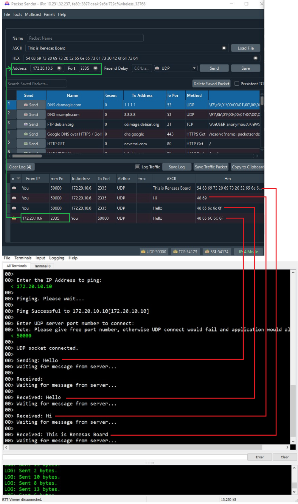

# Introduction #
The example project demonstrates the functionalities of WiFi_OnChip_Silex running on Renesas RA MCUs using Renesas Silex UART Pmod hardware. The project gives the user option to either scan WiFi networks or manually enter network credentials in J-Link RTT Viewer and connect. Then it performs a ping operation on user's entered URL or IP address. If successful, 'Ping Successful' message is printed on J-Link RTT Viewer. The project also demonstrates UDP socket operations in client mode. It tries connecting to the user entered UDP server IP address and port number. It is expected that UDP socket in server mode would be running on the user PC and listening on a free port before the EP tries to connect. Once connected to the UDP server, the client sends a 'Hello' to the server and then waits for the user to send the message from the server. Any incoming message from the server is displayed on J-Link RTT Viewer connected to the client. After receiving messages from the server, appropriate acknowledgment messages are sent to the server.

Please refer to the [Example Project Usage Guide](https://github.com/renesas/ra-fsp-examples/blob/master/example_projects/Example%20Project%20Usage%20Guide.pdf) for general information on example projects and [readme.txt](./readme.txt) for specifics of the operation.

## Required Resources ##
To build and run the example project, the following resources are needed.

### Software ###
* Renesas Flexible Software Package (FSP): Version 6.1.0
* e2 studio: Version 2025-07
* SEGGER J-Link RTT Viewer: Version 8.58
* GCC ARM Embedded Toolchain: Version 13.2.1.arm-13-7
* PacketSender (https://packetsender.com/download#show)

* Refer to the software required section in [Example Project Usage Guide](https://github.com/renesas/ra-fsp-examples/blob/master/example_projects/Example%20Project%20Usage%20Guide.pdf)

### Hardware ###
* Supported RA Boards: EK-RA4M3, EK-RA6M3, EK-RA6M3G, EK-RA6M4, EK-RA6M5, FPB-RA4E1, FPB-RA6E1, EK-RA8M1, EK-RA8D1, MCK-RA8T1, EK-RA2A2, FPB-RA0E1, FPB-RA8E1, EK-RA4L1, FPB-RA0E2, EK-RA2L2, EK-RA8P1, EK-RA8E2, EK-RA4C1, FPB-RA0L1
  * 1 x Renesas RA board.
  * 1 x Renesas Silex UART Pmod.
  * 1 x Wi-Fi router Access Point (AP) with internet access. Note: WiFi router AP's credentials should be known.
  * 1 x PC or laptop connected to the same Wi-Fi router AP. On PC/laptop, create UDP server and start listening at a port which is free. Port of value greater than 10000 is recommended.
  * 1 x Type-C USB cable.

### Hardware Connections ###
* For EK-RA4M3, EK-RA6M3, EK-RA6M3G, EK-RA6M4, EK-RA6M5, EK-RA2L2:
  * Connect Renesas Silex UART Pmod ----> PMOD1 (J26)	
  * Please carefully align pin 1 on the Renesas Silex UART Pmod with pin 1 on the PMOD1.

* For FPB-RA4E1, FPB-RA6E1, EK-RA8M1, EK-RA8D1, EK-RA8P1, EK-RA8E2:
  * For EK-RA8E2: The user needs to turn ON SW4-4 (PMOD2_MD_SEL) to use PMOD 2 for UART function.
  * Connect Renesas Silex UART Pmod ----> PMOD2 (J25)
  * Please carefully align pin 1 on the Renesas Silex UART Pmod with pin 1 on the PMOD2.

* For MCK-RA8T1:
  * Connect
  1) Renesas Silex UART Pmod (CN1:2) ----> P112 (CN2:P1)
  2) Renesas Silex UART Pmod (CN1:3) ----> P113 (CN1:P33)
  3) Renesas Silex UART Pmod (CN1:5) ----> GND
  4) Renesas Silex UART Pmod (CN1:6) ----> VCC
  5) Renesas Silex UART Pmod (CN1:8) ----> P114 (CN1:P31)

* For EK-RA2A2:
  * Connect
  1) Renesas Silex UART Pmod (CN1:2) ----> P501 (J1:1)
  2) Renesas Silex UART Pmod (CN1:3) ----> P500 (J4:19)
  3) Renesas Silex UART Pmod (CN1:5) ----> GND
  4) Renesas Silex UART Pmod (CN1:6) ----> VCC
  5) Renesas Silex UART Pmod (CN1:8) ----> P203 (J3:9)
	
* For FPB-RA0E1, FPB-RA8E1:
  * Connect Renesas Silex UART Pmod ----> PMOD1
  * Please carefully align pin 1 on the Renesas Silex UART Pmod with pin 1 on the PMOD1.

* For EK-RA4L1:
  * Connect
  1) Renesas Silex UART Pmod (CN1:2) ----> P109 (J3:19)
  2) Renesas Silex UART Pmod (CN1:3) ----> P110 (J3:20)
  3) Renesas Silex UART Pmod (CN1:5) ----> GND  (J3:25)
  4) Renesas Silex UART Pmod (CN1:6) ----> VCC  (J3:1)
  5) Renesas Silex UART Pmod (CN1:8) ----> P306 (J4:11)

* For FPB-RA0E2:
  * Connect
  1) Renesas Silex UART Pmod (CN1:2) ----> P402 (J1:3)
  2) Renesas Silex UART Pmod (CN1:3) ----> P403 (J1:4)
  3) Renesas Silex UART Pmod (CN1:5) ----> GND  (J1:8)
  4) Renesas Silex UART Pmod (CN1:6) ----> VCC  (J1:11)
  5) Renesas Silex UART Pmod (CN1:8) ----> P208 (J1:20)

* For EK-RA4C1:  
  * The user must place jumper J6 on pins 2-3, J8 on pins 1-2, J9 on pins 2-3 and turn OFF SW4-4 to use the on-board debug functionality.
  * The user must close E52 to use P305 for RST pin of PMOD2.
  * Connect  
  1) Renesas Silex UART Pmod (CN1:2) ----> P115 (J2:35)  
  2) Renesas Silex UART Pmod (CN1:3) ----> P608 (J2:37)  
  3) Renesas Silex UART Pmod (CN1:5) ----> GND  (J2:1)  
  4) Renesas Silex UART Pmod (CN1:6) ----> VCC  (J1:1)  
  5) Renesas Silex UART Pmod (CN1:8) ----> P305 (J2:38)

* For FPB-RA0L1:
  * To use the on-board debug functionality, the user must place jumper J9 on pins 1-2.
  * To use P101, P100, P013 on PMOD1, the user must close E34, E36, E35 and open E40.
  * Connect Renesas Silex UART Pmod ----> PMOD1 (J19)
  * Please carefully align pin 1 on the Renesas Silex UART Pmod with pin 1 on the PMOD1.

## Related Collateral References ##
The following documents can be referred to for enhancing your understanding of the operation of this example project:
- [FSP User Manual on GitHub](https://renesas.github.io/fsp/)
- [FSP Known Issues](https://github.com/renesas/fsp/issues)

# Project Notes #

## System Level Block Diagram ##
 High level block diagram
 

 
## FSP Modules Used ##
List all the various modules that are used in this example project. Refer to the FSP User Manual for further details on each module listed below.

| Module Name | Usage | Searchable Keyword  |
|-------------|-----------------------------------------------|-----------------------------------------------|
| AWS Core HTTP | AWS Core HTTP is used to communicate with the Host machine over a Wi-Fi network using the underlying On-chip Silex module. | rm_wifi_onchip_silex |
| FreeRTOS Heap 5 | FreeRTOS Heap is required for FreeRTOS standard Library Functions. | FreeRTOS Heap 5 |

**For EK-RA2A2:**
| Module Name | Usage | Searchable Keyword |
|-------------|-----------------------------------------------|-----------------------------------------------|
| TinyCrypt (S/W Only) | The TinyCrypt Library provides an implementation for targeting constrained devices with a minimal set of standard cryptography primitives. | TinyCrypt (S/W Only) |

## Module Configuration Notes ##
This section describes FSP Configurator properties which are important or different than those selected by default. 

|   Module Property Path and Identifier   |   Default Value   |   Used Value   |   Reason   |
| --------------------------------------- | ----------------- | ---------------| ---------- |
| configuration.xml > BSP > Properties > Settings > Property > RA Common > Main stack size (bytes) | 0x400 | 0x400 | Main program thread stack is configured to store the local variables of different functions in the code. |
| configuration.xml > BSP > Properties > Settings > Property > RA Common > Heap size (bytes) | 0 | 0x400 | Heap size is required for standard library functions to be used. |
| configuration.xml > Stacks > WiFi Thread > Properties > Settings > Property > Common > General > Use Mutexes | Disabled | Enabled | Enable to include mutex functionality. |
| configuration.xml > Stacks > WiFi Thread > Properties > Settings > Property > Common > General > Use Recursive Mutexes | Disabled | Enabled | Enable to include recursive mutex functionality. |
| configuration.xml > Stacks > WiFi Thread > Properties > Settings > Property > Thread > Stack size (bytes) | 1024 | 0x800 | Configure to store the local variables of different functions in the code. |
| configuration.xml > Stacks > WiFi Thread > Properties > Settings > Property > Thread > Memory Allocation > Support Dynamic Allocation | Disabled | Enabled | RTOS objects can be created using RAM that is automatically allocated from the FreeRTOS heap. |
| configuration.xml > Stacks > WiFi Thread > Properties > Settings > Property > Thread > Memory Allocation > Total Heap Size | 0 | 0x4000 | RAM is used to obtain memory allocation for secure libraries. |
| configuration.xml > Stacks > WiFi Thread > WiFi Onchip Silex Driver using UART (rm_wifi_onchip_silex) > Properties > Settings > Property > Common > Size of RX buffer for socket | 4096 | 512 | Set size of RX buffer for socket. |
| configuration.xml > Stacks > WiFi Thread > WiFi Onchip Silex Driver using UART (rm_wifi_onchip_silex) > Properties > Settings > Property > Common > Size of TX buffer for CMD port | 1500 | 512 | Set size of TX buffer for CMD port. |
| configuration.xml > Stacks > WiFi Thread > WiFi Onchip Silex Driver using UART (rm_wifi_onchip_silex) > Properties > Settings > Property > Common > Size of RX buffer for CMD port | 3000 | 512 | Set size of RX buffer for CMD port. |
| configuration.xml > Stacks > WiFi Thread > MbedTLS (Crypto Only) > Properties > Settings > Property > Common > Message Authentication Code (MAC) > MBEDTLS_CMAC_C | Undefine | Define | Enable MBed TLS CMAC-C. |
| configuration.xml > Stacks > WiFi Thread > MbedTLS (Crypto Only) > Properties > Settings > Property > Common > Public Key Cryptography (PKC) > ECC > MBEDTLS_ECDH_C | Undefine | Define | Enable MBed TLS ECDH-C. |
| configuration.xml > Stacks > WiFi Thread > g_uart0 UART (r_sau_uart) > Properties > Settings > Property > Module g_uart0 UART (r_sau_uart) > General > Channel | 0 | 0 | Select UART channel 0. |

The table below lists the FSP provided API used at the application layer by this example project.
| API Name | Usage |
|----------|--------------------------------------------------------------------------------|
| [WIFI_On](https://renesas.github.io/fsp/group___w_i_f_i___a_p_i.html#ga2ee26776a00869c415da4a108031af1d) | This API is used to turn on Wi-Fi module and initialize the drivers. |
| [WIFI_Scan](https://renesas.github.io/fsp/group___w_i_f_i___a_p_i.html#ga4f1c2fb7ab3463f7d19afb506e945fd6) | This API is used to perform a Wi-Fi network Scan. |
| [WIFI_ConnectAP](https://renesas.github.io/fsp/group___w_i_f_i___a_p_i.html#ga430d72715054198b6ce0885410b027a5) | This API is used to connect to the Wi-Fi Access Point (AP). |
| [WIFI_IsConnected ](https://renesas.github.io/fsp/group___w_i_f_i___a_p_i.html#gab293985fcadf84ff9a560e90271e0e0e) | This API is used to check if the Wi-Fi is connected. |
| [WIFI_GetIPInfo](https://renesas.github.io/fsp/group___w_i_f_i___a_p_i.html#ga5bcf899f31c02c57fd7e9c45f390b2c6) | This API is used to get IP configuration (IP address, NetworkMask, Gateway and DNS server addresses). |
| [WIFI_Ping](https://renesas.github.io/fsp/group___w_i_f_i___a_p_i.html#ga8680ac4cdb4455a2c03919c2f5417f72) | This API is used to ping an IP address in the network. |
| rm_wifi_onchip_silex_socket_create | This API is used to create a new socket instance. |
| rm_wifi_onchip_silex_udp_connect | This API is used to connect to a specific IP and Port using UDP socket. |
| rm_wifi_onchip_silex_send | This API is used to send data over UDP to a server. |
| rm_wifi_onchip_silex_recv | This API is used to receive data over TCP from a server. |
| rm_wifi_onchip_silex_socket_status_get | This API is used to get the socket status. |
| [WIFI_Off](https://renesas.github.io/fsp/group___w_i_f_i___a_p_i.html#ga93265c46f46cb899f08adc56608b35d5) | This API is used to turn off the Wi-Fi module. |

## Verifying Operation ##
1. Download the Packet Sender Software (https://packetsender.com/download#show) and install it on the Host PC.

2. Navigate to File > Settings on Packet Sender application and perform the following (described in the image).
	
	a) Enable UDP server.
	
	b) Enter the desired server port number (preferably >10000).
	
	c) Click OK to complete the server setup.
	

	
3. The server is enabled which can be verified as below:

	
4. Connect the USB Debug port to view the status/error messages on J-Link RTT Viewer.

5. On the J-Link RTT Viewer, either connect to the Wi-Fi Access point manually or connect via Wi-Fi scan.

6. On successful connection, the EP displays the MCU IP address.

7. Ping to any desired IP address to verify the network connectivity.

8. On successful ping, connect to the UDP server by providing IP address and Port number.

9. On successful connection, "UDP socket connected" is displayed on the J-Link RTT Viewer.

	
10. The EP sends a "Hello" message to the server and continuously listens for incoming messages.

11. Messages can be received from the client, with the IP address (mentioned in Step 6) and the port number (mentioned in step 10).

