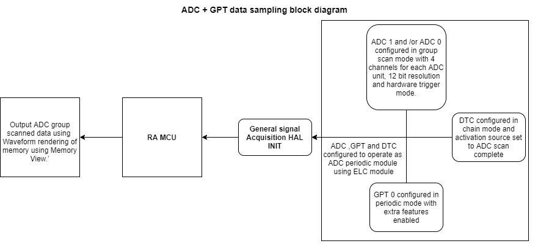
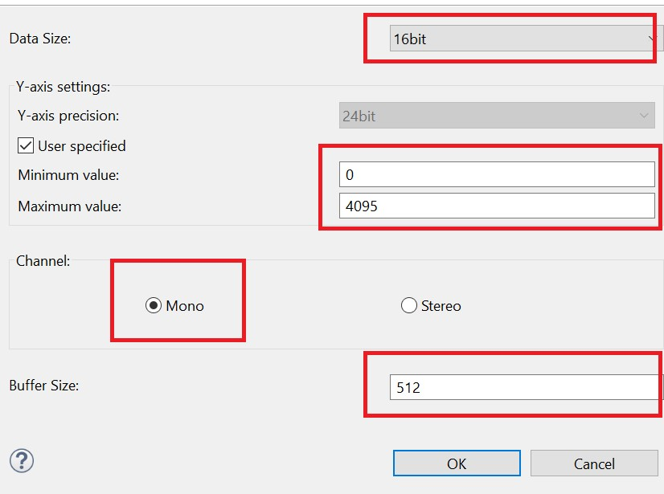
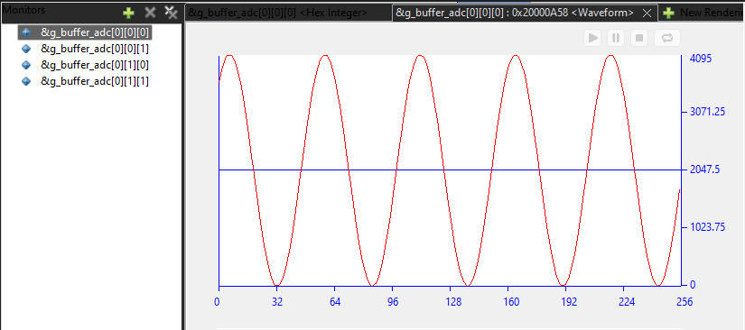
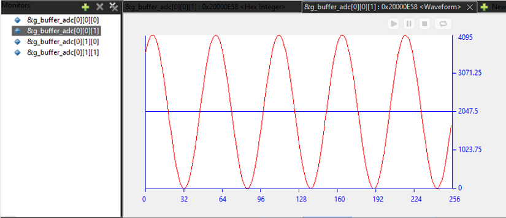
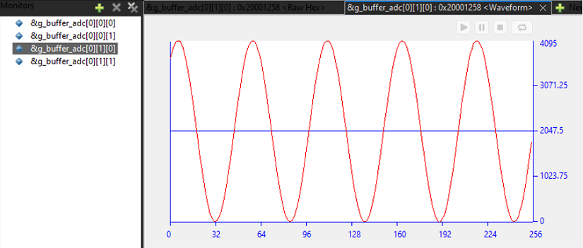
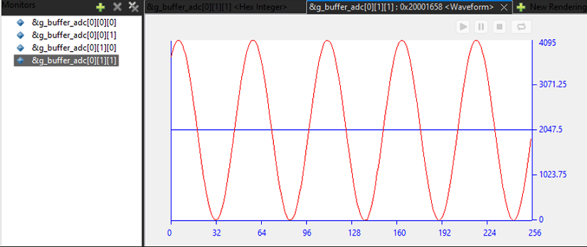
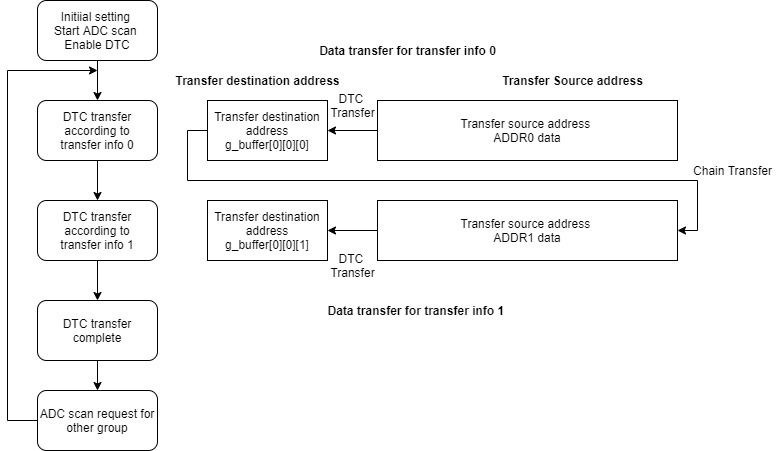

# Introduction #

The sample code accompanying this file shows the operation of an ADC GPT Periodic Sampling using the ADC, DTC, GPT, and ELC peripherals on an RA MCU.  
ADC GPT Periodic Sampling allows the user to sample analog signals at periodic intervals with a double buffer. The frequency of sampling is
determined by the settings of the GPT linked to the ADC unit by the ELC. The DTC is used to transfer data from the ADC data registers to the circular buffer.  
Using the DTC allows the CPU to be used for other operations. When the first buffer is filled completely, the CPU executes the ADC Interrupt service routine to
switch to the DTC to fill the second buffer with ADC values, Raise a flag/event to allow processing on the data available in the first buffer.

Such functionality is popular for Data signal acquisition applications that require a continuous sampling of Analog signals. 

Please refer to the [Example Project Usage Guide](https://github.com/renesas/ra-fsp-examples/blob/master/example_projects/Example%20Project%20Usage%20Guide.pdf) 
for general information on example projects and [readme.txt](./readme.txt) for specifics of operation.

## Required Resources ##
To build and run the ADC GPT Periodic Sampling, the following resources are needed.

### Software ###
Refer to software described in [Example Project Usage Guide](https://github.com/renesas/ra-fsp-examples/blob/master/example_projects/Example%20Project%20Usage%20Guide.pdf)

### Hardware ###
* Supported RA boards: EK-RA2E1, EK-RA2L1, EK-RA4M1, EK-RA4M2, FPB-RA6E1, EK-RA6M3, EK-RA6M3G, EK-RA6M1, EK-RA6M2, EK-RA2E2, EK-RA2A1, EK-RA4M3, EK-RA6M4, EK-RA6M5, EK-RA4E2, EK-RA6E2, MCK-RA4T1, MCK-RA6T3, EK-RA8M1, EK-RA8D1, FPB-RA2E3, MCK-RA8T1, EK-RA2A2, FPB-RA8E1, EK-RA4L1, EK-RA2L2, EK-RA8E2, FPB-RA2T1
* 1 x Renesas RA board.
* 1 x Type-C USB cable for programming and debugging.
* 1 x Signal Generator.
* 1 x Breadboard.
* Some jumper wires.

Refer to [readme.txt](./readme.txt) on information on how to connect the hardware.

### Hardware Connections ###
  The connection from the signal generator to breadboard:
  Connect input signal of (i.e., 800Hz) to the horizontal line of the breadboard.
  
  Connect pins mentioned bellow to horizontal holes of the breadboard so that all pins are shorted to receive an input signal.  
  Connect GND of the signal generator to GND of the RA board.
  
  Note: All the channels are connected to the same input signal for testing, the user can configure channels to other input frequencies as per requirement.
    
  Board supporting 32-bit GPT Timer with Enhanced features:
  - For EK-RA6M3, EK-RA6M3G:
    - ADC UNIT 0: AN000--P000, AN001--P001, AN002--P002, AN003--P008
    - ADC UNIT 1: AN100--P004, AN101--P005, AN102--P006, AN103--P010

  - For EK-RA6M1: 
    - ADC UNIT 0: AN000--P000, AN001--P001, AN002--P002, AN003--P008 ff
    - ADC UNIT 1: AN100--P004, AN101--P005, AN102--P006, AN105--P014

  - For EK-RA6M2:
    - ADC UNIT 0: AN000--P000, AN001--P001, AN002--P002, AN003--P008 
    - ADC UNIT 1: AN100--P004, AN101--P005, AN102--P006, AN105--P014

  Board supporting 32-bit GPT timer without Enhanced features:
  - For EK-RA2E1, EK-RA2L1, EK-RA4M1, EK-RA4M2, FPB-RA6E1:
    - ADC UNIT 0: AN000--P000, AN001--P001, AN002--P002, AN003--P003

  - For EK-RA2E2:
    - ADC UNIT 0: AN009--P014, AN010--P015, AN019--P103, AN020--P102

  - For EK-RA2A1:
    - ADC Unit 0: AN00--P500, AN01--P501, AN02--P502, AN03--P015 
    - Connect AVSS0 (J2:36) to VREFLO (J2:34)
    - Connect AVCC0 (J2:38) to VREFHO (J2:32)

  - For EK-RA4M3: 
    - ADC Unit 0: AN000--P000, AN001--P001, AN002--P002, AN003--P003
    - ADC Unit 1: AN119--P503, AN120--P504, AN121--P505, AN122--P506

  - For EK-RA6M4:
    - ADC Unit 0: AN000--P000, AN001--P001, AN002--P002, AN003--P003
    - ADC Unit 1: AN116--P500, AN117--P501, AN118--P502, AN119--P503

  - For EK-RA6M5: 
    - ADC Unit 0: AN004--P004, AN005--P005, AN006--P006, AN007--P007 
    - ADC Unit 1: AN100--P000, AN101--P001, AN102--P002, AN116--P500

  - For EK-RA4E2, EK-RA6E2, MCK-RA4T1, MCK-RA6T3: (Supporting 16-bit GPT timer) 
    - ADC Unit 0: AN000--P000, AN001--P001, AN002--P002, AN004--P004

  - For EK-RA8M1:
    - ADC Unit 0: AN002--P006, AN004--P007, AN005--P010, AN007--P014
    - ADC Unit 1: AN101--P001, AN102--P002, AN116--P513, AN117--P805

  - For FPB-RA2E3: (Supporting 16-bit GPT timer) 
    - ADC Unit 0: AN000--P000, AN001--P001, AN008--P013, AN009--P014

  - For EK-RA8D1:
    - ADC Unit 0: AN002--P006, AN004--P007, AN005--P010, AN007--P014
    - ADC Unit 1: AN100--P000, AN101--P001, AN102--P002, AN116--P513

  - For MCK-RA8T1:
    - ADC Unit 0: AN000--P004, AN001--P005, AN002--P006, AN004--P007
    - ADC Unit 1: AN100--P000, AN101--P001, AN102--P002, AN105--P015

  - For EK-RA2A2: (Supporting 16-bit GPT timer) 
    - ADC Unit 0: AN000--P014, AN001--P001, AN002--P002, AN003--P015
	  
  - For FPB-RA8E1:
    - ADC Unit 0: AN000--P004 (J1:20), AN001--P005 (J1:21), AN002--P006 (J1:22), AN004--P007 (J1:23)
    - ADC Unit 1: AN100--P000 (J1:15), AN101--P001 (J1:17), AN102--P002 (J1:18), AN104--P003 (J1:19)

  - For EK-RA4L1: 
    - ADC Unit 0: AN001--P003 (J1:6), AN002--P004 (J1:7), AN022--P513 (J1:13), AN023--P512 (J1:14)  

  - For EK-RA2L2:
    - ADC Unit 0: AN000--P000 (J1:7), AN001--P001 (J1:6), AN002--P002 (J1:5), AN003--P003 (J1:4)

  - For EK-RA8E2:
    - ADC Unit 0: AN000--P004 (J4:12), AN001--P005 (J4:13), AN002--P006 (J4:14), AN004--P007 (J4:15)
    - ADC Unit 1: AN101--P001 (J4:9), AN102--P002 (J4:10), AN104--P003 (J4:11), AN105--P015 (J17:9)

  - For FPB-RA2T1: (Supporting 16-bit GPT timer) 
    - ADC Unit 0: AN000--P013 (J4:16), AN001--P014 (J4:15), AN008--P000 (J4:24), AN009--P001 (J4:23)

## Related Collateral References ##
The following documents can be referred to for enhancing your understanding of 
the operation of this example project:
- [FSP User Manual on GitHub](https://renesas.github.io/fsp/)
- [FSP Known Issues](https://github.com/renesas/fsp/issues)

# Project Notes #

## System Level Block Diagram ##

## FSP Modules Used ##
List all the various modules that are used in this example project. Refer to the FSP User Manual for further details on each module listed below.

| Module Name | Usage  | Searchable Keyword (using New Stack > Search) |
|-------------|-----------------------------------------------|-----------------------------------------------|
| ADC |ADC is used in group scan mode to scan the input sinusoidal signal connected to ADC channels| ADC |
| DTC |DTC is used to transfer data from the ADC data registers to the circular buffer | DTC |
| GPT |GPT is used to generate ADC group scan trigger at periodic interval| GPT |
| ELC |ELC is used to link ADC with GPT module for Hardware triggering| ELC|

## Module Configuration Notes ##
This section describes FSP Configurator properties which are important or different than those selected by default. 

**Configuration Properties for using ADC unit 0**
|   Module Property Path and Identifier   |   Default Value   |   Used Value   |   Reason   |
| :-------------------------------------: | :---------------: | :------------: | :--------: |
|   configuration.xml > Stacks > g_adc0 ADC (r_adc) > Properties > Settings > Property > Module g_adc0 ADC (r_adc) > General > Unit |   0   |   0   |  Specifies the ADC Unit to be used.  |
|   configuration.xml > Stacks > g_adc0 ADC (r_adc) > Properties > Settings > Property > Module g_adc0 ADC (r_adc) > General > Mode |   Single Scan   |   Group Scan   |  Specifies the mode that this ADC unit is used in. In group scan mode start conditions can be independently selected for group A, B, allowing A/D conversion of group A, B to be started independently.  |
|   configuration.xml > Stacks > g_adc0 ADC (r_adc) > Properties > Settings > Property > Module g_adc0 ADC (r_adc) > Input > Channel Scan Mask (channel availability varies by MCU)  |   NULL  |   Channel 0, Channel 1  |   Configures Channel 0 and 1 for ADC 0 group A.   |
|   configuration.xml > Stacks > g_adc0 ADC (r_adc) > Properties > Settings > Property > Module g_adc0 ADC (r_adc) > Input > Group B Scan Mask (channel availability varies by MCU)  |   NULL  |   Channel 8, Channel 9  |   Configures Channel 8 and 9 for ADC 0 group B.   |
|   configuration.xml > Stacks > g_adc0 ADC (r_adc) > Properties > Settings > Property > Module g_adc0 ADC (r_adc) > Interrupts > Normal/Group A Trigger  |   Software  |   GPT0 CAPTURE COMPARE A (Capture/Compare match A)  |   Specifies the trigger type to be used for this unit.   |
|   configuration.xml > Stacks > g_adc0 ADC (r_adc) > Properties > Settings > Property > Module g_adc0 ADC (r_adc) > Interrupts > Group B Trigger  |   Disable  |   GPT0 COUNTER OVERFLOW (Overflow)  |   Specifies the trigger for Group B scanning in group scanning mode.  |
|   configuration.xml > Stacks > g_adc0 ADC (r_adc) > Properties > Settings > Property > Module g_adc0 ADC (r_adc) > Interrupts > Callback  |   NULL  |   g_adc0_callback  |   It is called from the interrupt service routine (ISR) each time the ADC scan completes.  |
|   configuration.xml > Stacks > g_adc0 ADC (r_adc) > Properties > Settings > Property > Module g_adc0 ADC (r_adc) > Interrupts > Scan End Interrupt Priority  |   Disable |   Priority 2  |   Select scan end interrupt priority.  |
|   configuration.xml > Stacks > g_adc0 ADC (r_adc) > Properties > Settings > Property > Module g_adc0 ADC (r_adc) > Interrupts > Scan End Group B Interrupt Priority|   Disable  |  Priority 2  |   Select group B scan end interrupt priority.   |

**Configuration Properties for using Timer, General PWM (GPT)**
|   Module Property Path and Identifier   |   Default Value   |   Used Value   |   Reason   |
| :-------------------------------------: | :---------------: | :------------: | :--------: |
|   configuration.xml > Stacks > g_timer0 Timer, General PWM (r_gpt) > Properties > Settings > Property > Module g_timer0 Timer, General PWM (r_gpt) > General > Period |   0x10000  |  21  |   Time period for free running timer.   |
|   configuration.xml > Stacks > g_timer0 Timer, General PWM (r_gpt) > Properties > Settings > Property > Module g_timer0 Timer, General PWM (r_gpt) > General > Period Unit |  Raw count  | Microseconds  | Unit of the period specified above.  |
|   configuration.xml > Stacks > g_timer0 Timer, General PWM (r_gpt) > Properties > Settings > Property > Module g_timer0 Timer, General PWM (r_gpt) > Interrupt > Overflow/Crest Interrupt Priority |  Disable | Priority 1  | Select the timer overflow interrupt priority.  |
|   configuration.xml > Stacks > g_timer0 Timer, General PWM (r_gpt) > Properties > Settings > Property > Module g_timer0 Timer, General PWM (r_gpt) > Interrupt > Capture A Interrupt Priority |  Disable | Priority 2  | Select the timer  Capture A interrupt priority.  |

**Configuration Properties for using ADC unit 0 group A Transfer (DTC)**
|   Module Property Path and Identifier   |   Default Value   |   Used Value   |   Reason   |
| :-------------------------------------: | :---------------: | :------------: | :--------: |
|   configuration.xml > Stacks > g_transfer_adc0_group_a Transfer (r_dtc) ADC0 SCAN END (End of A/D scanning operation) > Properties > Settings > Property > Module g_transfer_adc0_group_a Transfer (r_dtc) ADC0 SCAN END (End of A/D scanning operation) > Mode  |   Normal  |   Repeat  |  One transfer per activation, Repeat Area address reset after Number of Transfers, transfer repeats until stopped.  |
|   configuration.xml > Stacks > g_transfer_adc0_group_a Transfer (r_dtc) ADC0 SCAN END (End of A/D scanning operation) > Properties > Settings > Property > Module g_transfer_adc0_group_a Transfer (r_dtc) ADC0 SCAN END (End of A/D scanning operation) > Destination Address Mode  |   Fixed |   Incremented  |  Select the address mode for the destination. Destination address get incremented after each transfer.|
|   configuration.xml > Stacks > g_transfer_adc0_group_a Transfer (r_dtc) ADC0 SCAN END (End of A/D scanning operation) > Properties > Settings > Property > Module g_transfer_adc0_group_a Transfer (r_dtc) ADC0 SCAN END (End of A/D scanning operation) > Repeat Area |   Source  |   Destination |  Destination address resets to its initial value after completing Number of Transfers.   |
|   configuration.xml > Stacks > g_transfer_adc0_group_a Transfer (r_dtc) ADC0 SCAN END (End of A/D scanning operation) > Properties > Settings > Property > Module g_transfer_adc0_group_a Transfer (r_dtc) ADC0 SCAN END (End of A/D scanning operation) > Number of Transfer  |   0  |   64  |  Specify the number of transfers to be performed. |
|   configuration.xml > Stacks > g_transfer_adc0_group_a Transfer (r_dtc) ADC0 SCAN END (End of A/D scanning operation) > Properties > Settings > Property > Module g_transfer_adc0_group_a Transfer (r_dtc) ADC0 SCAN END (End of A/D scanning operation) > Activation Source  |   Disable  |   ADC0_SCAN_END  |  Select the DTC transfer start event. |

**Configuration Properties for using ADC unit 0 group B Transfer (DTC)**
|   Module Property Path and Identifier   |   Default Value   |   Used Value   |   Reason   |
| :-------------------------------------: | :---------------: | :------------: | :--------: |
|   configuration.xml > Stacks > g_transfer_adc0_group_b Transfer (r_dtc) ADC0 SCAN END B (A/D scan end interrupt for group B) > Properties > Settings > Property > Module g_transfer_adc0_group_b Transfer (r_dtc) ADC0 SCAN END B (A/D scan end interrupt for group B) > Mode  |   Normal  |   Repeat  |  One transfer per activation, Repeat Area address reset after Number of Transfers, transfer repeats until stopped.  |
|   configuration.xml > Stacks > g_transfer_adc0_group_b Transfer (r_dtc) ADC0 SCAN END B (A/D scan end interrupt for group B) > Properties > Settings > Property > Module g_transfer_adc0_group_b Transfer (r_dtc) ADC0 SCAN END B (A/D scan end interrupt for group B) > Destination Address Mode  |   Fixed |   Incremented  |  Select the address mode for the destination. Destination address get incremented after each transfer.|
|   configuration.xml > Stacks > g_transfer_adc0_group_b Transfer (r_dtc) ADC0 SCAN END B (A/D scan end interrupt for group B) > Properties > Settings > Property > Module g_transfer_adc0_group_b Transfer (r_dtc) ADC0 SCAN END B (A/D scan end interrupt for group B) > Repeat Area |   Source  |   Destination |  Destination address resets to its initial value after completing Number of Transfers.   |
|   configuration.xml > Stacks > g_transfer_adc0_group_b Transfer (r_dtc) ADC0 SCAN END B (A/D scan end interrupt for group B) > Properties > Settings > Property > Module g_transfer_adc0_group_b Transfer (r_dtc) ADC0 SCAN END B (A/D scan end interrupt for group B) > Number of Transfer  |   0  |   64  |  Specify the number of transfers to be performed. |
|   configuration.xml > Stacks > g_transfer_adc0_group_b Transfer (r_dtc) ADC0 SCAN END B (A/D scan end interrupt for group B) > Properties > Settings > Property > Module g_transfer_adc0_group_b Transfer (r_dtc) ADC0 SCAN END B (A/D scan end interrupt for group B) > Activation Source  |   Disable  |   ADC0 SCAN END B  |  Select the DTC transfer start event. |

## API Usage ##
The table below lists the FSP provided API used at the application layer by this example project.

| API Name    | Usage                                                                          |
|-------------|--------------------------------------------------------------------------------|
|R_ADC_ScanStart | This API is used to Start scanning of ADC channel connected to ADC peripheral, when ADC Periodic operation starts the API waits until trigger event are received.|
|R_DTC_Enable| This API is used to enable transfers on this activation source. when enable api is called it transfer data on every group scan complete event.|
|R_GPT_Start| This API is used to Start GPT timer in periodic mode , when timer starts it trigger ADC group scan at set periodic interval.|
|R_DTC_Reconfigure| This API is used to reconfigure DTC with chain mode transfer info.|
|R_DTC_Close| This API is used to close the opened DTC instance, when any failure occur.|
|R_GPT_Close| This API is used to close the opened GPT instance, when any failure occur.|
|R_ADC_Close| This API is used to close the opened ADC instance, when any failure occur.|
|R_ELC_Close| This API is used to close the opened ELC instance, when any failure occur.|
 

## Verifying operation ##
### Setting up waveform rendering ###
* To set waveform rendering, the user needs to first debug the code, then go to memory view and add g_user buffer under memory monitor.
* The user can view any of the respective channel by adding specific ADC Unit buffer under memory monitor. For example ADC Unit 0 Group A Channel 0 samples can be viewed by selecting &g_buffer_adc[0][0][0].
  This way other ADC Units, groups, and channels can be selected. 
* Then click on New Rendering -> Waveform -> Waveform properties  
* The configuration parameters of the Waveform properties are as follows:  
  - Select Data Size: 	16bit  
  - User-specified: 	  Tick on the box
  - Minimum values: 	  0
  - Maximum values: 	  4095
  - Channel:		        Mono
  - Buffer size:		    512
  
**Note:** 12-bit ADC will have minimum and maximum value between 0-4095. As Ping-Pong buffer is used, the buffer size is 512 (i.e., 256*2) for each channel, where 2 denotes the number of buffers and 256 is the size of the buffer.
    The user can add the buffer address of each channel in the memory to view the waveform of each channel connected.  

 

### Input for Signal generator ###
* The signal needs to be generated from the Signal Generator for the Input to the ADC (0-3V Sinusoidal) with a frequency set to 800Hz.

Import, Build and Debug the EP (*see section Starting Development* of **FSP User Manual**). After running the EP, open waveform rendering in memory viewer to see the output
of sampled data. One can also check the buffer in real-time by adding it to the expression tab.

Below images showcases the output on waveform rendering of ADC Unit 0 for each channel of group A and B:
* ADC Unit 0 Group A channel 0 (g_buffer_adc[0][0][0]) and channel 1 (g_buffer_adc[0][0][1]):

 

* ADC Unit 0 Group B channel 8 (g_buffer_adc[0][1][0]) and channel 9 (g_buffer_adc[0][1][1]):

 

## Special Topics ##
### Setting up Chain Mode in DTC ###
* The chain mode can be setup by declaring local transfer info structure containing info related to Chain Mode Transfer and configure DTC with same info.
  The table below lists the transfer info elements required for chain transfer
  | Transfer info element   | transfer info 0               |       transfer info 1              |
  |-------------|-------------------------------------------|------------------------------------|
  |Transfer mode | Normal mode| Normal mode|
  |Source address control | Fixed | Fixed |
  |Destination address control | Incremented| Incremented|
  |Chain transfer  | Enabled | Disable|
  |Transfer block size | 2 bytes | 2 bytes|
  |Transfer source address | &R_ADDR0| &R_ADDR1|
  |Transfer destination address | g_buffer[unit0][Group scan A][channel 0][0][0]| g_buffer[unit0][Group scan A][channel 1][0][0]|
  
**Note:** Above table shows chain transfer for group A of ADC Unit 0 same way this can be updated for other ADC units and groups.
          The user can also update their info as per requirement
* After A/D conversion is completed, the DTC is activated by an A/D Scan complete interrupt request.
  Once the DTC is activated, it reads transfer info for transfer_adc_groupA[0] which is a local buffer, and copy values of register ADDR0
  to the destination buffer location of DTC g_buffer_adc[0]. Since chain transfer is enabled, so the DTC successively reads transfer_adc_groupA[1] (i.e., channel 1 of group A).
* Once DTC operation for transfer_adc_groupA[1] starts it transfers values of registers ADDR1 to the destination buffer g_buffer_adc[1]. Since chain transfer is disabled in transfer info of A[1],
  data transfer by the DTC is completed here.
* DTC transfer completes the operation of one group, an A/D conversion interrupt is generated after DTC transfer is completed for the other ADC group 
  and the same process repeats for group B.
  

### Calculating Time period and ADC Trigger Raw count ###
* To calculate the Time period of GPT timer use 
  Time period = 1/input frequency (where input sampling frequency is 2 * signal generator input frequency).
  This calculated Time Period can be set as GPT Time period in the properties tab.
* To calculate Raw period count for ADC trigger use
   Raw period count =  (Time period in seconds * (PCLKD / (2^ Pre scaler)))
  (where prescaler value is 0 by default so 2^0 = 1)
  **Note :** PCLKD frequency will vary as per MCU variant.
* ADC Trigger value for ADC Compare match value for A and B are set to 50% and 99% duty cycle (Raw period count). So ADC Compare match value for A = (0.5 * Raw period count) and ADC Compare match value for 
  B = (0.99 * Raw period count). ADC Compare A and B Match raw count values are supported for MCUs supporting enhanced GPT timer.
  For MCUs without enhanced GPT timer support, the user only needs to set GPT Time period as ADC group are set to trigger ADC group A at 50% of the cycle and ADC group B at full cycle (GPT overflow interrupt).
  
### Ping Pong Buffer Operation ###
* The DTC is used to transfer data from the ADC data registers to the Ping-Pong buffer.
* Using the DTC allows the CPU to be used for other operations.
* When the first buffer is filled completely (i.e.,ss desired sample size), a DTC activation source generates an interrupt to the CPU.
* The CPU executes the ADC Interrupt service routine to:
  * Switch to the DTC to fill the second buffer with ADC values
  * Allow processing on the data available in the first buffer.

  