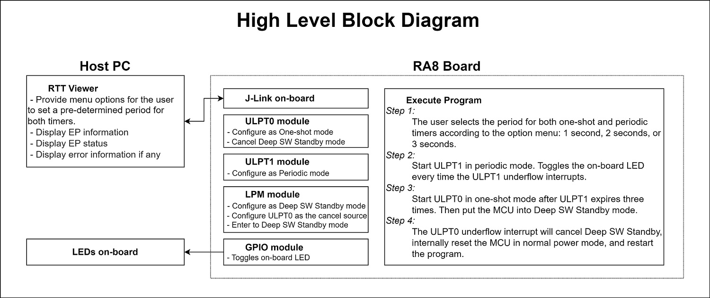
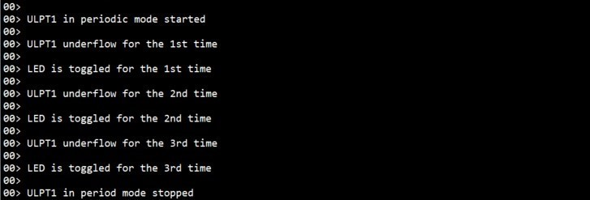

# Introduction #

This Example Project demonstrates the functionality of ULPT in periodic mode and one-shot mode. The user selects the period for both one-shot and periodic timers as 1 second, 2 seconds, or 3 seconds. After selecting the period, the ULPT1 starts in periodic mode and toggles the on-board LED when the ULPT1 underflow interrupt occurs. The ULPT1 will stop after underflow three times, and the ULPT0 will start in one-shot mode after that. The MCU will be put into Deep SW Standby mode and wait for the ULPT0 underflow interrupt to reset the MCU internally to Normal Mode and restart the EP.

Please refer to the [Example Project Usage Guide](https://github.com/renesas/ra-fsp-examples/blob/master/example_projects/Example%20Project%20Usage%20Guide.pdf) 
for general information on example projects and [readme.txt](./readme.txt) for specifics of operation.

## Required Resources ## 
To build and run the ULPT example project, the following resources are needed.

### Hardware ###
* Supported RA boards: EK-RA8M1, EK-RA8D1, MCK-RA8T1, FPB-RA8E1
* 1 x RA board.
* 1 x Type C USB cable for programming and debugging.

Refer to [readme.txt](./readme.txt) for information on how to connect the hardware.

### Software ###
* Renesas Flexible Software Package (FSP): Version 5.6.0
* e2 studio: Version 2024-10
* SEGGER J-Link RTT Viewer: Version 7.98g
* LLVM Embedded Toolchain for ARM: Version 18.1.3

Refer to the software required section in [Example Project Usage Guide](https://github.com/renesas/ra-fsp-examples/blob/master/example_projects/Example%20Project%20Usage%20Guide.pdf)

## Related Collateral References ##
The following documents can be referred to for enhancing your understanding of 
the operation of this example project:
- [FSP User Manual on GitHub](https://renesas.github.io/fsp/)
- [FSP Known Issues](https://github.com/renesas/fsp/issues)

# Project Notes #

## System Level Block Diagram ##
 High level block diagram of the system is as shown below:
 

## FSP Modules Used ##
List all the various modules that are used in this example project. Refer to the FSP User Manual for further details on each module listed below.

| Module Name | Usage | Searchable Keyword  |
|-------------|-----------------------------------------------|-----------------------------------------------|
| ULPT0 | ULPT0 is used as a one-shot timer. | r_ulpt |
| ULPT1 | ULPT1 is used as a periodic timer. | r_ulpt |
| LPM | LPM is used to put the MCU into low-power mode. | r_lpm |
| IO Port | IO Port is used to toggle the on-board LED. | r_ioport |

## Module Configuration Notes ##
This section describes FSP Configurator properties which are important or different than those selected by default. 

**Configuration Properties for using ULPT0**

|   Module Property Path and Identifier   |   Default Value   |   Used Value   |   Reason   |
|-----------------------------------------|-------------------|----------------|------------|
configuration.xml > g_timer_one_shot Timer, Ultra-Low-Power (r_ulpt) > Settings > Property > Module g_timer_one_shot Timer, Ultra-Low-Power (r_ulpt) > General > Channel | 0 | 0 | Select ULPT channel 0 in One-Shot mode. |
configuration.xml > g_timer_one_shot Timer, Ultra-Low-Power (r_ulpt) > Settings > Property > Module g_timer_one_shot Timer, Ultra-Low-Power (r_ulpt) > General > Mode | Periodic | One-Shot | Select One-Shot mode. |
configuration.xml > g_timer_one_shot Timer, Ultra-Low-Power (r_ulpt) > Settings > Property > Module g_timer_one_shot Timer, Ultra-Low-Power (r_ulpt) > General > Period | 0x10000 | 32768 | Initial period value. |
configuration.xml > g_timer_one_shot Timer, Ultra-Low-Power (r_ulpt) > Settings > Property > Module g_timer_one_shot Timer, Ultra-Low-Power (r_ulpt) > General > Count Source | LOCO | LOCO | Select LOCO as the clock source for the timer. |
configuration.xml > g_timer_one_shot Timer, Ultra-Low-Power (r_ulpt) > Settings > Property > Module g_timer_one_shot Timer, Ultra-Low-Power (r_ulpt) > Interrupts > Callback | NULL | one_shot_timer_callback | It is called from the interrupt service routine (ISR) each time the ULPT0 timer period elapses. |
configuration.xml > g_timer_one_shot Timer, Ultra-Low-Power (r_ulpt) > Settings > Property > Module g_timer_one_shot Timer, Ultra-Low-Power (r_ulpt) > Interrupts > Underflow Interrupt Priority | Disabled | Priority 2 | Select ULPT0 interrupt priority. |

**Configuration Properties for using ULPT1**

|   Module Property Path and Identifier   |   Default Value   |   Used Value   |   Reason   |
|-----------------------------------------|-------------------|----------------|------------|
configuration.xml > g_timer_periodic Timer, Ultra-Low-Power (r_ulpt) > Settings > Property > Module g_timer_periodic Timer, Ultra-Low-Power (r_ulpt) > General > Channel | 0 | 1 | Select ULPT channel 1 in Periodic mode. |
configuration.xml > g_timer_periodic Timer, Ultra-Low-Power (r_ulpt) > Settings > Property > Module g_timer_periodic Timer, Ultra-Low-Power (r_ulpt) > General > Mode | Periodic | Periodic | Select Periodic mode. |
configuration.xml > g_timer_periodic Timer, Ultra-Low-Power (r_ulpt) > Settings > Property > Module g_timer_periodic Timer, Ultra-Low-Power (r_ulpt) > General > Period | 0x10000 | 32768 | Initial period value.|
configuration.xml > g_timer_periodic Timer, Ultra-Low-Power (r_ulpt) > Settings > Property > Module g_timer_periodic Timer, Ultra-Low-Power (r_ulpt) > General > Count Source | LOCO | LOCO | Select LOCO as the clock source for the timer. |
configuration.xml > g_timer_periodic Timer, Ultra-Low-Power (r_ulpt) > Settings > Property > Module g_timer_periodic Timer, Ultra-Low-Power (r_ulpt) > Interrupts > Callback | NULL | periodic_timer_callback | It is called from the interrupt service routine (ISR) each time the ULPT1 timer period elapses. |
configuration.xml > g_timer_periodic Timer, Ultra-Low-Power (r_ulpt) > Settings > Property > Module g_timer_periodic Timer, Ultra-Low-Power (r_ulpt) > Interrupts > Underflow Interrupt Priority | Disabled | Priority 2 | Select ULPT1 interrupt priority. |

**Configuration Properties for using LPM**

|   Module Property Path and Identifier   |   Default Value   |   Used Value   |   Reason   |
|-----------------------------------------|-------------------|----------------|------------|
| configuration.xml > g_lpm_deep_sw_standby Low Power Modes (r_lpm) > Settings > Property > Module g_lpm_deep_sw_standby Low Power Modes (r_lpm) > General > Low Power Mode | Sleep mode | Deep Software Standby mode | Select Deep SW Standby mode. |
| configuration.xml > g_lpm_deep_sw_standby Low Power Modes (r_lpm) > Settings > Property > Module g_lpm_deep_sw_standby Low Power Modes (r_lpm) > Deep Standby Options > Cancel Sources > ULPT0 Overflow |	☐ | ☑ | Select ULPT0 as source cancel. |

## API Usage ##
The table below lists the FSP provided API used at the application layer by this example project.

| API Name    | Usage                                                                          |
|-------------|--------------------------------------------------------------------------------|
| R_FSP_VersionGet | This API is used to get FSP package information used in the project. |
| R_LPM_Open | This API is used to initialize LPM instance. |
| R_LPM_LowPowerModeEnter | This API is used to put the MCU into low-power mode. |
| R_LPM_Close | This API is used to close the opened LPM instance. |
| R_ULPT_Open | This API is used to initialize the ULPT module instance. |
| R_ULPT_InfoGet | This API is used to get ULPT timer information that contains the period, count direction, and frequency.|
| R_ULPT_PeriodSet | This API is used to update period for ULPT timer. |
| R_ULPT_Start | This API is used to start the ULPT timer. |
| R_ULPT_Stop | This API is used to stop the ULPT timer. |
| R_ULPT_Close | This API is used to close the opened ULPT module instance. |
| R_BSP_PinWrite | This API is used to set the output level for the on-board LED. |

## Verifying operation ##
1. Import, generate, and build the example project.
2. Flash project binary to the RA board.
3. Open J-Link RTT Viewer and provide period value for one-shot and periodic timers.
* Below image shows J-Link RTT Viewer log:

  

  
  
  
  
  
