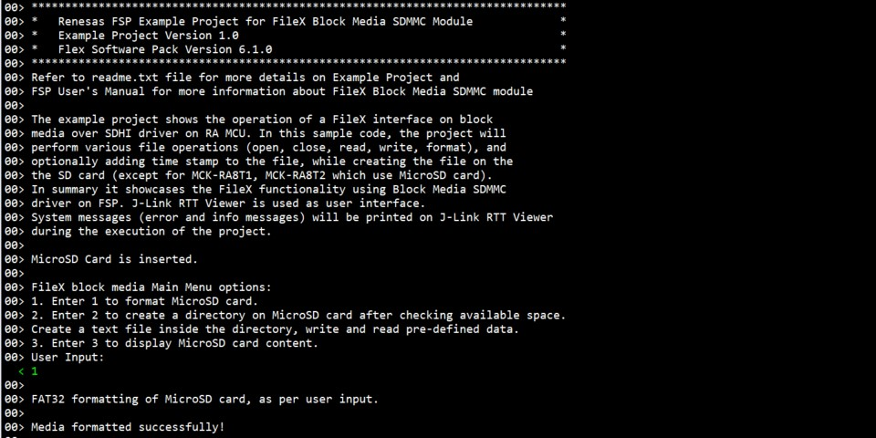
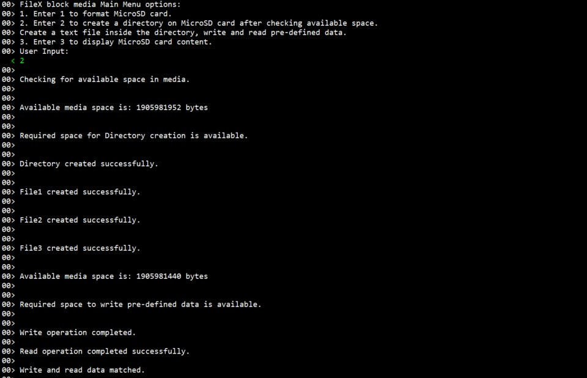

# Introduction #
The example project shows the operation of a FileX interface on block media over SDHI driver on RA MCU. In this sample code, the project will perform various file operations (open, close, read, write, format), and optionally adding time stamp to the file, while creating the file on the SD card (except for MCK-RA8T1, MCK-RA8T2 which use MicroSD card). In summary it showcases the FileX functionality using Block Media SDMMC driver on FSP. J-Link RTT Viewer is used as user interface. System messages (error and info messages) will be printed on J-Link RTT Viewer during the execution of the project.

Please refer to the [Example Project Usage Guide](https://github.com/renesas/ra-fsp-examples/blob/master/example_projects/Example%20Project%20Usage%20Guide.pdf) for general information on example projects and [readme.txt](./readme.txt) for specifics of operation.

## Required Resources ##
To build and run the Filex Block Media using SDMMC example project, the following resources are needed.

### Software ###
* Renesas Flexible Software Package (FSP): Version 6.1.0
* e2 studio: Version 2025-07
* SEGGER J-Link RTT Viewer: Version 8.58
* LLVM Embedded Toolchain for ARM: Version 18.1.3

Refer to software requirements mentioned in [Example Project Usage Guide](https://github.com/renesas/ra-fsp-examples/blob/master/example_projects/Example%20Project%20Usage%20Guide.pdf)

### Hardware ###
Supported RA boards: EK-RA6M3, EK-RA6M4, FPB-RA6E1, EK-RA8M1, EK-RA8D1, MCK-RA8T1, EK-RA8P1, MCK-RA8T2
* 1 x Renesas RA board.
* 1 x USB cable for programming and debugging.
  * Type-C USB cable: MCK-RA8T1, EK-RA8P1, MCK-RA8T2
  * Micro USB cable: the other boards
* For EK-RA6M3, EK-RA6M4, FPB-RA6E1, EK-RA8M1, EK-RA8D1, EK-RA8P1:
	* 1 x SD card (e.g., https://shop.sandisk.com/en-sg/products/memory-cards/sd-cards/sandisk-ultra-uhs-i-sd?sku=SDSDUNC-032G-ZN6IN).
	* 1 x Pmod SD: Full sized SD Card Slot (e.g., https://digilent.com/shop/pmod-sd-full-sized-sd-card-slot/).
	* 10 x Jumper wires.
* For MCK-RA8T1, MCK-RA8T2:
	* 1 x MicroSD card (e.g., https://shop.sandisk.com/en-ie/products/memory-cards/microsd-cards/sandisk-ultra-lite-uhs-i-microsd?sku=SDSQUNR-032G-GN3MA).

### Hardware Connections ###
* For EK-RA6M3:
  * 1 Bit Width
    * SD0CMD  P412 (J4:33)    --->    Pmod SD MOSI (J1:2)
    * SD0DAT0 P411 (J4:36)   	--->    Pmod SD MISO (J1:3)
    * SD0CLK  P413 (J4:34)   	--->    Pmod SD SCK  (J1:4)
    * GND          	          --->    Pmod SD GND  (J1:5)
    * VCC +3V3  	            --->    Pmod SD VCC  (J1:6)
    * SD0CD   P415 (J4:32)  	--->    Pmod SD CD   (J1:9)
    * SD0WP   P414 (J4:31)  	--->    Pmod SD WP   (J1:10)

  * 4 Bits Width
    * Above mentioned connections for 1 Bit Width. In addition below connections
    * SD0DAT1 P410 (J4:35)   	--->    Pmod SD DAT1 (J1:7)
    * SD0DAT2 P206 (J1:38)   	--->    Pmod SD DAT2 (J1:8)
    * SD0DAT3 P205 (J2:04)   	--->    Pmod SD CS   (J1:1)

* For EK-RA6M4:
  * 1 Bit Width
    * SD0CMD  P412    --->    Pmod SD MOSI (J1:2)
    * SD0DAT0 P411   	--->    Pmod SD MISO (J1:3)
    * SD0CLK  P413   	--->    Pmod SD SCK  (J1:4)
    * GND          	  --->    Pmod SD GND  (J1:5)
    * VCC +3V3    	  --->    Pmod SD VCC  (J1:6)
    * SD0CD   P210   	--->    Pmod SD CD   (J1:9)
    * SD0WP   P209   	--->    Pmod SD WP   (J1:10)

  * 4 Bit Width
    * Above mentioned connections for 1 Bit Width. In addition below connections
    * SD0DAT1 P410   	--->    Pmod SD DAT1 (J1:7)
    * SD0DAT2 P206   	--->    Pmod SD DAT2 (J1:8)
    * SD0DAT3 P205   	--->    Pmod SD CS   (J1:1)

* For FPB-RA6E1:
  * 1 Bit Width 
    * SD0CMD  P412 (J3:20) 	  ---> 	  Pmod SD MOSI (J1:2)
    * SD0DAT0 P411 (J3:21) 	  ---> 	  Pmod SD MISO (J1:3)
    * SD0CLK  P413 (J3:19) 	  ---> 	  Pmod SD SCK  (J1:4)
    * GND 			              ---> 	  Pmod SD GND  (J1:5)
    * VCC  +3V3 		          ---> 	  Pmod SD VCC  (J1:6)
    * SD0CD   P210 (J3:35) 	  ---> 	  Pmod SD CD   (J1:9)
    * SD0WP   P209 (J3:36) 	  ---> 	  Pmod SD WP   (J1:10)

  * 4 Bit Width
    * Above mentioned connections for 1 Bit Width. In addition below connections
    * SD0DAT1 P410 (J3:22) 	  ---> 	  Pmod SD DAT1 (J1:7)
    * SD0DAT2 P206 (J3:31) 	  ---> 	  Pmod SD DAT2 (J1:8)
    * SD0DAT3 P205 (J3:32) 	  ---> 	  Pmod SD CS   (J1:1)

* For EK-RA8M1:
  * Note: The user needs to remove jumper J61 to use SDHI channel 0.

    Hardware connection for SDHI channel 0 as below:
  * 1 Bit Width
    * SD0CMD  P307 (J54:5) 	  ---> 	  Pmod SD MOSI (J1:2)
    * SD0DAT0 P304 (J54:9) 	  ---> 	  Pmod SD MISO (J1:3)
    * SD0CLK  P308 (J54:4) 	  ---> 	  Pmod SD SCK  (J1:4)
    * GND 			              ---> 	  Pmod SD GND  (J1:5)
    * VCC +3V3 		            ---> 	  Pmod SD VCC  (J1:6)
    * SD0CD   P306 (J54:7) 	  ---> 	  Pmod SD CD   (J1:9)
    * SD0WP   P305 (J54:8) 	  ---> 	  Pmod SD WP   (J1:10)

  * 4 Bit Width
    * Above mentioned connections for 1 Bit Width. In addition below connections
    * SD0DAT1 P303 (J54:6)  	---> 	  Pmod SD DAT1 (J1:7)
    * SD0DAT2 P302 (J54:14) 	---> 	  Pmod SD DAT2 (J1:8)
    * SD0DAT3 P301 (J54:12) 	---> 	  Pmod SD CS   (J1:1)

* For EK-RA8D1:
  * Note: The user must turn-off SW1-3, SW1-5, SW1-8 on board to use SDHI channel 1.
  
    Hardware connection for SDHI channel 1 as below:	
  * 1 Bit Width
    * SD1CMD  P401 (J51:7) 	  ---> 	  Pmod SD MOSI (J1:2)
    * SD1DAT0 P402 (J52:15) 	---> 	  Pmod SD MISO (J1:3)
    * SD1CLK  P400 (J51:10) 	---> 	  Pmod SD SCK  (J1:4)
    * GND 			              ---> 	  Pmod SD GND  (J1:5)
    * VCC +3V3 		            ---> 	  Pmod SD VCC  (J1:6)
    * SD1CD   P406 (J51:5) 	  ---> 	  Pmod SD CD   (J1:9)
    * SD1WP   P700 (J51:6) 	  ---> 	  Pmod SD WP   (J1:10)

  * 4 Bit Width
    * Above mentioned connections for 1 Bit Width. In addition below connections
    * SD1DAT1 P403 (J51:9)  	---> 	  Pmod SD DAT1 (J1:7)
    * SD1DAT2 P404 (J57:1)  	---> 	  Pmod SD DAT2 (J1:8)
    * SD1DAT3 P405 (J51:8)  	---> 	  Pmod SD CS   (J1:1)

* For MCK-RA8T1:
  * Connect Micro SD card to Micro SD socket (CN12).

* For EK-RA8P1:
  
  Hardware connection for SDHI channel 0 as below:
  * 1 Bit Width
    * SD0CMD  PD04 (J2:32) 	  --->    Pmod SD MOSI (J1:2)
    * SD0DAT0 PD03 (J2:31) 	  --->    Pmod SD MISO (J1:3)
    * SD0CLK  PD05 (J2:27) 	  --->    Pmod SD SCK  (J1:4)
    * GND 			              ---> 	  Pmod SD GND  (J1:5)
    * VCC +3V3 		            ---> 	  Pmod SD VCC  (J1:6)
    * SD0CD   P503 (J37:14) 	--->    Pmod SD CD   (J1:9)
    * SD0WP   PD06 (J3:4) 	  --->    Pmod SD WP   (J1:10)

  * 4 Bit Width
    * Above mentioned connections for 1 Bit Width. In addition below connections
    * SD0DAT1 PD02 (J2:33)  	---> 	  Pmod SD DAT1 (J1:7)
    * SD0DAT2 PD01 (J2:34) 	  ---> 	  Pmod SD DAT2 (J1:8)
    * SD0DAT3 P111 (J1:3) 	  ---> 	  Pmod SD CS   (J1:1)

* For MCK-RA8T2: 
	* Connect MicroSD card to MicroSD socket (CN17).

## Related Collateral References ##
The following documents can be referred to for enhancing your understanding of the operation of this example project:
- [FSP User Manual on GitHub](https://renesas.github.io/fsp/)
- [FSP Known Issues](https://github.com/renesas/fsp/issues)

# Project Notes #

## System Level Block Diagram ##

## FSP Modules Used ##
List all the various modules that are used in this example project. Refer to the FSP User Manual for further details on each module listed below.

| Module Name | Usage  | Searchable Keyword (using New Stack > Search) |
|-------------|-----------------------------------------------|-----------------------------------------------|
| FileX on Block Media | With FileX Block Media SDMMC driver, the user can store the required board data (sensor readings, ethernet packets etc.) on the SD/MicroSD Card. | file |

## Module Configuration Notes ##
This section describes FSP Configurator properties that are important or different from those selected by default.

|   Module Property Path and Identifier   |   Default Value   |   Used Value   |   Reason   |
| :-------------------------------------: | :---------------: | :------------: | :--------: |
| configuration.xml > BSP > Properties > Settings > Property > Main stack size (bytes) | 0x400 | 0x1000 | Modified main stack size to accommodate function calls as per application requirement. |
| configuration.xml > BSP > Properties > Settings > Property > Heap size (bytes) | 0 | 0x1800 | Increased stack size to accommodate standard library functions in the application. |
| configuration.xml > Stacks > g_sdmmc0 SD/MMC (r_sdhi) > Properties > Settings > Property > Module g_sdmmc0 SD/MMC (r_sdhi) > Card Interrupt Priority | Disabled | Priority 2 | Card interrupt priority is enabled and set to priority 12 to trigger interrupt when card is inserted or removed. |
| configuration.xml > Stacks > FileX_Thread > Properties > Settings > Property > Thread > Stack size (bytes) | 1024 | 4096 | Increased stack area to accommodate FileX function calls. |
| configuration.xml > Stacks > RTT Thread > Properties > Settings > Property > Thread > Priority | 1 | 2 | RTT thread priority is lowered to allow the Filex Block Media driver to process the requests. |
| configuration.xml > Stacks > RTT Thread > Properties > Settings > Property > Thread > Stack size (bytes) | 1024 | 4096 | Modified stack area as per application specific requirements. |

**Configuration Properties for using SD/MMC**

|   Module Property Path and Identifier   |   Default Value   |   Used Value   |   Reason   |
|-----------------------------------------|-------------------|----------------|------------|
| configuration.xml > Stacks > g_sdmmc SD/MMC (r_sdhi) > Properties > Settings > Property > Module g_sdmmc SD/MMC (r_sdhi) > Channel | 0 | 0 | Select SD/MMC channel 0. |
| configuration.xml > Stacks > g_sdmmc SD/MMC (r_sdhi) > Properties > Settings > Property > Module g_sdmmc SD/MMC (r_sdhi) > Bus Width | 4 Bits | 4 Bits | Select 4 bits bus width. |
| configuration.xml > Stacks > g_sdmmc SD/MMC (r_sdhi) > Properties > Settings > Property > Module g_sdmmc SD/MMC (r_sdhi) > Card Detection | CD Pin | CD Pin | Select card detection using the CD pin. |
| configuration.xml > Stacks > g_sdmmc SD/MMC (r_sdhi) > Properties > Settings > Property > Module g_sdmmc SD/MMC (r_sdhi) > Write Protection | WP Pin | Not Used | Select not used the write protect pin. |
| configuration.xml > Stacks > g_sdmmc SD/MMC (r_sdhi) > Properties > Settings > Property > Module g_sdmmc SD/MMC (r_sdhi) > Access Interrupt Priority | Priority 12 | Priority 2 | Select the access interrupt priority. |
| configuration.xml > Stacks > g_sdmmc SD/MMC (r_sdhi) > Properties > Settings > Property > Module g_sdmmc SD/MMC (r_sdhi) > Card Interrupt Priority | Disabled | Priority 2 | Select the card interrupt priority. |

## API Usage ##

The table below lists the FileX API used at the application layer by this example project.

| API Name    | Usage                                                                          |
|-------------|--------------------------------------------------------------------------------|
| RM_FILEX_BLOCK_MEDIA_Open | Initializes callback and configuration for FileX Block Media interface. |
| RM_FILEX_BLOCK_MEDIA_Close | This API closes media device. |
| fx_media_open | This function opens media and checks for errors. |
| fx_media_format | This function formats specified media - FAT12/16/32 format. |
| fx_system_initialize | This function initializes the various control data structures for the FileX System component. |
| fx_media_space_available | This function returns the number of space available in the specified media. |
| fx_directory_create | This function verifies the directory name, checks for various errors and creates an empty directory. |
| fx_file_create | This function verifies the file name, checks for various errors and creates an empty file. |
| fx_file_truncate | This function sets the file to the specified size. |
| fx_file_write | This function writes the specified number of bytes into the file's data area. |
| fx_media_flush | This function flushes each written open file to the underlying media. |
| fx_file_read | This function reads the specified number of bytes. |
| fx_system_date_set | This function sets the system date to the variable used by the caller. |
| fx_system_time_set | This function sets the system time to the variable used by the caller. |

## Verifying Operation ##
Import, build and debug the EP (see section Starting Development of **FSP User Manual**). After running the EP, open the J-Link RTT Viewer to see the output.
Before running the example project, refer to the below steps for hardware connections:
* Connect RA MCU debug port to the host PC via a Type-C USB cable. 
* Connect MicroSD card to MicroSD socket.

The output on J-Link RTT Viewer:

