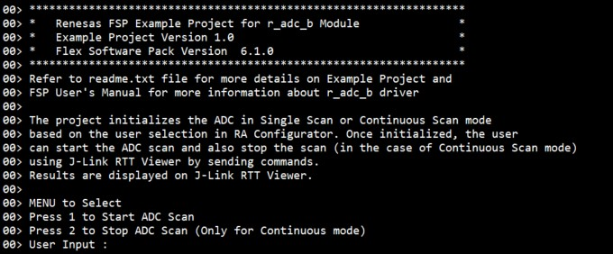
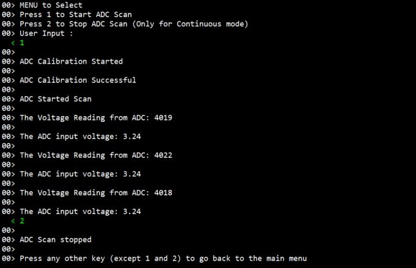
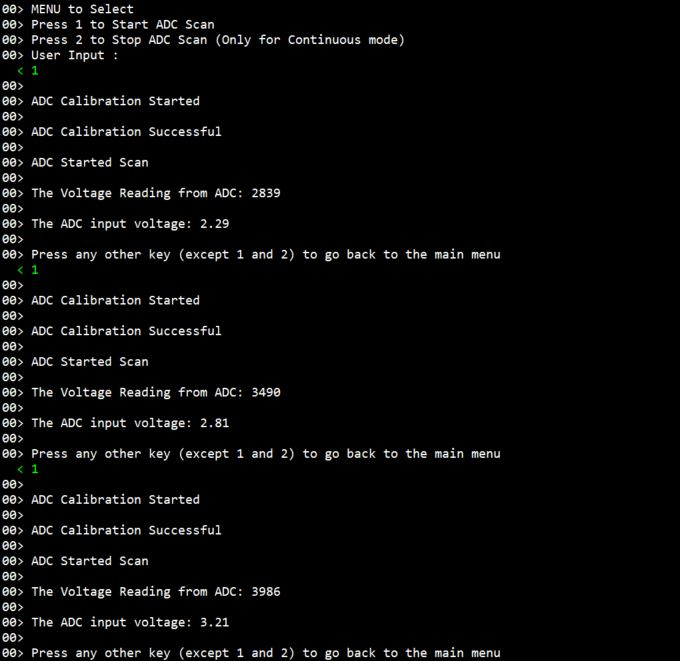

# Introduction #
 
This example project demonstrates basic functionalities of ADC driver, including the ADC's Window Compare Mode on Renesas RA MCUs based on Renesas FSP. An J-Link RTT Viewer input command triggers the ADC scan to read the analog data of adc channel and outputs the converted data onto the J-Link RTT Viewer output. The project initializes the ADC in Single Scan or Continuous Scan mode based on the user selection in RA Configurator. Once initialized, the user can initiate the ADC scan and also stop the scan (in the case of Continuous Scan mode) using J-Link RTT Viewer by sending commands. The user provides ADC channel input voltage from 0V to 3.3V with a variable power supply unit at the ADC channel voltage input pin. Once ADC scan is initialized, Window Compare Mode is enabled and compares the ADC channel input voltage with the upper and lower limits. The upper limit and lower limit are configured in RA Configurator. If the ADC channel input voltage is above the upper limit or below the lower limit, it triggers an event and notifies the user to  act accordingly. Result and ADC status are displayed on the J-Link RTT Viewer.

Note:
* FPB-RA0E1, FPB-RA0E2 do not support Window Compare Mode and operate with One-shot or Sequential mode.
* MCK-RA6T2 does not support Window Compare Mode and operates with internal temperature sensor.
* EK-RA8P1, MCK-RA8T2 do not support Window Compare Mode.

Please refer to the [Example Project Usage Guide](https://github.com/renesas/ra-fsp-examples/blob/master/example_projects/Example%20Project%20Usage%20Guide.pdf) for general information on example projects and [readme.txt](./readme.txt) for specifics of operation.

## Required Resources ## 
To build and run the ADC example project, the following resources are needed.

### Software ###
1. Refer to the software required section in [Example Project Usage Guide](https://github.com/renesas/ra-fsp-examples/blob/master/example_projects/Example%20Project%20Usage%20Guide.pdf)

### Hardware ###
Supported RA boards: EK-RA2A1, EK-RA2E1, EK-RA2E2, EK-RA2L1, EK-RA4E2, EK-RA4M1, EK-RA4M2, EK-RA4M3, EK-RA4W1, MCK-RA4T1, MCK-RA6T2, MCK-RA6T3, EK-RA6E2, EK-RA6M1, EK-RA6M2, EK-RA6M3, EK-RA6M3G, EK-RA6M4, EK-RA6M5, RSSK-RA6T1, FPB-RA4E1, FPB-RA6E1, EK-RA8M1, EK-RA8D1, FPB-RA2E3, MCK-RA8T1, EK-RA2A2, FPB-RA0E1, FPB-RA8E1, EK-RA4L1, FPB-RA0E2, EK-RA8E2, EK-RA2L2, EK-RA8P1, FPB-RA2T1, EK-RA4C1, MCK-RA8T2
* 1 x Renesas RA board.
* 1 x Type-C USB cable for programming and debugging.
* 1 x External Variable DC Power supply.
* Some jumper wires to connect External Variable DC Power supply to the RA board.

### Hardware Connections ###
* Connect External Variable DC Power supply to the RA board as shown below:
	* Connect the positive output pin (V+) of the External Variable DC Power supply to ADC Channel Voltage input pin of the RA board.
	* Connect the ground (GND) of the External Variable DC Power supply to the ground (GND) of the RA board.
* ADC Channel Voltage input pin of each the RA board:
	* For EK-RA2A1:  
		* AN01 P501.  
		* Connect AVSS0 (J2:36) to VREFL0 (J2:34) using a jumper or wire.
	
	* For EK-RA2E1, EK-RA2L1, EK-RA4E2, EK-RA4M1, EK-RA4M2, EK-RA4M3, EK-RA6E2, EK-RA6M1, EK-RA6M2, EK-RA6M3, EK-RA6M3G, EK-RA6M4, EK-RA6M5, FPB-RA6E1, FPB-RA4E1, MCK-RA4T1, MCK-RA6T3, FPB-RA2E3:  
		* AN000 P000.  
	
	* For EK-RA2E2:  
		* AN009 P014.  
	
	* For EK-RA4W1:  
		* AN04 P004.  
	
	* For RSSK-RA6T1:  
		* AN002 P002.  
	
	* For EK-RA8M1, EK-RA8D1:  
		* AN00 P004.  
	
	* For MCK-RA8T1:  
		* AN002 P006 (CN1:9).  
	
	* For EK-RA2A2:  
		* AN000 P014.  
	
	* For FPB-RA0E1:  
		* AN000 P010.

	* For FPB-RA8E1:  
		* AN00 P004 (J1:20).

	* For EK-RA4L1:
		* AN002 P004 (J1:7).

	* For FPB-RA0E2:
		* To use P011 on J2: The soldering bridge E48 must be closed.
		* AN001 P011 (J2:26).

	* For EK-RA8E2:
		*  AN000 P004 (J4:12).

	* For EK-RA2L2:
		* AN000 P000 (J1:7).

	* For EK-RA8P1:
		* AN001 P001 (J2:11).

   	* For FPB-RA2T1:
		* AN000 P013 (J4:16).

	* For EK-RA4C1:  
		* The user must place jumper J6 on pins 2-3, J8 on pins 1-2, J9 on pins 2-3 and turn OFF SW4-4 to use the on-board debug functionality.  
		* AN002 P004 (J3:7).

	* For MCK-RA8T2:
		* AN002 P002 (CN3:5).

## Related Collateral References ##
The following documents can be referred to for enhancing your understanding of the operation of this example project:
- [FSP User Manual on GitHub](https://renesas.github.io/fsp/)
- [FSP Known Issues](https://github.com/renesas/fsp/issues)

# Project Notes #

## System Level Block Diagram ##
 High level block diagram
  

Note: FPB-RA0E1, FPB-RA0E2, MCK-RA6T2, EK-RA8P1, MCK-RA8T2 do not support Window Compare Mode.

## FSP Modules Used ##
List of important modules that are used in this example project. Refer to the FSP User Manual for further details on each module listed below.

| Module Name | Usage | Searchable Keyword |
|-------------|-----------------------------------------------|-----------------------------------------------|
| ADC | Driver for the ADC peripheral to demonstrate basic functionalities of ADC, including the Window Compare Mode on Renesas RA MCUs. | adc |

For MCK-RA6T2, EK-RA8P1, MCK-RA8T2:

| Module Name | Usage | Searchable Keyword |
|-------------|-----------------------------------------------|-----------------------------------------------|
| ADC_B | Driver for the ADC_B peripheral to demonstrate basic functionalities of ADC on Renesas RA MCUs. | adc_b |

For FPB-RA0E1, FPB-RA0E2:

| Module Name | Usage | Searchable Keyword |
|-------------|-----------------------------------------------|-----------------------------------------------|
| ADC_D | Driver for the ADC_D peripheral to demonstrate basic functionalities of ADC on Renesas RA MCUs. | adc_d |

## Module Configuration Notes ##
This section describes FSP Configurator properties which are important or different than those selected by default. 

**ADC Configuration properties**

|   Module Property Path and Identifier   |   Default Value   |   Used Value   |   Reason   |
| :-------------------------------------: | :---------------: | :------------: | :--------: |
| configuration.xml > Stacks > g_adc_b ADC Driver on r_adc_b > Properties > Settings > Property > Module g_adc_b ADC Driver on r_adc_b > General > Operation > ADC 0 > Scan Mode | Single Scan | Continuous Scan | Scan mode operation for ADC B module. |
| configuration.xml > Stacks > g_adc_b ADC Driver on r_adc_b > Properties > Settings > Property > Module g_adc_b ADC Driver on r_adc_b > General > Calibration > Sample-and-Hold Calibration > Sampling Time | 95 | 5 | Configure sampling time for calibration operation. |
| configuration.xml > Stacks > g_adc_b ADC Driver on r_adc_b > Properties > Settings > Property > Module g_adc_b ADC Driver on r_adc_b > General > Calibration > Sample-and-Hold Calibration > Hold Time | 5 | 5 | Configure hold time for calibration operation. |
| configuration.xml > Stacks > g_adc_b ADC Driver on r_adc_b > Properties > Settings > Property > Module g_adc_b ADC Driver on r_adc_b > Virtual Channels > Virtual Channel 0 > Scan Group | None | Scan Group 0 | Assign virtual channel to scan group for grouped conversions. |
| configuration.xml > Stacks > g_adc_b ADC Driver on r_adc_b > Properties > Settings > Property > Module g_adc_b ADC Driver on r_adc_b > Virtual Channels > Virtual Channel 0 > Channel Select | ADC Channel 0 | ADC Channel 2 | Select physical ADC input channel for virtual channel 0. |
| configuration.xml > Stacks > g_adc_b ADC Driver on r_adc_b > Properties > Settings > Property > Module g_adc_b ADC Driver on r_adc_b > Scan Groups > Scan Group 0 > Enable | Disable | Enable | Enable Scan Group 0 for grouped ADC conversions. |
| configuration.xml > Stacks > g_adc_b ADC Driver on r_adc_b > Properties > Settings > Property > Module g_adc_b ADC Driver on r_adc_b > Scan Groups > Scan Group 0 > Converter Selection | ADC 0 | ADC 0 | Specify which ADC unit is used for this scan group. |
## API Usage ##

The table below lists the FSP provided API used at the application layer by this example project.

| API Name    | Usage                                                                          |
|-------------|--------------------------------------------------------------------------------|
| R_ADC_Open | This API is used to open the ADC instance. |
| R_ADC_ScanCfg | This API is used to configure the ADC scan parameters. |
| R_ADC_Calibrate | This API is used to initiate ADC Calibration. |
| R_ADC_ScanStart | This API is used to start the ADC Scan. |
| R_ADC_Read | This API is used to read the adc converted value from the specific ADC channel. |
| R_ADC_ScanStop | This API is used to stop the ADC scan. |
| R_ADC_Close | This API is used to close the ADC module. |
| R_ADC_StatusGet | This API is used to get the ADC status. |

For FPB-RA0E1, FPB-RA0E2:

| API Name    | Usage                                                                          |
|-------------|--------------------------------------------------------------------------------|
| R_ADC_D_Open | This API is used to open the ADC_D instance. |
| R_ADC_D_ScanCfg | This API is used to configure the ADC_D scan parameters. |
| R_ADC_D_ScanStart | This API is used to start the ADC_D Scan. |
| R_ADC_D_Read | This API is used to read the adc converted value from the specific ADC_D channel. |
| R_ADC_D_ScanStop | This API is used to stop the ADC_D scan. |
| R_ADC_D_Close | This API is used to close the ADC_D module. |
| R_ADC_D_StatusGet | This API is used to get the ADC_D status. |

For MCK-RA6T2, EK-RA8P1, MCK-RA8T2:
| API Name    | Usage                                                                          |
|-------------|--------------------------------------------------------------------------------|
| R_ADC_B_Open | This API is used to open the ADC_B instance. |
| R_ADC_B_ScanCfg | This API is used to configure the ADC scan parameters. |
| R_ADC_B_Calibrate | This API is used to initiate ADC Calibration. |
| R_ADC_B_ScanStart | This API is used to start the ADC Scan.  |
| R_ADC_B_Read | This API is used to read the adc converted value from the specific ADC channel. |
| R_ADC_B_ScanStop | This API is used to stop the ADC scan. |
| R_ADC_B_Close | This API is used to close the ADC module. |
| R_ADC_B_StatusGet | This API is used to get the ADC status. |

## Verifying Operation ##
1. Import, generate and build the example project. Before running the example project, make sure hardware connections are done.
2. Download the example project to the Renesas RA board and run the project.
3. Open J-Link RTT Viewer and connect to the Renesas RA board.
4. The user can perform Menu option operations and check the corresponding results J-Link RTT Viewer.
5. Also, the user can supply input voltage to ADC scan channel pin and verify result on J-Link RTT Viewer.
6. If the ADC value is outside the window compare, its status is shown in the J-Link RTT Viewer.
	* The Boundary values of ADC Window Compare Mode are:
		* Lower Reference is 1.0V
		* Upper Reference is 2.5V.  
		* Reference Voltage is 3.3V.  
	* Note: FPB-RA0E1, FPB-RA0E2, MCK-RA6T2, EK-RA8P1, MCK-RA8T2 do not support Window Compare Mode.

## ADC Value calculation ##

   Digital Output = (2^n * Analog input voltage)/(Reference Voltage)
          n = Number of bits
		  Digital Output is then converted to its Binary Equivalent

   For Example:
   1) If the Analog input voltage is 1.5V
   
    	For 12-bit ADC
		Digital Output = (2^12 * 1.5)/3.3
		               = (4096 * 1.5)/3.3
					   = 6144/3.3
		Digital Output = 1861
		
		For 16-bit ADC
		Digital Output = (2^15 * 1.5)/3.3
		               = (32768 * 1.5)/3.3
					   = 49152/3.3
		Digital Output = 14894
	
	Note: Limitation for 16-bit ADC - Refer: Table 32.13 A/D conversion result output ranges of each A/D conversion in the RA2A1 User Manual (R01UH0888EJ0100 Rev.1.00)
   
   The images below showcase the ADC output for Continuous mode on J-Link RTT Viewer:

   
 
   
   
   The image below shows the ADC output for Single Scan mode on J-Link RTT Viewer:
	
   
