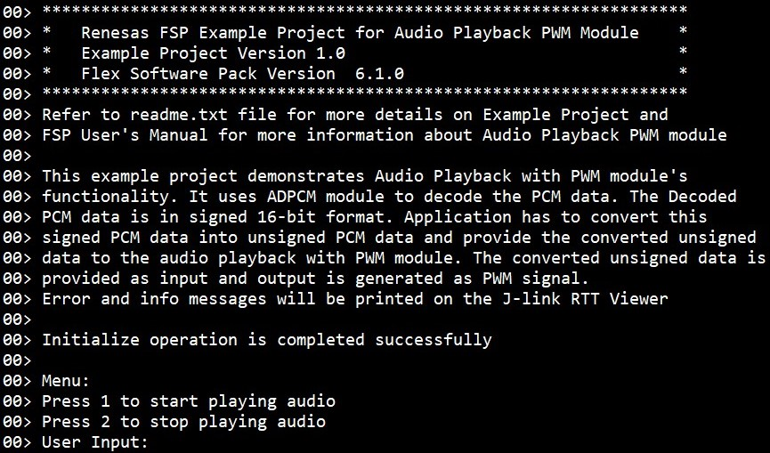
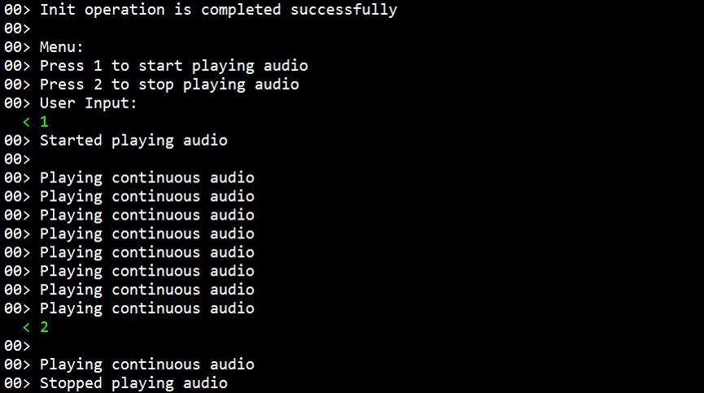

# Introduction #

This project demonstrates Audio Playback with PWM module's functionality. It uses ADPCM module to decode the PCM data. The Decoded PCM data is in signed 16-bit format. The Application converts this signed PCM data into unsigned PCM data and provide the converted unsigned data to the audio playback with PWM module. The converted unsigned data is provided as input and output is generated as PWM signal. The application status messages will be displayed on the J-Link RTT Viewer.

Please refer to the [Example Project Usage Guide](https://github.com/renesas/ra-fsp-examples/blob/master/example_projects/Example%20Project%20Usage%20Guide.pdf) 
for general information on example projects and [readme.txt](./readme.txt) for specifics of operation.

## Required Resources ## 
To build and run the Audio Playback example project, the following resources are needed.

### Software ###
1. Refer to the software required section in [Example Project Usage Guide](https://github.com/renesas/ra-fsp-examples/blob/master/example_projects/Example%20Project%20Usage%20Guide.pdf)  

### Hardware ###
Supported RA Boards: EK-RA2A1, EK-RA2L1, EK-RA4M1, EK-RA4M2, EK-RA4M3, EK-RA4W1 EK-RA6M1, EK-RA6M2, EK-RA6M3, EK-RA6M4, RSSK-RA6T1, EK-RA6M5, FPB-RA4E1, FPB-RA6E1, MCK-RA6T2, EK-RA4E2, EK-RA6E2, MCK-RA4T1, MCK-RA6T3, EK-RA8M1, EK-RA8D1, MCK-RA8T1, EK-RA2A2, FPB-RA8E1, EK-RA4L1, EK-RA8E2, EK-RA8P1, EK-RA4C1, MCK-RA8T2.
* 1 x Renesas RA board.
* 1 x Type-C USB cable for programming and debugging.  
* 1 x Pmod AMP2 (e.g., https://digilent.com/reference/pmod/pmodamp2/).
* 1 x Wired headset with 3.5mm audio jack.
* Some jumper wires.

### Hardware Connection ###
Connect Renesas RA MCU kit's pin to Digilent Pmod AMP2's pin by following the table below:

 |EK-RA2A1                       |     Pmod AMP2     |
 | :---------------------------: | :---------------: |
 | PWM_OUTPUT_PIN P109           |  AIN (Pin 1)     |
 | VCC -- (via 22k ohms resistor) | ~SHUTDOWN (Pin 4) | 
 | VCC                           |  VCC (Pin 6)      |
 | GND                           |  GAIN (Pin 2)      |
 | GND                           |  GND (Pin 5)      |

 | EK-RA2L1                     |  Pmod AMP2         |
 | :--------------------------: | :----------------: |
 | PWM_OUTPUT_PIN P111         |  AIN (Pin 1)      | 
 | VCC -- (via 22k ohms resistor)| ~SHUTDOWN (Pin 4)  | 
 | VCC                          |  VCC (Pin 6)       |  
 | GND                          |  GAIN (Pin 2)       | 
 | GND                          |  GND (Pin 5)       | 

 | EK-RA4M1, EK-RA6M1 EK-RA6M5, RSSK-RA6T1 FPB-RA4E1, FPB-RA6E1 EK-RA4E2, EK-RA6E2 MCK-RA4T1, MCK-RA6T3 | Pmod AMP2 |
 | :---------------------------------------------------------------------------------------------: | :--------: |
 | PWM_OUTPUT_PIN P500         |  AIN (Pin 1)    |  
 | VCC -- (via 22k ohms resistor)| ~SHUTDOWN (Pin 4)|  
 | VCC                          |  VCC (Pin 6)     |
 | GND                          |  GAIN (Pin 2)     |
 | GND                          |  GND (Pin 5)     |

 | EK-RA4M2, EK-RA6M3               |  Pmod AMP2        |
 | :--------------------------:    | :--------:        |
 | PWM_OUTPUT_PIN P107            |  AIN (Pin 1)     |
 | VCC -- (via 22k ohms resistor)   | ~SHUTDOWN (Pin 4) |
 | VCC                             |  VCC (Pin 6)      |
 | GND                             |  GAIN (Pin 2)      |
 | GND                             |  GND (Pin 5)      |

|	EK-RA4W1                     |    Pmod AMP2    |
| :--------------------------: | :--------: |
|	PWM_OUTPUT_PIN P501         |  AIN (Pin 1)  |
|	VCC -- (via 22k ohms resistor)| ~SHUTDOWN (Pin 4)  |
|	VCC                          |  VCC (Pin 6)  |
|	GND                          |  GAIN (Pin 2)  |
|	GND                          |  GND (Pin 5)  |

|	EK-RA4M3, EK-RA6M2 EK-RA6M4, EK-RA8M1 EK-RA8D1|        Pmod AMP2|                     
| :--------------------------: | :--------: |
|	PWM_OUTPUT_PIN P713       |  AIN (Pin 1)  |
|	VCC -- (via 22k ohms resistor)| ~SHUTDOWN (Pin 4)  |
|	VCC                        |  VCC (Pin 6)  |
|	GND                        |  GAIN (Pin 2)  |
|	GND                        |  GND (Pin 5)  |

|	MCK-RA6T2                    |     Pmod AMP2|
| :--------------------------: | :--------: |
|	PWM_OUTPUT_PIN  PB04 (CN4:29) |  AIN  (Pin 1)  |
|	VCC --(via 22k ohms resistor)| ~SHUTDOWN (Pin 4)  |
|	VCC                          |  VCC (Pin 6)  |
|	GND                          |  GAIN (Pin 2)  |
|	GND                          |  GND (Pin 5)  |

|	MCK-RA8T1				             |              Pmod AMP2|
| :--------------------------: | :--------: |
|	PWM_OUTPUT_PIN  P411 (CN6:9)          |  AIN (Pin 1)  |
|	VCC --(via 22k ohms resistor)| ~SHUTDOWN (Pin 4)  |
|	VCC                          |  VCC (Pin 6)  |
|	GND                          |  GAIN (Pin 2)  |
|	GND                          |  GND (Pin 5)  |

|	EK-RA2A2                     |    Pmod AMP2|
| :--------------------------: | :--------: |
|	PWM_OUTPUT_PIN  P110 (J4:9)  |  AIN  (Pin 1)  |
|	VCC -- (via 22k ohms resistor)| ~SHUTDOWN (Pin 4)  |
|	VCC                          |  VCC (Pin 6)  |
|	GND                          |  GAIN (Pin 2)  |
|	GND                          |  GND (Pin 5) |

 | FPB-RA8E1                       |  Pmod AMP2        |
 | :--------------------------:    | :--------:        |
 | PWM_OUTPUT_PIN P107 (J1:49)  |  AIN (Pin 1)     |
 | VCC -- (via 22k ohms resistor)   | ~SHUTDOWN (Pin 4) |
 | VCC                             |  VCC (Pin 6)      |
 | GND                             |  GAIN (Pin 2)      |
 | GND                             |  GND (Pin 5)      |

 | EK-RA4L1                        |  Pmod AMP2        |
 | :--------------------------:    | :--------:        |
 | PWM_OUTPUT_PIN P107 (J2:49)  |  AIN (Pin 1)     |
 | VCC -- (via 22k ohms resistor)   | ~SHUTDOWN (Pin 4) |
 | VCC                             |  VCC (Pin 6)      |
 | GND                             |  GAIN (Pin 2)      |
 | GND                             |  GND (Pin 5)      |

 | EK-RA8E2                        |  Pmod AMP2        |
 | :--------------------------:    | :--------:        |
 | PWM_OUTPUT_PIN P107 (J3:21)  |  AIN  (Pin 1)     |
 | VCC -- (via 22k ohms resistor)   | ~SHUTDOWN (Pin 4) |
 | VCC                             |  VCC (Pin 6)      |
 | GND                             |  GAIN (Pin 2)      |
 | GND                             |  GND (Pin 5)      |

 | EK-RA8P1                        |  Pmod AMP2        |
 | :--------------------------:    | :--------:        |
 | PWM_OUTPUT_PIN P713 (J1:35)  |  AIN  (Pin 1)     |
 | VCC -- (via 22k ohms resistor)   | ~SHUTDOWN (Pin 4) |
 | VCC                             |  VCC (Pin 6)      |
 | GND                             |  GAIN (Pin 2)      |
 | GND                             |  GND (Pin 5)      |

 | EK-RA4C1                        |  Pmod AMP2        |
 | :--------------------------:    | :--------:        |
 | PWM_OUTPUT_PIN P107 (J2:47)  |  AIN  (Pin 1)     |
 | VCC -- (via 22k ohms resistor)   | ~SHUTDOWN (Pin 4) |
 | VCC                             |  VCC (Pin 6)      |
 | GND                             |  GAIN (Pin 2)      |
 | GND                             |  GND (Pin 5)      |

 For EK-RA4C1: The user must place jumper J6 on pins 2-3, J8 on pins 1-2, J9 on pins 2-3 and turn OFF SW4-4 to use the on-board debug functionality.

 | MCK-RA8T2                        |  Pmod AMP2        |
 | :--------------------------:    | :--------:        |
 | PWM_OUTPUT_PIN P800 (CN4:11)  |  AIN  (Pin 1)     |
 | VCC -- (via 22k ohms resistor)   | ~SHUTDOWN (Pin 4) |
 | VCC                             |  VCC (Pin 6)      |
 | GND                             |  GAIN (Pin 2)      |
 | GND                             |  GND (Pin 5)      |

## Related Collateral References ##
The following documents can be referred to for enhancing your understanding of the operation of this example project:
- [FSP User Manual on GitHub](https://renesas.github.io/fsp/)
- [FSP Known Issues](https://github.com/renesas/fsp/issues)

# Project Notes #
## System Level Block Diagram ##
 High level block diagram of the system is as shown below:

## FSP Modules Used ##
List all the various modules that are used in this example project. Refer to the FSP User Manual for further details on each module listed below.

| Module Name | Usage | Searchable Keyword |
|-------------|-----------------------------------------------|-----------------------------------------------|
| Audio Playback PWM Driver |The Audio Playback with PWM middleware is used to play audio streams at user selected playback rate using PWM hardware on AGT timers. | Audio Playback PWM Driver |
| ADPCM Decoder | The ADPCM Audio Decoder is used to decodes 4-bit ADPCM input data into 16-bit PCM output data. | ADPCM Decoder |
| DTC | DTC is used to transfer the audio data at faster rate without using the CPU. | r_dtc |
| AGT | AGT is used to perform PWM mode operation. | r_agt |

## Module Configuration Notes ##
This section describes FSP Configurator properties which are important or different than those selected by default.

**Configuration Properties for using Audio Playback PWM**

|   Module Property Path and Identifier   |   Default Value   |   Used Value   |   Reason   |
| :-------------------------------------: | :---------------: | :------------: | :--------: |
| configuration.xml > Stacks > g_rm_audio_playback Audio Playback PWM (rm_audio_playback_pwm) > Properties > Settings > Property > Module g_rm_audio_playback Audio Playback PWM (rm_audio_playback_pwm) > General > Playback Speed (Hz) | 44100 | 16000 | Playback speed is set to 16KHz to match the sampling rate used to encode data used as input for playback. |

**Configuration Properties for using AGT**

|   Module Property Path and Identifier   |   Default Value   |   Used Value   |   Reason   |
| :-------------------------------------: | :---------------: | :------------: | :--------: |
| configuration.xml > Stacks > g_timer0 Timer, Low-Power (r_agt) > Properties > Settings > Property > Common > Pin Output Support | Disabled | Enabled | Configures AGT pin for output. |
| configuration.xml > Stacks > g_timer0 Timer, Low-Power (r_agt) > Properties > Settings > Property > Module g_timer0 Timer, Low-Power (r_agt) > Output > AGTOA Output | Disabled | Start Level High | Configures AGTOA for output. |
| configuration.xml > Stacks > g_timer0 Timer, Low-Power (r_agt) > Properties > Settings > Property > Module g_timer0 Timer, Low-Power (r_agt) > Interrupts > Underflow Interrupt Priority | Disabled | Priority 12 |Priority set for optimum functioning of MCU. |

**Configuration Properties for using DTC**

|   Module Property Path and Identifier   |   Default Value   |   Used Value   |   Reason   |
| :-------------------------------------: | :---------------: | :------------: | :--------: |
| configuration.xml > Stacks > g_transfer0 Transfer (r_dtc) > Properties > Settings > Property > Module g_transfer0 (r_dtc) > Activation Source | Disabled | AGTx INT(AGT Interrupt) | This is enabled to interrupt CPU and notify application that all audio samples have been output. |

The table below lists the FSP provided API used at the application layer by this example project.

| API Name    | Usage                                                                          |
|-------------|--------------------------------------------------------------------------------|
| RM_ADPCM_DECODER_Open | This API is used to initialize ADPCM audio decoder device. |
| RM_ADPCM_DECODER_Close | This API is used to close the ADPCM decoder device. |
| RM_ADPCM_DECODER_Decode | This API is used to decode 4bit ADPCM data to 16bit PCM data. |
| RM_AUDIO_PLAYBACK_PWM_Open | This API is used to open and configure the Audio Playback with PWM driver. |
| RM_AUDIO_PLAYBACK_PWM_Close | This API is used to close the module driver. |
| RM_AUDIO_PLAYBACK_PWM_Start | This API is used to start the audio playback PWM module. |
| RM_AUDIO_PLAYBACK_PWM_Play | This API is used to play a single audio buffer by input samples. |
| RM_AUDIO_PLAYBACK_PWM_Stop | This API is used to stop the audio playback PWM module. |

* Callback:  
g_rm_audio_playback_callback function is called to identify the audio playback events and perform operation as per the received events. Also, there are only one events available in the EP, they are used to signal when the audio play is complete.
1. When an event AUDIO_PLAYBACK_EVENT_PLAYBACK_COMPLETE is received the audio playback application sets the playback started and completed flag.

## Verifying Operation ##
1. Import, generate and build the example project.
2. Flash Audio Playback binary to the RA MCU.
3. Open J-Link RTT Viewer and perform operation as per menu option.
4. Hear the audio playback sound using the wired headset after selecting play audio from menu option.

The images below showcase the output on J-Link RTT Viewer for Audio Playback:
  
1. The image below shows menu options

 
  
2. The image below shows when start and stop is selected
  
 

## Special Topics ##
### Input Data ###
1. Get a 16Khz wav file.
2. Encode the wav file into ADPCM data using [online wav to ADPCM converter tool](https://convertio.co).
3. With #2 step encoded ADPCM binary data will be generated.
4. This binary data can be converted into hex data format (.txt file) using [online bin-to-hex converter tool](http://tomeko.net/online_tools/file_to_hex.php?lang=en).
5. For the example project the converted ADPCM data from #4 is stored in the audio_playback_pwm_ep.c file.
