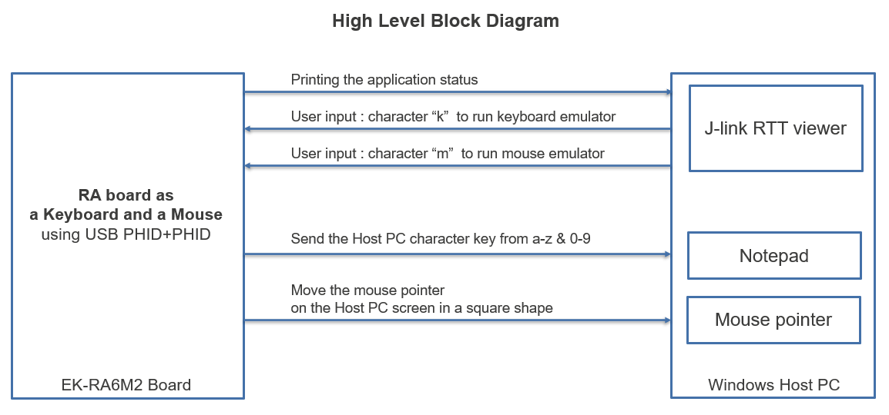
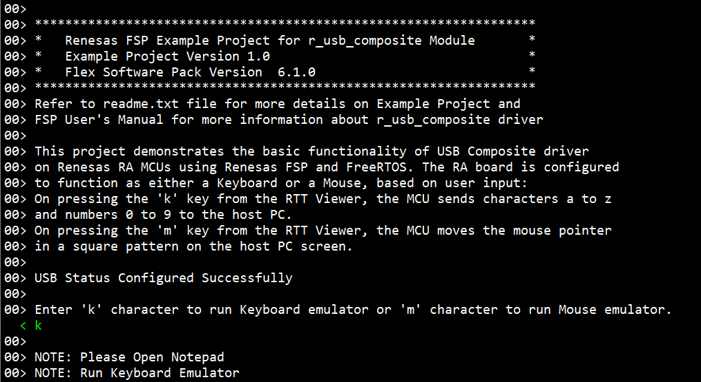
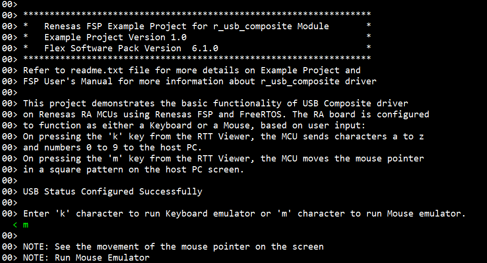
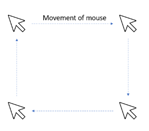

# Introduction #
This project demonstrates the basic functionality of USB PHID + PHID Composite Device on Renesas RA MCUs based on Renesas FSP. The RA board is configured to function as either a Keyboard or a Mouse. On pressing "k" from the RTT Viewer, the MCU will work as a Keyboard. The MCU sends characters a to z and numbers 0 to 9 to the host PC. On pressing "m" from the RTT Viewer, the MCU will work as a Mouse. The MCU sends mouse coordinates to the host PC, making the pointer move in a square pattern on the host PC screen.

## Required Resources ##
To build and run the USB PHID + PHID Composite Device example project, the following resources are needed.

### Software ###
Refer to software described in [Example Project Usage Guide](https://github.com/renesas/ra-fsp-examples/blob/master/example_projects/Example%20Project%20Usage%20Guide.pdf)

### Hardware ###
*	1 x Renesas RA board.
*	2 x Type-C USB cables.
*   1 x Host PC with at least 2 USB ports (1 for debug and 1 for COM port).

### Hardware Connections ###
* For EK-RA6M2:
    * Connect micro-AB USB Full-Speed port (J9) of the board to USB port of the host PC via a micro USB cable.
    * Connect micro-AB USB Debug port (J11) of the board to USB port of the host PC via a micro USB cable.

* For EK-RA8M1, EK-RA8D1:
    * Jumper J12: Connect pins 2-3.
    * Connect the jumper J15 pins.
    * Connect micro-AB USB Full-Speed port (J11) of the board to USB port of the host PC via a micro USB cable.
    * Connect micro-AB USB Debug port (J10) of the board to USB port of the host PC via a micro USB cable.

* For MCK-RA8T1:
    * Jumper JP9: Connect pins 2-3.
    * Connect the jumper JP10 pins.
    * Connect Type-C USB Full-Speed port (CN14) of the board to USB port of the host PC via a Type-C USB cable.
    * Connect Type-C USB Debug port (CN11) of the board to USB port of the host PC via a Type-C USB cable.

* For EK-RA4L1:
    * Turn ON S4-4 to select USB device mode.
    * Set J17 jumper to pins 2-3, Set J7 jumper to use P407 for USBFS VBUS.
    * Connect Type-C USB Full-Speed port (J11) of the board to USB port of the host PC via a Type-C USB cable.
    * Connect Type-C USB Debug port (J10) of the board to USB port of the host PC via a Type-C USB cable.

* For EK-RA8E2, EK-RA8P1:
    * Connect Type-C USB Full-Speed port (J11) of the board to USB port of the host PC via a Type-C USB cable.
    * Connect Type-C USB Debug port (J10) of the board to USB port of the host PC via a Type-C USB cable.

* For EK-RA2L2:
    * Connect Type-C USB Full-Speed port (J11) of the board to USB port of the host PC via a Type-C USB cable.
    * Connect micro-AB USB Debug port (J10) of the board to USB port of the host PC via a micro USB cable.

* For MCK-RA8T2:
    * Jumper JP6: Connect pins 2-3.
    * Connect Jumper JP7 pins.
    * Connect Type-C USB Full-Speed port (CN18) of the board to USB port of the host PC via a Type-C USB cable.
    * Connect Type-C USB Debug port (CN13) of the board to USB port of the host PC via a Type-C USB cable.

## Related Collateral References
The following documents can be referred to for enhancing your understanding of the operation of this example project:
* [FSP User Manual on GitHub](https://renesas.github.io/fsp/)
* [FSP Known Issues](https://github.com/renesas/fsp/issues)

# Project Notes #
## System Level Block Diagram ##
 High level block diagram

## FSP Modules Used ##
List all the various modules that are used in this example project. Refer to the FSP User Manual for further details on each module listed below.

| Module Name | Usage | Searchable Keyword  |
|-------------|-----------------------------------------------|-----------------------------------------------|
|USB Composite | USB composite device works as a USB Peripheral by combining two peripheral device classes and r_usb_basic module. | r_usb_composite |
|USB PHID | The r_usb_phid module combines with the r_usb_basic module to provide a USB Peripheral Human Interface Device Class (PHID) driver. | r_usb_phid |
|USB basic | The r_usb_basic module operates in combination with the device class drivers provided by Renesas to form a complete USB stack. | r_usb_basic |

## Module Configuration Notes ##
This section describes FSP Configurator properties which are important or different from those selected by default.

**Common Configuration Properties**
|   Module Property Path and Identifier   |   Default Value   |   Used Value   |   Reason   |
| :-------------------------------------: | :---------------: | :------------: | :--------: |
| configuration.xml > Stacks > Phid Thread > Properties > Settings > Property > Common > General > Max Priorities | 5 | 15 | Match with maximum interrupt priority in USB Basic. |
| configuration.xml > Stacks > Phid Thread > Properties > Settings > Property > Thread > Memory Allocation > Support Dynamic Allocation | Disabled | Enabled | RTOS objects can be created using RAM that is automatically allocated from the FreeRTOS heap. |
| configuration.xml > Stacks > Phid Thread > Properties > Settings > Property > Thread > Memory Allocation > Total Heap Size | 0 | 10000 | This is changed because Dynamic Allocation support is enabled, so application makes use of amount of RAM available in the FreeRTOS heap. |
| configuration.xml > Stacks > Phid Thread > Properties > Settings > Property > Thread > Stack size (bytes) | 1024 | 2048 | This is changed to handle its worst-case function call nesting and local variable usage. |
| configuration.xml > Stacks > Phid Thread > Properties > Settings > Property > Thread > Priority | 1 | 5 | This is changed to set thread priority. |

The table below lists the FSP provided API used at the application layer by this example project.

| API Name    | Usage                                                                          |
|-------------|--------------------------------------------------------------------------------|
| R_USB_Open | This API is used to open the USB basic driver. |
| R_USB_PeriControlDataGet | This API is used to receive data from the host when receiving the USB_STATUS_REQUEST or USB_SET_REPORT event. |
| R_USB_PeriControlDataSet | This API is used to perform USB transfer to the keyboard or mouse when receiving the USB_GET_REPORT_DESCRIPTOR, or USB_GET_HID_DESCRIPTOR event. |
| R_USB_PeriControlStatusSet | This API is used to set the response to the setup packet. |
| R_USB_Write | This API is used to write data to the host when receiving USB_STATUS_REQUEST_COMPLETE or USB_STATUS_WRITE_COMPLETE event. |
| R_USB_Close | This API is used to close the USB basic driver. |

## Verifying Operation ##
Import, build and debug the EP (see section Starting Development of FSP User Manual). After running the EP, open the J-Link RTT Viewer and choose whether to use the RA board as a keyboard or mouse.

* Keyboard:
In RTT Viewer, choose k

Open Notepad on the PC, lowercase characters a - z, and numbers 0 - 9 will be shown on the Notepad.

* Mouse:
In RTT Viewer, choose m

  

The mouse will move on the host PC's screen, as shown below.

